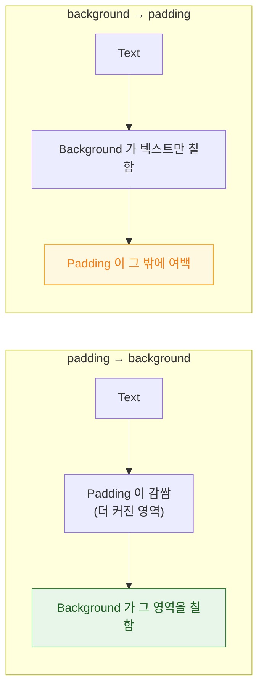

## modifier 는 뷰를 감싸므로 순서가 의미를 바꾼다

### 개념 (What)

`.padding()` 이나 `.background()` 는 뷰의 **속성을 설정하는 것이 아니다.** 각 modifier 는 **원래 뷰를 감싼 새로운 뷰를 반환**한다.

```swift
Text("Hi").padding().background(.blue)
// 실제 구조: Background(Padding(Text))
```

따라서 순서를 바꾸면 **감싸는 순서가 바뀌고**, 곧 [레이아웃 협상의 순서](layout-is-a-three-step-negotiation.md)가 바뀐다. UIKit 의 `view.backgroundColor = .blue` 와 달리 순서가 결과를 바꾼다.

### 왜 필요한가 (Why)

이것을 모르면 "왜 여백에 색이 안 칠해지지", "왜 탭 영역이 안 넓어지지" 같은 문제를 무작위로 순서를 바꿔가며 해결하게 된다.

### 대표 사례 네 가지

**1. padding 과 background**

```swift
Text("Hi").padding().background(.blue)    // 여백까지 파랑
Text("Hi").background(.blue).padding()    // 텍스트만 파랑, 여백은 투명
```



**2. frame 과 background**

```swift
Text("Hi").frame(width: 200, height: 50).background(.blue)  // 200×50 파랑
Text("Hi").background(.blue).frame(width: 200, height: 50)  // 텍스트 크기만 파랑, 200×50 안에 가운데 정렬
```

**3. 탭 영역** — 가장 실무적으로 중요하다

```swift
// ❌ 투명 영역은 탭이 통과한다 → 아이콘 픽셀만 눌린다
Image(systemName: "star").padding().onTapGesture { }

// ✅ contentShape 로 탭 영역을 명시
Image(systemName: "star")
    .padding()
    .contentShape(Rectangle())     // 여백을 포함한 사각형 전체가 탭 영역
    .onTapGesture { }
```

**4. clipShape 와 shadow**

```swift
// ❌ 그림자까지 잘린다
Image("photo").shadow(radius: 8).clipShape(.rect(cornerRadius: 12))

// ✅ 자른 뒤에 그림자
Image("photo").clipShape(.rect(cornerRadius: 12)).shadow(radius: 8)
```

두 번째 형태가 [offscreen 렌더링](../../01_system_internals/graphics-and-media/offscreen-rendering-cost.md) 관점에서도 유리하다.

### 순서 규칙 정리

| 원하는 것 | 순서 |
| :--- | :--- |
| 여백까지 배경 칠하기 | `padding` → `background` |
| 지정 크기 전체를 칠하기 | `frame` → `background` |
| 여백을 탭 영역에 포함 | `padding` → `contentShape` → 제스처 |
| 잘린 모양에 그림자 | `clipShape` → `shadow` |
| 전체에 애니메이션 | 변경 대상 modifier **뒤에** `animation` |

### 순서가 상관없는 것도 있다

`.font()`, `.foregroundStyle()` 같은 **environment 를 설정하는 modifier** 는 값을 트리 아래로 흘려보낼 뿐이라 상대 순서가 대체로 무관하다. 반대로 **레이아웃이나 그리기에 관여하는 modifier**(padding, frame, background, clipShape, offset)는 순서가 항상 의미를 갖는다.

### 관찰 가능한 증거

```swift
// 각 단계의 경계를 색으로 구분해 어디서 크기가 달라지는지 본다
Text("Hi")
    .border(.red)        // Text 자체 크기
    .padding()
    .border(.green)      // padding 후 크기
    .background(.blue)
    .border(.orange)     // background 후 크기
```

이 방법이 modifier 순서 문제 진단에 가장 빠르다. Xcode Preview 에서 즉시 확인된다.

### 연관 문서

- [SwiftUI 레이아웃은 부모 제안·자식 선택·부모 배치의 3단계 협상이다](layout-is-a-three-step-negotiation.md)
- [Offscreen 렌더링은 추가 패스와 컨텍스트 전환을 강제한다](../../01_system_internals/graphics-and-media/offscreen-rendering-cost.md)
- [SwiftUI 의 View 는 화면 객체가 아니라 화면을 서술한 값이다](view-is-a-value-not-an-object.md)

공식 문서: [Configuring views](https://developer.apple.com/documentation/swiftui/configuring-views)
