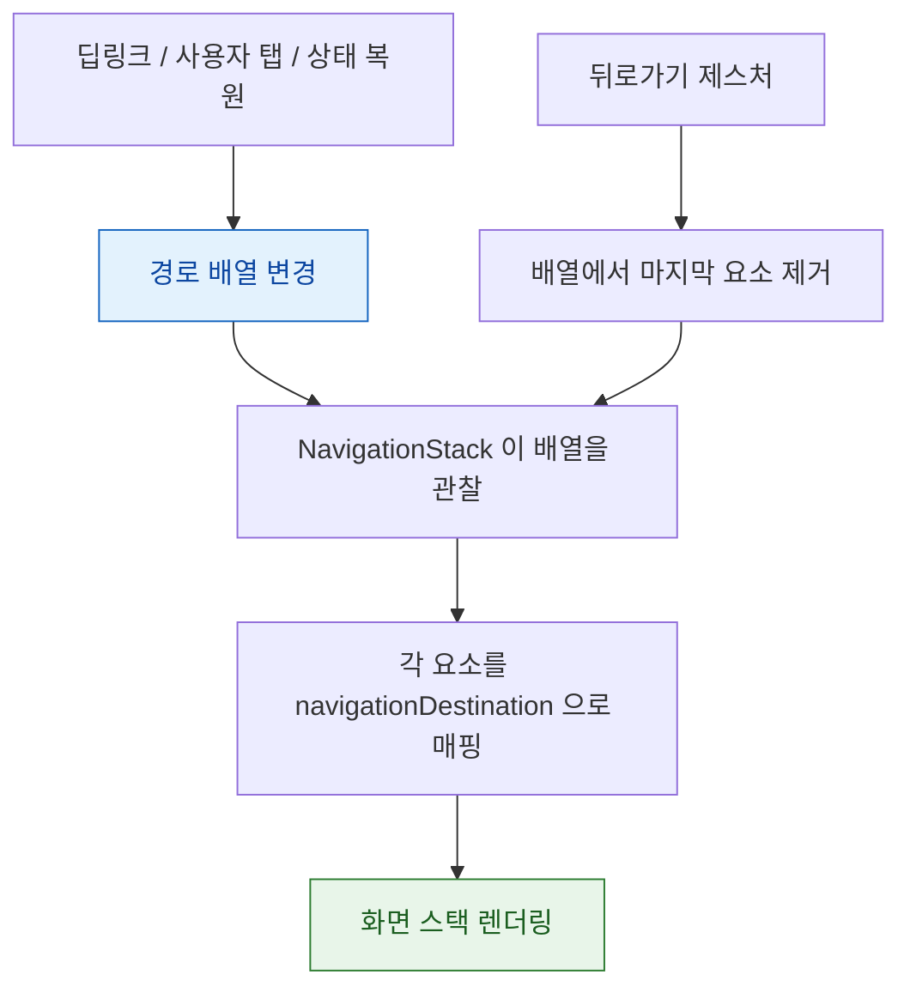

## NavigationStack 은 화면 스택이 아니라 경로 상태를 그린다

### 개념 (What)

`UINavigationController` 는 **명령형**이다. `pushViewController` 를 호출하면 화면이 쌓인다. 스택은 컨트롤러 내부에 있고 앱은 명령만 보낸다.

`NavigationStack` 은 **선언형**이다. 앱이 **경로 배열을 상태로 소유**하고, SwiftUI 는 그 배열을 화면으로 그린다. push 는 배열에 추가하는 것이고, pop 은 제거하는 것이다.

```swift
@State private var path: [Route] = []

NavigationStack(path: $path) {
    RootView()
        .navigationDestination(for: Route.self) { route in
            destination(for: route)
        }
}

// push = 배열에 추가
path.append(.detail(id: 42))
// pop to root = 배열 비우기
path.removeAll()
```

### 왜 필요한가 (Why)

이 구조가 세 가지를 공짜로 준다.

1. **딥링크가 자연스럽다**: URL 을 경로 배열로 번역하면 끝이다. 화면을 하나씩 push 할 필요가 없다.
2. **상태 복원이 자연스럽다**: 경로 배열을 저장했다 복원하면 화면 스택이 그대로 돌아온다.
3. **테스트가 가능하다**: 내비게이션 로직이 UI 없이 배열 조작으로 검증된다.

[유니버설 링크 처리](../../00_foundations/worked-examples/03-universal-link-to-scene-restore.md)와 [종료 후 상태 복원](../../00_foundations/worked-examples/05-termination-recovery-of-edit-state.md)이 같은 메커니즘 위에 선다.

### 내부 메커니즘 (How)



**`navigationDestination` 은 타입으로 매칭된다.** 경로 배열의 각 요소 타입에 대응하는 destination 이 등록되어 있어야 한다.

### 두 가지 경로 표현

```swift
// 1) 타입이 하나면 배열이 간단하다
@State private var path: [Route] = []

// 2) 여러 타입을 섞으려면 NavigationPath (타입 소거)
@State private var path = NavigationPath()
path.append(User(id: 1))      // 서로 다른 타입을 함께 쌓을 수 있다
path.append(Post(id: 42))
```

`NavigationPath` 는 `Codable` 표현을 제공하므로 **경로 전체를 직렬화해 저장**할 수 있다.

```swift
// 상태 복원용 저장
if let data = try? JSONEncoder().encode(path.codable) { save(data) }
```

### 자주 겪는 함정

| 함정 | 원인 | 대응 |
| :--- | :--- | :--- |
| `navigationDestination` 이 동작하지 않음 | 스택 **밖**이나 조건부 분기 안에 선언 | 스택 안, 무조건 실행되는 위치에 선언 |
| 딥링크로 여러 화면을 못 띄움 | 하나씩 push 하려 함 | 배열을 **한 번에** 설정 |
| 뒤로 갔는데 상태가 남음 | destination 뷰의 [identity 유지](view-identity-determines-state-lifetime.md) | 경로 요소에 고유 id 포함 |
| iPad 에서 레이아웃이 어색 | Stack 은 단일 컬럼 | `NavigationSplitView` 사용 |

```swift
// ❌ 조건 안에 있으면 등록되지 않을 수 있다
if isLoggedIn {
    RootView().navigationDestination(for: Route.self) { ... }
}

// ✅ 항상 등록되게 두고 destination 안에서 분기
RootView()
    .navigationDestination(for: Route.self) { route in
        isLoggedIn ? AnyView(destination(route)) : AnyView(LoginView())
    }
```

### 딥링크와의 결합

```swift
.onOpenURL { url in
    // URL 을 "화면 하나" 가 아니라 "경로 전체" 로 번역한다
    path = [.itemList, .itemDetail(id: parseID(url))]
    // 이러면 뒤로가기가 자연스럽게 목록으로 간다
}
```

### 연관 문서

- [View 의 identity 가 상태의 생사를 결정한다](view-identity-determines-state-lifetime.md)
- [03-universal-link-to-scene-restore](../../00_foundations/worked-examples/03-universal-link-to-scene-restore.md)
- [apple-deep-links](../../04_system_services/apple-deep-links.md)
- [소유 관계에 따라 property wrapper 를 고른다](state-ownership-property-wrappers.md)

공식 문서: [NavigationStack](https://developer.apple.com/documentation/swiftui/navigationstack) · [WWDC 2022: The SwiftUI cookbook for navigation](https://developer.apple.com/videos/play/wwdc2022/10054/)
