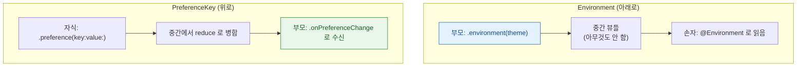

## PreferenceKey 는 자식에서 부모로, Environment 는 부모에서 자식으로 흐른다

### 개념 (What)

SwiftUI 의 데이터는 명시적 프로퍼티 전달 말고도 **두 개의 암묵적 통로**로 흐르며, 방향이 서로 반대다.

| | 방향 | 용도 | 합쳐지는 방식 |
| :--- | :--- | :--- | :--- |
| **`@Environment`** | 부모 → 자식 (**아래로**) | 테마, 로케일, dismiss 같은 공용 컨텍스트 | 가장 가까운 조상 값이 이김 |
| **`PreferenceKey`** | 자식 → 부모 (**위로**) | 자식의 크기·제목 같은 것을 부모가 알아야 할 때 | `reduce` 로 여러 자식 값을 병합 |

### 왜 필요한가 (Why)

**Environment**: 값을 10 단계 아래로 넘기려고 모든 중간 뷰의 시그니처에 프로퍼티를 추가하는 것은 유지 불가능하다.

**PreferenceKey**: 자식이 자기 크기를 계산한 뒤에야 부모가 그 크기를 알 수 있는데, [레이아웃 협상](layout-is-a-three-step-negotiation.md)은 부모→자식 방향이다. 부모가 자식의 결과를 받으려면 역방향 통로가 필요하다.



### Environment 사용

```swift
// 시스템 값 읽기
@Environment(\.colorScheme) private var colorScheme
@Environment(\.dismiss)     private var dismiss
@Environment(\.dynamicTypeSize) private var typeSize

// 커스텀 객체 주입 (iOS 17+)
ContentView().environment(themeModel)

struct DeepChild: View {
    @Environment(ThemeModel.self) private var theme
    var body: some View { Text("Hi").foregroundStyle(theme.accent) }
}
```

> [!WARNING] Environment 의 대가
> 의존성이 시그니처에 드러나지 않는다. 주입을 잊으면 **런타임에 크래시하거나 기본값으로 조용히 동작**한다. 화면 고유 데이터에는 쓰지 말고, 트리 전체가 쓰는 공용 컨텍스트에만 쓴다.

### PreferenceKey 사용 — 자식의 크기를 부모가 알아야 할 때

```swift
struct HeightKey: PreferenceKey {
    static var defaultValue: CGFloat = 0
    // 여러 자식의 값을 어떻게 합칠지 결정한다
    static func reduce(value: inout CGFloat, nextValue: () -> CGFloat) {
        value = max(value, nextValue())
    }
}

struct Row: View {
    var body: some View {
        Text("내용")
            .background(GeometryReader { g in
                Color.clear.preference(key: HeightKey.self, value: g.size.height)
            })
    }
}

struct Container: View {
    @State private var maxHeight: CGFloat = 0
    var body: some View {
        HStack { Row(); Row() }
            .onPreferenceChange(HeightKey.self) { maxHeight = $0 }   // 자식들 중 최대 높이
    }
}
```

`reduce` 가 핵심이다. 자식이 여러 개면 각각의 값을 이 함수로 병합한다. `max`, `+`, 배열 `append` 등 용도에 맞게 정한다.

### PreferenceKey 의 함정: 갱신 루프

```swift
// ❌ preference 로 받은 값이 다시 레이아웃을 바꾸면 무한 루프
.onPreferenceChange(HeightKey.self) { height = $0 }   // height 가 다시 자식 크기를 바꾸면 순환
```

값을 받아 **레이아웃에 되먹이면** 재계산 → 새 preference → 재계산이 반복될 수 있다. SwiftUI 가 대개 수렴시키지만, 값이 진동하면 CPU 를 계속 쓴다. `onPreferenceChange` 안에서 레이아웃 입력을 바꿀 때는 수렴 조건을 확인한다.

**대안**: iOS 16+ 의 `Layout` 프로토콜을 쓰면 자식 크기를 레이아웃 단계에서 직접 조회할 수 있어 preference 왕복이 필요 없다.

### 관찰 가능한 증거

```swift
.onPreferenceChange(HeightKey.self) { v in
    print("preference 갱신: \(v)")   // 진동하면 여기가 계속 찍힌다
}
```

CPU 가 유휴 상태에서도 높다면 Instruments Time Profiler 로 레이아웃 관련 프레임이 반복되는지 확인한다.

### 연관 문서

- [SwiftUI 레이아웃은 부모 제안·자식 선택·부모 배치의 3단계 협상이다](layout-is-a-three-step-negotiation.md)
- [소유 관계에 따라 property wrapper 를 고른다](state-ownership-property-wrappers.md)
- [AttributeGraph 는 diff 가 아니라 의존성 그래프로 무효화 범위를 정한다](attributegraph-tracks-dependency-not-diff.md)

공식 문서: [PreferenceKey](https://developer.apple.com/documentation/swiftui/preferencekey) · [EnvironmentValues](https://developer.apple.com/documentation/swiftui/environmentvalues)
