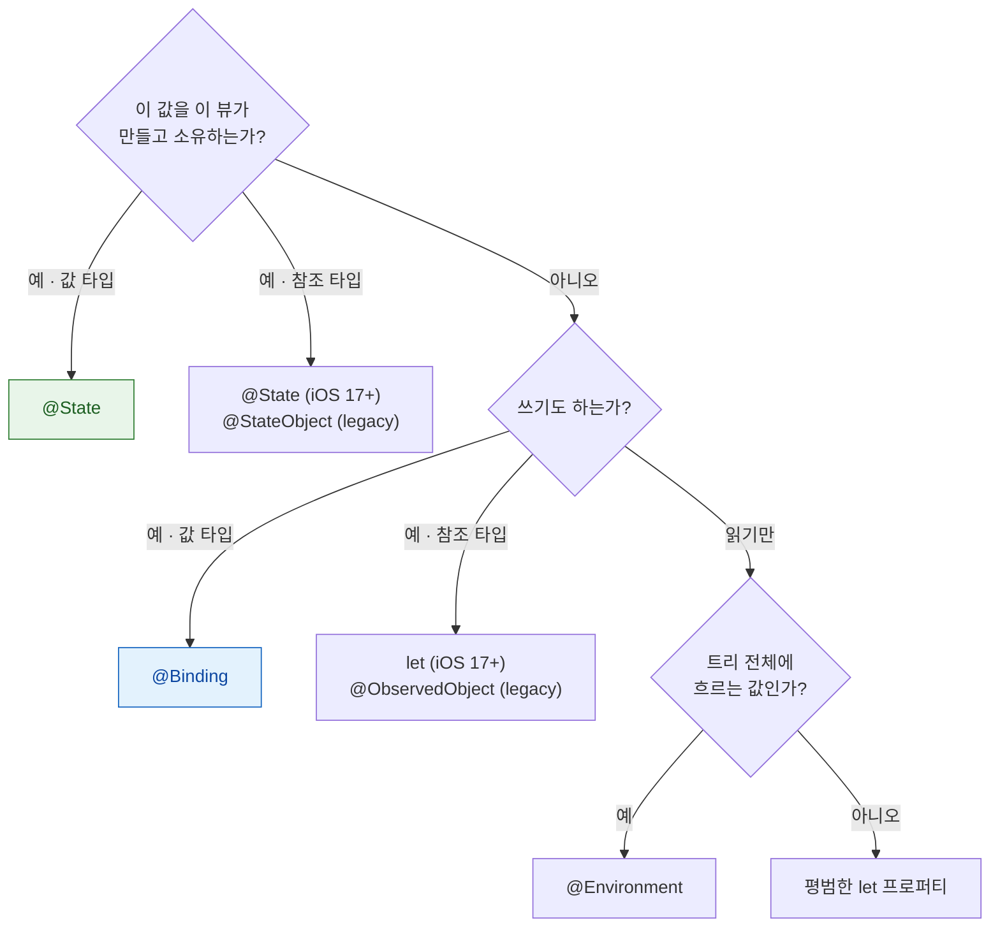

## 소유 관계에 따라 property wrapper 를 고른다

### 개념 (What)

SwiftUI 의 property wrapper 선택은 취향 문제가 아니라 **"이 상태를 누가 소유하는가"** 라는 하나의 질문으로 결정된다.

| 질문 | 답 |
| :--- | :--- |
| 이 뷰가 값을 **소유**하는가? | `@State` |
| 남이 소유한 값을 **읽고 쓰는가**? | `@Binding` |
| 이 뷰가 참조 타입 모델을 **만들어 소유**하는가? | `@State` (iOS 17+) / `@StateObject` (legacy) |
| 참조 타입 모델을 **주입받는가**? | 그냥 `let` (iOS 17+) / `@ObservedObject` (legacy) |
| 트리 전체에 **암묵적으로 흐르는가**? | `@Environment` |

### 왜 필요한가 (Why)

잘못 고르면 두 가지 버그가 난다.

1. **상태가 리셋된다**: 소유해야 할 곳에서 `@ObservedObject`(또는 매번 새로 만드는 값)를 쓰면, 부모가 재평가될 때마다 모델이 다시 만들어진다.
2. **갱신이 안 된다**: 값 복사만 하고 `@Binding` 을 안 쓰면 자식의 변경이 부모에 반영되지 않는다.

### 소유 vs 주입 — 가장 흔한 실수

```swift
// ❌ 뷰가 모델을 소유해야 하는데 매번 새로 만든다
struct ContentView: View {
    var model = Model()        // 부모 재평가마다 새 인스턴스 → 상태 소실
    var body: some View { ... }
}

// ✅ iOS 17+: @State 가 참조 타입 소유도 담당한다
struct ContentView: View {
    @State private var model = Model()   // 뷰 수명 동안 한 번만 생성
    var body: some View { ChildView(model: model) }
}

// ✅ 주입받는 쪽은 그냥 let — @Observable 이 알아서 추적한다
struct ChildView: View {
    let model: Model                     // 소유하지 않는다
    var body: some View { Text(model.name) }
}
```

> [!IMPORTANT] iOS 17 전후로 규칙이 바뀌었다
> `@Observable` 이전에는 소유에 `@StateObject`, 주입에 `@ObservedObject` 를 썼다. `@Observable` 이후에는 **소유에 `@State`, 주입에 평범한 `let`** 이면 된다. 두 방식을 섞으면 추적이 예상대로 동작하지 않는다.

### `@Binding` — 소유하지 않고 쓰기

```swift
struct ParentView: View {
    @State private var isOn = false          // 소유
    var body: some View {
        ToggleRow(isOn: $isOn)               // $ 로 binding 생성
    }
}

struct ToggleRow: View {
    @Binding var isOn: Bool                  // 소유하지 않고 읽기/쓰기
    var body: some View { Toggle("알림", isOn: $isOn) }
}
```

`@Binding` 은 값 복사가 아니라 **getter/setter 쌍**이다. 그래서 자식의 쓰기가 부모의 `@State` 에 도달한다.

### `@Environment` — 트리를 따라 내려가는 값

```swift
// 시스템 제공 값
@Environment(\.colorScheme) private var colorScheme
@Environment(\.dismiss) private var dismiss

// 커스텀 값 주입 (iOS 17+)
ContentView().environment(themeModel)

struct ChildView: View {
    @Environment(ThemeModel.self) private var theme
}
```

**주의**: Environment 는 편리하지만 의존성이 시그니처에 드러나지 않는다. 깊이 전달할 값(테마, 로케일, dismiss)에만 쓰고, 화면 고유 데이터는 명시적으로 넘긴다.

### 선택 흐름도



### 관찰 가능한 증거

`_printChanges()` 출력에 `@self` 가 반복되면 **부모가 매번 다른 값을 넘기고 있다**는 뜻이다. 소유해야 할 것을 주입하고 있지 않은지 확인한다.

`@State` 를 `private` 로 선언하는 것이 관례인 이유도 여기 있다 — 소유한 상태를 밖에서 초기화하면 소유 관계가 깨진다.

### 연관 문서

- [AttributeGraph 는 diff 가 아니라 의존성 그래프로 무효화 범위를 정한다](attributegraph-tracks-dependency-not-diff.md)
- [View 의 identity 가 상태의 생사를 결정한다](view-identity-determines-state-lifetime.md)
- [PreferenceKey 는 위로, Environment 는 아래로 흐른다](preference-flows-up-environment-flows-down.md)
- [apple-observation-framework](../../01_language_concurrency/apple-observation-framework.md)

공식 문서: [Managing user interface state](https://developer.apple.com/documentation/swiftui/managing-user-interface-state)
