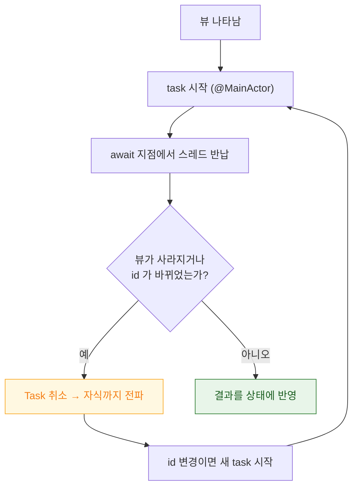

## .task 는 비동기 작업의 수명을 뷰 수명에 묶고 사라질 때 자동 취소한다

### 개념 (What)

`.task { }` 는 뷰가 나타날 때 비동기 작업을 시작하고, **뷰가 사라지면 그 작업을 취소**한다. 개발자가 `Task` 를 보관했다가 `onDisappear` 에서 취소하는 코드를 대신한다.

```swift
struct ProfileView: View {
    let userID: String
    @State private var user: User?

    var body: some View {
        content
            .task {                       // 나타날 때 시작, 사라질 때 자동 취소
                user = try? await api.fetchUser(userID)
            }
    }
}
```

이것은 [구조적 동시성](../../01_language_concurrency/concurrency/structured-concurrency-task-tree.md)을 **뷰 수명에 연결**한 것이다.

### 왜 필요한가 (Why)

수동으로 하면 빠뜨리기 쉬운 것들을 대신해 준다.

```swift
// ❌ 수동 관리 — 취소를 잊으면 화면을 닫아도 요청이 계속 돈다
final class Model: ObservableObject {
    private var task: Task<Void, Never>?
    func load() { task = Task { ... } }
    deinit { task?.cancel() }     // 빠뜨리기 쉽다
}

// ✅ .task 는 뷰 수명과 자동으로 묶인다
.task { await load() }
```

- 화면을 빠르게 열고 닫아도 **요청이 쌓이지 않는다**
- 취소가 [Task 트리로 전파](../../01_language_concurrency/concurrency/structured-concurrency-task-tree.md)되어 자식 작업까지 정리된다
- `@MainActor` 컨텍스트에서 시작되므로 결과를 그대로 상태에 대입할 수 있다

### `.task(id:)` — 입력이 바뀌면 다시 시작

```swift
struct SearchResults: View {
    let query: String
    @State private var results: [Item] = []

    var body: some View {
        List(results) { ItemRow(item: $0) }
            .task(id: query) {              // query 가 바뀌면 이전 작업 취소 후 재시작
                try? await Task.sleep(for: .milliseconds(300))   // 디바운스
                try? Task.checkCancellation()
                results = await api.search(query)
            }
    }
}
```

`id` 가 바뀌면 **이전 작업을 취소하고 새로 시작**한다. 검색 디바운스와 취소가 이 한 줄로 해결된다. 수동으로 하면 이전 Task 보관·취소·경쟁 조건 처리가 필요하다.



### 취소는 협력적이다

`.task` 가 취소해도 **작업이 스스로 확인해야 실제로 멈춘다.**

```swift
.task {
    for item in items {
        try Task.checkCancellation()     // 확인하지 않으면 끝까지 돈다
        await process(item)
    }
}
```

`URLSession` 의 async API 는 취소를 자동으로 존중하지만, 직접 만든 루프는 확인해야 한다. → [await 중단 지점](../../01_language_concurrency/concurrency/await-suspension-stores-continuation.md)

### `.task` vs `.onAppear`

| | `.onAppear` | `.task` |
| :--- | :--- | :--- |
| 동기/비동기 | 동기 클로저 | async 클로저 |
| 취소 | 없음 (직접 관리) | **자동** |
| 재시작 | 없음 | `.task(id:)` 로 가능 |
| 호출 시점 | 나타날 때마다 | 나타날 때마다 |

**비동기 작업이면 `.task`, 동기 부수 효과면 `.onAppear`** 로 나누면 된다.

> [!IMPORTANT] `.onAppear` 도 여러 번 호출된다
> 탭 전환, 스크롤 재진입 등으로 뷰가 다시 나타나면 또 호출된다. "한 번만" 을 원하면 플래그를 상태로 들고 있어야 한다.

### 관찰 가능한 증거

**Instruments의 Swift Concurrency** 템플릿에서 Task 의 생성·취소·완료를 시간축으로 본다. 화면을 닫았는데 Task 가 살아 있으면 `.task` 대신 비구조적 `Task { }` 를 쓰고 있는 것이다.

```swift
.task {
    defer { print("task 종료") }    // 취소 시에도 실행된다
    ...
}
```

### 연관 문서

- [구조적 동시성은 작업 수명을 스코프에 묶고 취소를 트리로 전파한다](../../01_language_concurrency/concurrency/structured-concurrency-task-tree.md)
- [await 는 스레드를 막지 않고 continuation 을 힙에 저장한다](../../01_language_concurrency/concurrency/await-suspension-stores-continuation.md)
- [@MainActor 는 UI 상태를 메인 스레드에 묶고 nonisolated 가 그 탈출구다](../../01_language_concurrency/concurrency/mainactor-and-nonisolated.md)
- [View 의 identity 가 상태의 생사를 결정한다](view-identity-determines-state-lifetime.md)

공식 문서: [task(priority:_:)](https://developer.apple.com/documentation/swiftui/view/task(priority:_:))
