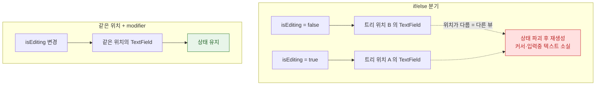

## View 의 identity 가 상태의 생사를 결정한다

### 개념 (What)

SwiftUI 는 "이 뷰가 **아까 그 뷰와 같은 뷰인가**"를 판단해야 `@State` 를 이어갈지 버릴지 결정할 수 있다. 그 판단 기준이 **identity** 다.

identity 는 두 종류다.

| 종류 | 무엇으로 정해지는가 |
| :--- | :--- |
| **구조적 identity(structural)** | **뷰 트리에서의 위치**. 개발자가 명시하지 않으면 이것이 쓰인다 |
| **명시적 identity(explicit)** | `.id(_:)` 또는 `ForEach` 의 `id` |

**identity 가 같으면 상태가 유지되고, 바뀌면 이전 뷰는 파괴되고 새로 만들어진다.** `@State` 초기값으로 돌아가고, `.task` 는 취소 후 재시작되며, 전환 애니메이션이 발생한다.

### 왜 필요한가 (Why)

SwiftUI 에서 가장 재현하기 어려운 버그 두 가지가 전부 여기서 나온다.

1. **"입력하던 내용이 갑자기 사라진다"** → identity 가 의도치 않게 바뀌어 상태가 리셋됨
2. **"다른 항목을 골랐는데 이전 항목의 상태가 남아 있다"** → identity 가 같아서 상태가 재사용됨

### 구조적 identity 가 깨지는 대표 패턴

```swift
// ❌ 조건에 따라 다른 분기 → 서로 다른 구조적 위치 → 상태가 유지되지 않는다
var body: some View {
    if isEditing {
        TextField("이름", text: $name)   // A 위치
    } else {
        TextField("이름", text: $name)   // B 위치 — A 와 다른 뷰로 취급된다
    }
}

// ✅ 같은 위치를 유지하고 속성만 바꾼다
var body: some View {
    TextField("이름", text: $name)
        .disabled(!isEditing)
}
```



### `.id()` 는 강력하지만 양날이다

```swift
// 의도적 리셋: 사용자가 바뀌면 편집 상태를 처음부터
EditorView(user: user)
    .id(user.id)          // user.id 가 바뀌면 통째로 새 뷰
```

이건 유용한 도구다. 하지만 **매번 새 값을 주면 매 프레임 뷰가 파괴·재생성**된다.

```swift
// ❌ UUID() 는 평가할 때마다 새 값
SomeView().id(UUID())     // 매 재평가마다 상태 리셋 + 애니메이션 깨짐
```

### `ForEach` 의 id 는 상태를 항목에 묶는다

```swift
// ❌ 인덱스를 id 로 쓰면, 항목이 삽입·삭제될 때 id 가 밀린다
ForEach(items.indices, id: \.self) { i in RowView(item: items[i]) }

// ✅ 항목 고유 식별자를 쓴다
ForEach(items) { item in RowView(item: item) }     // Identifiable
```

인덱스를 쓰면 중간에 항목을 삭제했을 때 **뒤 항목들의 identity 가 전부 밀려** 상태가 엉뚱한 행으로 옮겨간다.

### 진단

```swift
let _ = Self._printChanges()
```

출력에 **`@identity`** 가 보이면 그 뷰의 identity 가 바뀐 것이다. 상태 소실이나 원치 않는 애니메이션이 보일 때 이 신호를 먼저 찾는다.

### 연관 문서

- [SwiftUI 의 View 는 화면 객체가 아니라 화면을 서술한 값이다](view-is-a-value-not-an-object.md)
- [AttributeGraph 는 diff 가 아니라 의존성 그래프로 무효화 범위를 정한다](attributegraph-tracks-dependency-not-diff.md)
- [소유 관계에 따라 property wrapper 를 고른다](state-ownership-property-wrappers.md)
- [.task 는 비동기 작업의 수명을 뷰 수명에 묶는다](task-modifier-ties-async-to-view-lifetime.md)

공식 문서: [WWDC 2021: Demystify SwiftUI](https://developer.apple.com/videos/play/wwdc2021/10022/)
