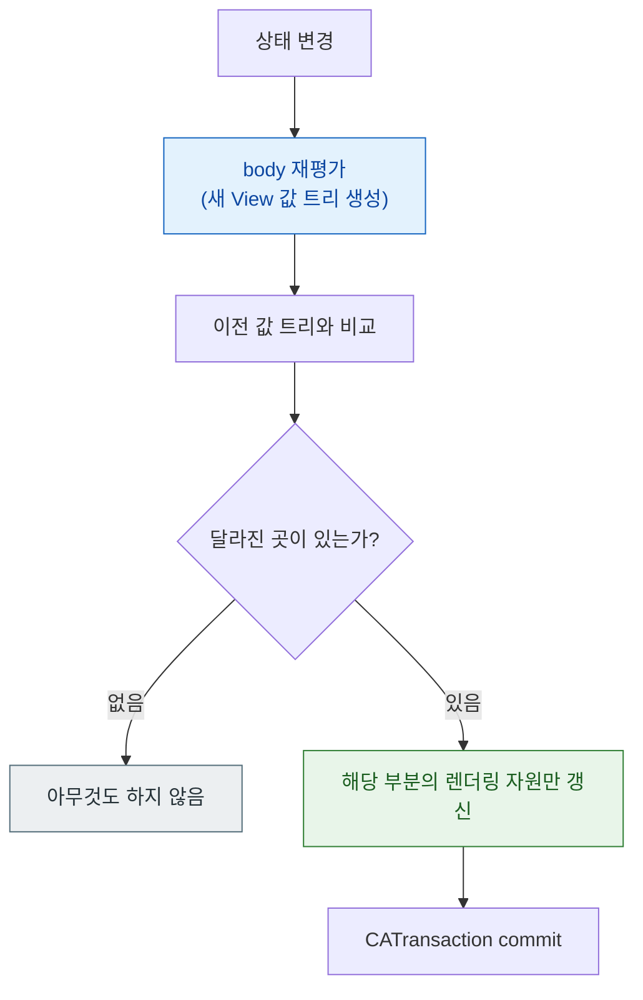

## SwiftUI 의 View 는 화면 객체가 아니라 화면을 서술한 값이고 body 는 여러 번 호출된다

### 개념 (What)

`UIView` 는 화면에 존재하는 **객체**다. 만들고, 참조를 들고 있다가, 속성을 바꾸면 그 객체가 변한다.

SwiftUI 의 `View` 는 다르다. **struct 이고, 화면이 어떻게 생겨야 하는지를 서술한 값**이다. SwiftUI 는 이 값을 받아 내부적으로 실제 렌더링 자원(레이어)을 관리하며, 값이 바뀌면 이전 값과 비교해 달라진 부분만 실제 자원에 반영한다.

따라서 `body` 는 "화면을 만드는 함수"가 아니라 **"지금 상태에서 화면이 어떠해야 하는지를 계산하는 순수 함수"** 다.

### 왜 필요한가 (Why)

1. **`body` 는 몇 번 호출될지 모른다**: 상태가 바뀔 때마다, 부모가 다시 평가될 때마다 호출된다. 여기에 부수 효과나 무거운 계산을 넣으면 그것이 반복된다.
2. **View 인스턴스를 붙잡아 두는 것이 무의미하다**: 매번 새 값이 만들어진다. `@State` 로 표시하지 않은 저장 프로퍼티는 다음 평가 때 초기값으로 돌아간다.
3. **비용 모델이 UIKit 과 반대다**: UIKit 은 뷰 생성이 비싸고 속성 변경이 싸다. SwiftUI 는 **View 값 생성이 싸고**(단순 struct), 실제 비용은 그 값을 실제 자원에 반영하는 단계에 있다.

### 내부 메커니즘 (How)



**`body` 가 호출되었다는 것이 화면이 다시 그려졌다는 뜻이 아니다.** 비교 결과 동일하면 렌더링은 일어나지 않는다. 그래서 `body` 호출 횟수와 실제 렌더링 비용은 별개로 봐야 한다.

### 실무 규칙

```swift
struct ProfileView: View {
    let user: User

    // ❌ body 안에서 매번 계산 — 재평가마다 반복된다
    var body: some View {
        List(user.posts.sorted { $0.date > $1.date }) { post in
            Row(post: post)
        }
    }
}

struct ProfileView2: View {
    let user: User
    // ✅ 값이 만들어질 때 한 번 계산
    private var sortedPosts: [Post] { user.posts }   // 이미 정렬된 것을 받는다

    var body: some View { List(sortedPosts) { Row(post: $0) } }
}
```

| 하면 안 되는 것 | 이유 |
| :--- | :--- |
| `body` 안에서 정렬·필터·파싱 | 재평가마다 반복 |
| `body` 안에서 네트워크 요청 | 부수 효과. `.task {}` 를 쓴다 |
| `body` 안에서 `Date()` 등 비결정적 값 읽기 | 매번 다른 결과 → 불필요한 갱신 |
| 저장 프로퍼티에 가변 상태 보관 | 다음 평가 때 초기화된다. `@State` 를 쓴다 |

### 관찰 가능한 증거

```swift
var body: some View {
    let _ = Self._printChanges()   // 어떤 속성이 재평가를 유발했는지 출력 (디버그 전용)
    ...
}
```

`_printChanges()` 출력이 예상보다 자주 나오면 [의존성을 너무 넓게 잡은 것](attributegraph-tracks-dependency-not-diff.md)이다. **Instruments의 SwiftUI 템플릿**은 뷰별 body 평가 횟수와 소요 시간을 집계해 준다.

### 연관 문서

- [AttributeGraph 는 diff 가 아니라 의존성 그래프로 무효화 범위를 정한다](attributegraph-tracks-dependency-not-diff.md)
- [View 의 identity 가 상태의 생사를 결정한다](view-identity-determines-state-lifetime.md)
- [소유 관계에 따라 property wrapper 를 고른다](state-ownership-property-wrappers.md)
- [07-swiftui-state-change-to-pixel](../../00_foundations/worked-examples/07-swiftui-state-change-to-pixel.md)

공식 문서: [View](https://developer.apple.com/documentation/swiftui/view)
