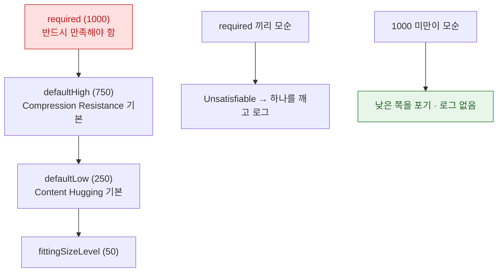

## Auto Layout 은 우선순위가 붙은 제약 시스템을 풀어 프레임을 정한다

### 개념 (What)

Auto Layout 은 뷰 배치를 **선형 제약 방정식의 집합**으로 표현하고, 이를 푸는 알고리즘(Cassowary 계열)으로 프레임을 계산한다. [SwiftUI 의 3단계 협상](../swiftui/layout-is-a-three-step-negotiation.md)과 근본적으로 다른 접근이다.

| | Auto Layout | SwiftUI |
| :--- | :--- | :--- |
| 방식 | 제약 시스템을 **푼다** | 부모-자식이 **협상한다** |
| 실패 양상 | 모순(unsatisfiable) 또는 부족(ambiguous) | 항상 답이 나옴 (원치 않는 값일 뿐) |
| 우선순위 | 있음 (1~1000) | 없음 (레이아웃 우선순위는 별개 개념) |

**해가 하나로 정해지려면 제약이 충분하되 모순이 없어야 한다.** 이 두 가지가 Auto Layout 의 두 가지 실패 모드다.

### 왜 필요한가 (Why)

콘솔에 쏟아지는 제약 로그는 두 종류이고, 원인과 처방이 완전히 다르다.

| 실패 | 콘솔 | 원인 | 처방 |
| :--- | :--- | :--- | :--- |
| **Unsatisfiable** | `Unable to simultaneously satisfy constraints` | 제약이 **모순** | 하나를 제거하거나 우선순위를 낮춘다 |
| **Ambiguous** | 로그 없이 위치가 이상함 | 제약이 **부족** | 제약을 추가한다 |

두 번째가 더 위험하다. **경고가 안 뜨고 조용히 엉뚱한 곳에 배치된다.**

### 우선순위 체계



**실무 요령**: 상황에 따라 켜고 끄고 싶은 제약은 `required` 대신 `999` 로 둔다. 그러면 모순이 생겨도 경고 없이 조용히 양보한다.

```swift
// 활성/비활성을 토글하는 제약은 999 로
let optional = view.heightAnchor.constraint(equalToConstant: 100)
optional.priority = .init(999)
optional.isActive = true
```

### Content Hugging vs Compression Resistance

이 둘을 헷갈리면 "왜 이 라벨이 늘어나지 / 줄어들지"를 못 고친다.

| | 저항하는 것 | 기본 우선순위 |
| :--- | :--- | :--- |
| **Content Hugging** | **커지는 것**에 저항 ("내 콘텐츠보다 크게 만들지 마") | 250 |
| **Compression Resistance** | **작아지는 것**에 저항 ("내 콘텐츠를 자르지 마") | 750 |

```swift
// 두 라벨 중 어느 쪽이 늘어날지 정한다
titleLabel.setContentHuggingPriority(.defaultLow,  for: .horizontal)   // 이쪽이 늘어남
badgeLabel.setContentHuggingPriority(.defaultHigh, for: .horizontal)   // 이쪽은 딱 맞게

// 어느 쪽이 먼저 잘릴지 정한다
titleLabel.setContentCompressionResistancePriority(.defaultLow, for: .horizontal)  // 이쪽이 먼저 잘림
```

### 성능: 제약 개수가 비용이다

제약 시스템을 푸는 비용은 제약 수에 대해 선형보다 나쁘게 증가한다. 깊은 계층에 제약이 많으면 [레이아웃 구간](layout-cycle-is-deferred-and-coalesced.md)이 프레임 예산을 먹는다.

- **셀 안에서는 제약을 재사용한다.** `cellForRow` 에서 매번 제약을 추가하면 누적된다.
- 정적 배치라면 `frame` 직접 설정이 훨씬 싸다.
- `UIStackView` 는 편하지만 내부적으로 제약을 만든다. 깊게 중첩하면 비싸다.

### 관찰 가능한 증거

```swift
// 모호한 레이아웃 탐지 (디버거 콘솔)
po view.hasAmbiguousLayout
po view.value(forKey: "_autolayoutTrace")     // 계층 전체의 모호성 표시

// 모호한 뷰를 시각적으로 흔들어 보기
view.exerciseAmbiguityInLayout()
```

`_autolayoutTrace` 출력에서 `AMBIGUOUS LAYOUT` 이 붙은 뷰가 제약이 부족한 뷰다.

**Debug > View Debugging > Capture View Hierarchy** 에서 뷰를 선택하면 적용된 제약 목록과 충돌 여부를 볼 수 있다.

```
# 제약 충돌 로그를 브레이크포인트로 잡기
# Breakpoint Navigator > Symbolic Breakpoint > UIViewAlertForUnsatisfiableConstraints
```

### 연관 문서

- [레이아웃은 지연되고 합쳐진다](layout-cycle-is-deferred-and-coalesced.md)
- [SwiftUI 레이아웃은 부모 제안·자식 선택·부모 배치의 3단계 협상이다](../swiftui/layout-is-a-three-step-negotiation.md)
- [히치는 평균 FPS 가 아니라 사용자가 실제로 본 지연을 잰다](../../01_system_internals/graphics-and-media/hitches-measure-user-visible-jank.md)

공식 문서: [Auto Layout Guide](https://developer.apple.com/library/archive/documentation/UserExperience/Conceptual/AutolayoutPG/index.html)
