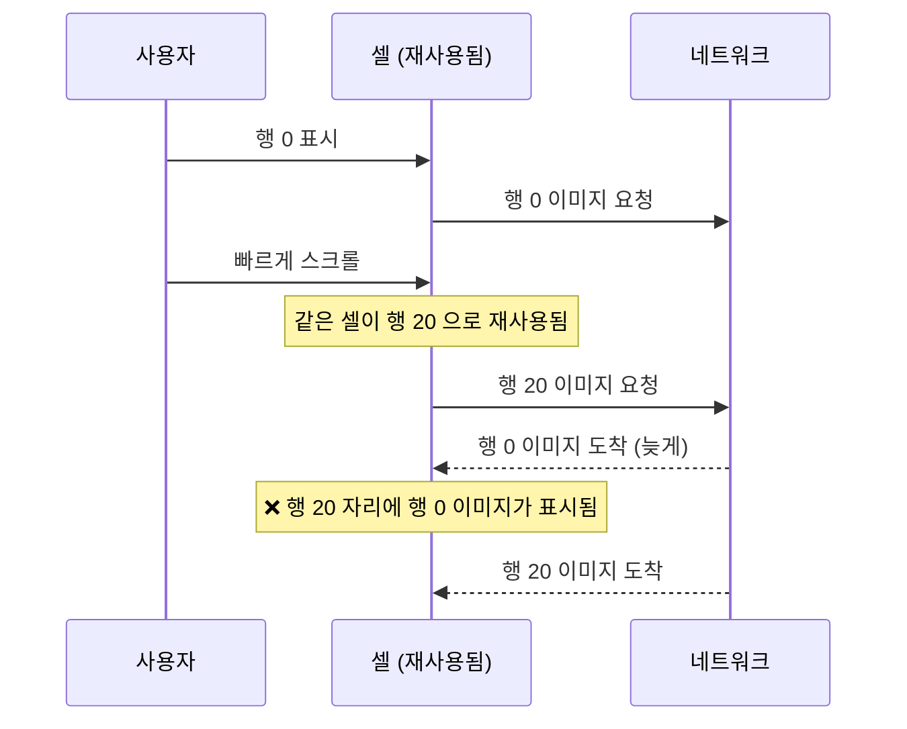

## 셀 재사용은 이전 상태를 그대로 물려주므로 모든 상태를 명시적으로 되돌려야 한다

### 개념 (What)

`dequeueReusableCell` 은 새 셀을 만드는 것이 아니라, **화면 밖으로 나간 셀을 그대로 돌려준다.** 그 셀에는 이전 행의 이미지, 선택 상태, 진행 중이던 애니메이션, 진행 중이던 네트워크 요청이 **전부 남아 있다.**

즉 셀 설정 코드는 "값을 채우는 것"이 아니라 **"이전 상태를 완전히 덮어쓰는 것"** 이어야 한다.

### 왜 필요한가 (Why)

이 성질이 만드는 버그는 전부 "스크롤하면 이상해진다" 형태로 나타난다.

| 증상 | 원인 |
| :--- | :--- |
| 엉뚱한 행에 이미지가 뜬다 | 비동기 로딩 결과가 재사용된 셀에 도착 |
| 스크롤하면 선택 표시가 옮겨다닌다 | 선택 상태를 되돌리지 않음 |
| 배지가 사라지지 않는다 | 조건부로만 설정하고 else 에서 숨기지 않음 |
| 스크롤할수록 느려진다 | `cellForRow` 에서 서브뷰나 제약을 매번 추가 |

### 비동기 이미지 로딩 — 가장 흔한 버그

```swift
// ❌ 재사용된 셀에 이전 행의 이미지가 도착한다
func collectionView(_ cv: UICollectionView, cellForItemAt ip: IndexPath) -> UICollectionViewCell {
    let cell = cv.dequeueReusableCell(withReuseIdentifier: "Cell", for: ip) as! PhotoCell
    loadImage(url: items[ip.item].url) { image in
        cell.imageView.image = image     // 이 셀은 이미 다른 행을 그리고 있을 수 있다
    }
    return cell
}
```



**해법 1 — 도착 시점에 여전히 그 행인지 확인**

```swift
loadImage(url: url) { [weak cv] image in
    guard let cell = cv?.cellForItem(at: ip) as? PhotoCell else { return }  // 이미 사라졌으면 무시
    cell.imageView.image = image
}
```

**해법 2 — 셀이 자기 토큰을 들고 검증** (더 견고하다)

```swift
final class PhotoCell: UICollectionViewCell {
    private var currentURL: URL?
    private var task: Task<Void, Never>?

    func configure(url: URL) {
        currentURL = url
        imageView.image = nil            // ★ 이전 이미지를 즉시 비운다
        task?.cancel()                   // ★ 이전 요청 취소
        task = Task {
            let image = await ImageLoader.shared.load(url)
            guard !Task.isCancelled, currentURL == url else { return }   // 여전히 이 URL 인가
            imageView.image = image
        }
    }

    override func prepareForReuse() {
        super.prepareForReuse()
        task?.cancel(); task = nil
        currentURL = nil
        imageView.image = nil
    }
}
```

### `prepareForReuse` 의 역할과 한계

`prepareForReuse` 는 **재사용 직전**에 호출된다. 여기서 되돌려야 할 것:

```swift
override func prepareForReuse() {
    super.prepareForReuse()
    imageView.image = nil          // 이미지
    task?.cancel()                 // 진행 중 요청
    layer.removeAllAnimations()    // 진행 중 애니메이션
    accessoryType = .none          // 액세서리
    isSelected = false             // 선택 상태
    textLabel?.text = nil
}
```

> [!IMPORTANT] `prepareForReuse` 에만 의존하지 않는다
> 이 메서드는 **재사용될 때만** 호출된다. 처음 만들어진 셀에는 불리지 않는다. 따라서 `configure` 에서도 모든 상태를 무조건 설정해야 한다. "조건이 맞을 때만 설정"하는 코드가 버그의 근원이다.

```swift
// ❌ else 가 없으면 이전 상태가 남는다
if item.isNew { badgeView.isHidden = false }

// ✅ 항상 양쪽을 설정
badgeView.isHidden = !item.isNew
```

### `cellForRow` 에서 하면 안 되는 것

```swift
// ❌ 재사용될 때마다 서브뷰와 제약이 누적된다
cell.contentView.addSubview(label)
NSLayoutConstraint.activate([...])
```

서브뷰 추가와 제약 설정은 **셀 초기화 시 한 번**(`init` 또는 `awakeFromNib`)만 한다. `cellForRow` 는 데이터를 채우는 자리다.

### Modern 대안: `UIContentConfiguration` / Diffable Data Source

```swift
// iOS 14+: 셀 등록 시점에 설정을 분리하면 재사용 실수가 줄어든다
let registration = UICollectionView.CellRegistration<UICollectionViewListCell, Item> { cell, _, item in
    var config = cell.defaultContentConfiguration()
    config.text = item.title
    config.image = item.thumbnail
    cell.contentConfiguration = config       // 매번 통째로 교체 → 잔여 상태가 없다
}
```

`contentConfiguration` 은 **값 타입을 통째로 교체**하므로 "일부만 설정해서 이전 값이 남는" 실수가 구조적으로 사라진다.

### 관찰 가능한 증거

```swift
override func prepareForReuse() {
    super.prepareForReuse()
    print("재사용: \(ObjectIdentifier(self))")   // 같은 주소가 반복되면 정상 동작 중
}
```

**Instruments의 Time Profiler** 에서 `cellForItemAt` 이 두꺼우면 여기서 무거운 일을 하고 있는 것이다. 이미지 디코딩이 보이면 [다운샘플링](../../01_system_internals/graphics-and-media/layer-tree-commit-to-render-server.md)이 필요하다.

### 연관 문서

- [레이아웃은 지연되고 합쳐진다](layout-cycle-is-deferred-and-coalesced.md)
- [Auto Layout 은 우선순위가 붙은 제약 시스템을 풀어 프레임을 정한다](autolayout-solves-a-constraint-system.md)
- [07-scroll-hitches](../../00_foundations/diagnostic-runbooks/07-scroll-hitches.md)
- [레이어 트리는 IPC 로 Render Server 에 커밋된다](../../01_system_internals/graphics-and-media/layer-tree-commit-to-render-server.md)

공식 문서: [UICollectionView](https://developer.apple.com/documentation/uikit/uicollectionview) · [UIContentConfiguration](https://developer.apple.com/documentation/uikit/uicontentconfiguration)
