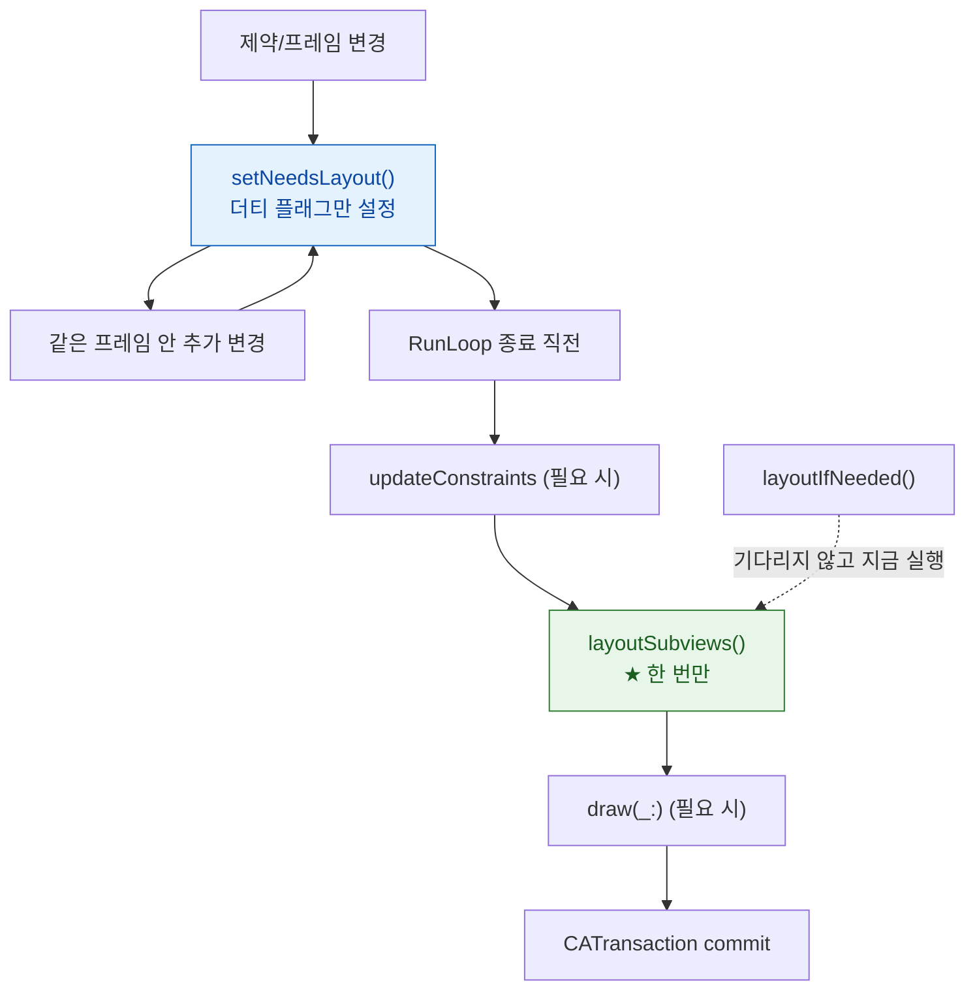

## 레이아웃은 즉시 실행되지 않고 다음 갱신 주기까지 미뤄져 한 번에 합쳐진다

### 개념 (What)

`setNeedsLayout()` 은 레이아웃을 **실행하지 않는다.** "이 뷰는 다시 배치해야 한다"고 표시만 하고 즉시 반환한다. 실제 `layoutSubviews()` 는 [RunLoop 가 한 바퀴를 마치며 CATransaction 을 커밋하는 시점](../../01_system_internals/boot-and-runtime/runloop-drives-main-thread.md)에 호출된다.

같은 뷰에 `setNeedsLayout` 을 100 번 불러도 `layoutSubviews` 는 **한 번** 실행된다. 이것이 **합침(coalescing)** 이다.

### 왜 필요한가 (Why)

1. **성능**: 속성을 바꿀 때마다 즉시 재배치하면 한 프레임 안에서 같은 계산이 수십 번 반복된다.
2. **"왜 지금 크기가 안 바뀌었지"의 답**: 제약을 바꾼 직후 `frame` 을 읽으면 아직 **이전 값**이다. 아직 레이아웃이 실행되지 않았다.
3. **애니메이션이 안 되는 이유**: 애니메이션 블록 안에서 제약만 바꾸고 `layoutIfNeeded()` 를 호출하지 않으면, 실제 배치가 블록 밖에서 일어나 애니메이션되지 않는다.

### 세 종류의 무효화

| 호출 | 표시하는 것 | 대응 실행 |
| :--- | :--- | :--- |
| `setNeedsLayout()` | 배치가 필요함 | `layoutSubviews()` |
| `setNeedsDisplay()` | 다시 그려야 함 | `draw(_:)` |
| `setNeedsUpdateConstraints()` | 제약 갱신 필요 | `updateConstraints()` |

각각 강제 실행 짝이 있다: `layoutIfNeeded()`, (즉시 그리기는 없음), `updateConstraintsIfNeeded()`.



### 제약 애니메이션의 정확한 형태

```swift
// ❌ 애니메이션되지 않는다 — 배치가 블록 밖에서 일어난다
UIView.animate(withDuration: 0.3) {
    self.heightConstraint.constant = 200
}

// ✅ 블록 안에서 강제로 배치를 실행시킨다
heightConstraint.constant = 200
UIView.animate(withDuration: 0.3) {
    self.view.layoutIfNeeded()      // 여기서 실제 배치 → 애니메이션 대상이 된다
}
```

**핵심**: 애니메이션은 "블록 안에서 실제로 바뀐 값"을 대상으로 한다. 제약 상수 변경은 즉시 프레임을 바꾸지 않으므로, `layoutIfNeeded()` 로 블록 안에서 프레임 변경을 일으켜야 한다.

### `layoutSubviews` 에서 하면 안 되는 것

```swift
override func layoutSubviews() {
    super.layoutSubviews()
    // ❌ 여기서 다시 무효화하면 무한 루프가 될 수 있다
    setNeedsLayout()

    // ❌ 여기서 제약을 추가하면 매번 누적된다
    NSLayoutConstraint.activate([...])

    // ✅ 프레임 계산과 배치만
    subview.frame = CGRect(...)
}
```

`layoutSubviews` 는 **여러 번 호출된다.** 회전, 크기 변경, 스크롤, 부모 재배치 때마다 불린다. 여기에 일회성 설정(옵서버 등록, 제약 추가, 서브뷰 추가)을 넣으면 중복 누적된다.

### 관찰 가능한 증거

```swift
// 레이아웃이 몇 번 실행되는지 센다
override func layoutSubviews() {
    super.layoutSubviews()
    layoutCount += 1
    print("layoutSubviews #\(layoutCount) bounds=\(bounds)")
}
```

**Instruments의 Time Profiler** 에서 메인 스레드 스택에 `layoutSubviews` 나 `-[UIView(Hierarchy) layoutBelowIfNeeded]` 가 두껍게 보이면 레이아웃이 병목이다. 스크롤 중이라면 [히치](../../01_system_internals/graphics-and-media/hitches-measure-user-visible-jank.md)의 commit 구간 원인이다.

`layoutIfNeeded()` 를 스크롤 델리게이트나 반복 루프에서 호출하면 합침이 무력화되어 매번 동기 레이아웃이 일어난다. 성능 문제의 흔한 원인이다.

### 연관 문서

- [Auto Layout 은 제약 시스템을 푼다](autolayout-solves-a-constraint-system.md)
- [메인 스레드의 이벤트 처리와 화면 갱신은 RunLoop 한 바퀴 안에서 정해진 순서로 일어난다](../../01_system_internals/boot-and-runtime/runloop-drives-main-thread.md)
- [레이어 트리는 IPC 로 Render Server 에 커밋된다](../../01_system_internals/graphics-and-media/layer-tree-commit-to-render-server.md)
- [ViewController 생명주기는 view 프로퍼티의 지연 로딩이 시작점이다](viewcontroller-lifecycle-is-driven-by-view-loading.md)

공식 문서: [UIView layout](https://developer.apple.com/documentation/uikit/uiview)
