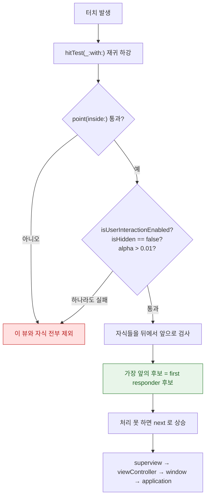

## 터치는 hit-test 로 내려가 대상을 찾고 이벤트는 responder chain 을 타고 올라간다

### 개념 (What)

터치 하나가 처리되기까지 방향이 **두 번 바뀐다.**

1. **아래로 (hit-testing)**: 시스템이 뷰 계층을 **위에서 아래로** 훑으며 "이 좌표를 받을 가장 앞의 뷰"를 찾는다.
2. **위로 (responder chain)**: 찾은 뷰가 처리하지 못하면 이벤트가 **부모로, 또 그 부모로** 올라간다.

"버튼이 안 눌린다"는 1 단계 문제이고, "이벤트를 어디서 받아야 하지"는 2 단계 문제다.

### 왜 필요한가 (Why)



### "터치가 안 먹는" 네 가지 원인

hit-testing 이 뷰를 **제외하는 조건**이 곧 원인 목록이다.

| 조건 | 확인 |
| :--- | :--- |
| `isUserInteractionEnabled == false` | `UIImageView` 와 `UILabel` 은 **기본값이 false** |
| `isHidden == true` | — |
| `alpha <= 0.01` | 거의 투명한 뷰는 제외된다 |
| **부모 bounds 밖** | 자식이 부모 영역을 벗어나면 hit-test 가 부모에서 이미 걸러진다 |

마지막이 가장 헷갈린다. **부모가 `clipsToBounds = false` 라 눈에는 보여도, hit-test 는 부모의 `point(inside:)` 에서 이미 탈락한다.**

```swift
// 부모 밖으로 나간 자식도 터치받게 하려면 hitTest 를 확장한다
override func hitTest(_ point: CGPoint, with event: UIEvent?) -> UIView? {
    if let hit = super.hitTest(point, with: event) { return hit }
    // 자식 영역까지 직접 검사
    for sub in subviews.reversed() {
        let p = convert(point, to: sub)
        if let hit = sub.hitTest(p, with: event) { return hit }
    }
    return nil
}
```

### 탭 영역 넓히기

```swift
// 아이콘이 작아 누르기 어려울 때 — 뷰 크기를 키우지 않고 판정만 넓힌다
override func point(inside point: CGPoint, with event: UIEvent?) -> Bool {
    let expanded = bounds.insetBy(dx: -12, dy: -12)   // 최소 44×44 확보
    return expanded.contains(point)
}
```

SwiftUI 에서는 [`.contentShape(Rectangle())`](../swiftui/modifier-order-changes-semantics.md) 가 같은 역할을 한다.

### Responder chain 을 타고 올라가는 이벤트

```swift
// 특정 대상을 지정하지 않으면 chain 을 따라 올라가며 처리할 수 있는 객체를 찾는다
UIApplication.shared.sendAction(#selector(MyProtocol.handleAction), to: nil, from: self, for: nil)

// 커스텀 이벤트를 chain 으로 전파
extension UIResponder {
    func notifyUp(_ message: String) {
        next?.notifyUp(message)      // 처리하지 않으면 부모로
    }
}
```

이 패턴은 **깊이 중첩된 셀에서 상위 컨트롤러로 이벤트를 올릴 때** 델리게이트 체인을 만들지 않아도 되게 해 준다.

체인의 순서: `UIView` → `superview` → … → `UIViewController` → `window` → `UIApplication` → `AppDelegate`

### First Responder 와 키보드

```swift
textField.becomeFirstResponder()    // 키보드 표시
view.endEditing(true)               // 현재 first responder 사임 → 키보드 숨김

// 현재 누가 first responder 인지 (디버깅용)
print(UIResponder.currentFirstResponder as Any)
```

### 관찰 가능한 증거

```swift
// 어떤 뷰가 터치를 받았는지 확인
override func hitTest(_ point: CGPoint, with event: UIEvent?) -> UIView? {
    let result = super.hitTest(point, with: event)
    print("hitTest \(point) → \(String(describing: result))")
    return result
}
```

**Debug > View Debugging > Capture View Hierarchy** 에서 뷰를 선택하면 `User Interaction Enabled` 와 실제 프레임을 확인할 수 있다. 눈에 보이는 위치와 프레임이 다르면 부모 밖으로 나간 경우다.

### 연관 문서

- [ViewController 생명주기는 view 프로퍼티의 지연 로딩이 시작점이다](viewcontroller-lifecycle-is-driven-by-view-loading.md)
- [modifier 는 뷰를 감싸므로 순서가 의미를 바꾼다](../swiftui/modifier-order-changes-semantics.md) - SwiftUI 의 `contentShape`
- [SpringBoard 와 FrontBoard 가 앱의 전경·배경 전이를 소유한다](../../01_system_internals/ipc-and-process/springboard-frontboard-lifecycle.md) - 이벤트가 앱에 도달하기 전 경로

공식 문서: [Using responders and the responder chain to handle events](https://developer.apple.com/documentation/uikit/using-responders-and-the-responder-chain-to-handle-events)
