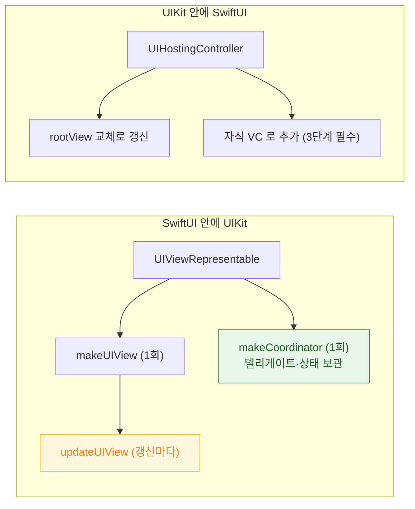

## UIKit 과 SwiftUI 상호 운용은 서로 다른 두 수명 모델을 잇는 일이다

### 개념 (What)

상호 운용의 어려움은 API 가 아니라 **수명 모델이 다르다**는 데 있다.

| | UIKit | SwiftUI |
| :--- | :--- | :--- |
| 뷰 | 오래 사는 **객체** | 매번 새로 만들어지는 **값** |
| 상태 보관 | 객체 프로퍼티 | `@State` (프레임워크가 관리) |
| 갱신 | 명령형 (`label.text = ...`) | 선언형 (값 재평가) |

이 둘을 이으려면 **"값이 매번 새로 만들어져도 살아남는 저장소"** 가 필요하다. 그것이 `Coordinator` 다.

### 두 방향



### SwiftUI 안에 UIKit — `UIViewRepresentable`

```swift
struct SearchBar: UIViewRepresentable {
    @Binding var text: String

    // 1회만 호출 — 뷰 생성
    func makeUIView(context: Context) -> UISearchBar {
        let bar = UISearchBar()
        bar.delegate = context.coordinator     // 델리게이트는 Coordinator 가 받는다
        return bar
    }

    // SwiftUI 가 갱신될 때마다 호출 — 매번 불린다는 전제로 작성한다
    func updateUIView(_ bar: UISearchBar, context: Context) {
        if bar.text != text { bar.text = text }   // ★ 같으면 쓰지 않는다 (루프 방지)
    }

    // 값이 새로 만들어져도 살아남는 저장소
    func makeCoordinator() -> Coordinator { Coordinator(text: $text) }

    final class Coordinator: NSObject, UISearchBarDelegate {
        private let text: Binding<String>
        init(text: Binding<String>) { self.text = text }
        func searchBar(_ b: UISearchBar, textDidChange s: String) { text.wrappedValue = s }
    }
}
```

**두 가지 함정**

1. **`updateUIView` 는 자주 호출된다.** 값이 실제로 달라졌을 때만 쓰지 않으면 → 쓰기 → SwiftUI 갱신 → `updateUIView` → 쓰기의 **무한 루프**가 된다. 위 코드의 `if bar.text != text` 가 그 방어다.
2. **델리게이트를 `self` 로 두면 안 된다.** `UIViewRepresentable` 은 struct 값이라 곧 사라진다. 반드시 `Coordinator` 가 받는다.

### UIKit 안에 SwiftUI — `UIHostingController`

```swift
let host = UIHostingController(rootView: ProfileView(user: user))

// ★ 자식 컨트롤러 3단계를 반드시 지킨다
addChild(host)
view.addSubview(host.view)
host.view.translatesAutoresizingMaskIntoConstraints = false
NSLayoutConstraint.activate([ /* ... */ ])
host.didMove(toParent: self)

// 갱신은 rootView 교체
host.rootView = ProfileView(user: updatedUser)
```

[3단계를 빠뜨리면](viewcontroller-lifecycle-is-driven-by-view-loading.md) SwiftUI 뷰가 생명주기 이벤트를 받지 못해 `.task` 나 `.onAppear` 가 동작하지 않는다.

**크기 문제**: `UIHostingController` 의 뷰는 SwiftUI 의 [레이아웃 협상](../swiftui/layout-is-a-three-step-negotiation.md) 결과를 따른다. UIKit 제약과 충돌하면 `sizingOptions`(iOS 16+)로 조율한다.

```swift
host.sizingOptions = [.intrinsicContentSize]   // SwiftUI 콘텐츠 크기를 intrinsic 으로 노출
```

### 셀 안의 SwiftUI

```swift
// iOS 16+: 리스트 셀 안에 SwiftUI 를 넣는 공식 경로
cell.contentConfiguration = UIHostingConfiguration {
    ProfileRow(user: user)
}
```

이 방식은 [셀 재사용](cell-reuse-requires-full-state-reset.md)과도 잘 맞는다. 설정을 통째로 교체하므로 잔여 상태가 남지 않는다.

### 무엇을 어디에 둘 것인가

| 상황 | 선택 |
| :--- | :--- |
| 신규 화면 | SwiftUI |
| SwiftUI 에 없는 UIKit 기능 (특정 카메라 UI 등) | `UIViewRepresentable` 로 감싸기 |
| 기존 UIKit 앱에 새 화면 추가 | `UIHostingController` |
| 복잡한 컬렉션 레이아웃 | UIKit `UICollectionViewCompositionalLayout` + `UIHostingConfiguration` |

### 관찰 가능한 증거

```swift
func updateUIView(_ v: UISearchBar, context: Context) {
    print("updateUIView 호출")    // 예상보다 자주 찍히면 의존성이 넓다
}
```

호출이 과도하면 [SwiftUI 쪽 의존성 범위](../swiftui/attributegraph-tracks-dependency-not-diff.md)를 좁힌다. **Debug > View Debugging > Capture View Hierarchy** 로 SwiftUI 와 UIKit 뷰가 실제로 어떻게 중첩되었는지 확인할 수 있다.

### 연관 문서

- [ViewController 생명주기는 view 프로퍼티의 지연 로딩이 시작점이다](viewcontroller-lifecycle-is-driven-by-view-loading.md)
- [셀 재사용은 이전 상태를 그대로 물려주므로 모든 상태를 명시적으로 되돌려야 한다](cell-reuse-requires-full-state-reset.md)
- [SwiftUI 의 View 는 화면 객체가 아니라 화면을 서술한 값이다](../swiftui/view-is-a-value-not-an-object.md)
- [AttributeGraph 는 diff 가 아니라 의존성 그래프로 무효화 범위를 정한다](../swiftui/attributegraph-tracks-dependency-not-diff.md)

공식 문서: [UIViewRepresentable](https://developer.apple.com/documentation/swiftui/uiviewrepresentable) · [UIHostingController](https://developer.apple.com/documentation/swiftui/uihostingcontroller)
