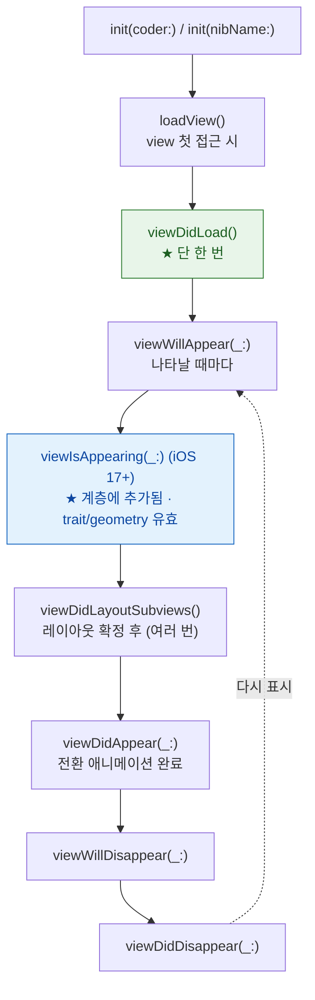

## ViewController 생명주기는 view 프로퍼티의 지연 로딩이 시작점이다

### 개념 (What)

`UIViewController.view` 는 **lazy 프로퍼티**다. 처음 접근하는 순간 `loadView()` 가 호출되어 뷰가 만들어지고, 그 직후 `viewDidLoad()` 가 불린다.

이 사실이 생명주기 전체의 출발점이다. **`viewDidLoad` 는 "컨트롤러가 만들어질 때"가 아니라 "뷰가 처음 필요해질 때"** 호출된다.

```swift
let vc = DetailViewController()   // 아직 viewDidLoad 안 불림
_ = vc.view                       // ← 여기서 loadView + viewDidLoad
```

### 왜 필요한가 (Why)

1. **`init` 에서 `self.view` 를 만지면 안 되는 이유**: 뷰 로딩이 앞당겨져 초기화 순서가 꼬인다. 주입받아야 할 의존성이 아직 없는 상태에서 `viewDidLoad` 가 실행될 수 있다.
2. **호출 횟수가 다르다**: `viewDidLoad` 는 **한 번**, `viewWillAppear`/`viewDidAppear` 는 **여러 번**이다. 한 번만 해야 할 일과 나타날 때마다 해야 할 일을 구분해야 한다.
3. **기하 정보의 유효 시점이 따로 있다**: `viewWillAppear` 시점의 `view.bounds` 는 최종값이 아닐 수 있다.

### 호출 순서와 각 단계의 계약



| 단계 | 여기서 할 일 | 하면 안 되는 일 |
| :--- | :--- | :--- |
| `viewDidLoad` | 한 번만 하는 설정, 서브뷰 추가, 옵서버 등록 | 크기에 의존하는 계산 (**bounds 가 최종값 아님**) |
| `viewWillAppear` | 데이터 새로고침, 상태바 스타일 | 무거운 작업 (전환이 끊긴다) |
| **`viewIsAppearing`** | **크기·trait 에 의존하는 갱신, 스크롤 위치 복원** | — |
| `viewDidLayoutSubviews` | 최종 프레임 기반 조정 | 프레임을 다시 바꿔 순환 유발 |
| `viewDidAppear` | 애니메이션 시작, 분석 이벤트 | 화면 표시를 막는 동기 작업 |
| `viewWillDisappear` | 편집 내용 저장, 키보드 내리기 | — |

### `viewIsAppearing` 이 해결한 문제 (iOS 17+)

기존에는 "뷰가 계층에 붙었고 크기가 확정된" 시점을 잡기가 애매했다.

```swift
// ❌ 기존 회피책 — viewWillAppear 에서는 bounds 가 부정확할 수 있고,
//    viewDidAppear 는 이미 사용자에게 보인 뒤라 깜빡임이 생긴다
override func viewWillAppear(_ animated: Bool) {
    super.viewWillAppear(animated)
    collectionView.scrollToItem(at: indexPath, at: .centeredVertically, animated: false)
}

// ✅ iOS 17+ — 계층에 붙었고 trait/geometry 가 유효하며 아직 보이기 전
override func viewIsAppearing(_ animated: Bool) {
    super.viewIsAppearing(animated)
    collectionView.scrollToItem(at: indexPath, at: .centeredVertically, animated: false)
}
```

**스크롤 위치 복원, 초기 선택 상태, 크기 기반 초기 배치**는 여기가 맞는 자리다.

### 컨테이너에 자식을 붙일 때의 계약

자식 컨트롤러를 추가할 때 세 단계를 빠뜨리면 자식이 생명주기 이벤트를 받지 못한다.

```swift
addChild(child)                       // 1. 부모-자식 관계 수립
view.addSubview(child.view)           // 2. 뷰 계층 추가
child.didMove(toParent: self)         // 3. 완료 통보

// 제거는 역순
child.willMove(toParent: nil)
child.view.removeFromSuperview()
child.removeFromParent()
```

이걸 빠뜨리면 자식의 `viewWillAppear` 가 호출되지 않아 "화면은 보이는데 데이터가 갱신되지 않는" 증상이 난다.

### 관찰 가능한 증거

```swift
// 각 단계에서 bounds 가 언제 확정되는지 직접 확인해 본다
override func viewDidLoad()            { super.viewDidLoad();            print("didLoad",   view.bounds) }
override func viewWillAppear(_ a: Bool){ super.viewWillAppear(a);        print("willAppear", view.bounds) }
override func viewIsAppearing(_ a: Bool){ super.viewIsAppearing(a);      print("isAppearing",view.bounds) }
override func viewDidLayoutSubviews()  { super.viewDidLayoutSubviews();  print("didLayout",  view.bounds) }
```

**Debug > View Debugging > Capture View Hierarchy** 로 자식 컨트롤러가 실제로 계층에 붙었는지 확인한다.

### 연관 문서

- [레이아웃은 지연되고 합쳐진다](layout-cycle-is-deferred-and-coalesced.md)
- [SpringBoard 와 FrontBoard 가 앱의 전경·배경 전이를 소유한다](../../01_system_internals/ipc-and-process/springboard-frontboard-lifecycle.md)
- [UIKit 과 SwiftUI 상호 운용은 두 개의 수명을 잇는다](uikit-swiftui-interop-bridges-two-lifetimes.md)

공식 문서: [UIViewController](https://developer.apple.com/documentation/uikit/uiviewcontroller) · [WWDC 2023: What's new in UIKit](https://developer.apple.com/videos/play/wwdc2023/10055/)
