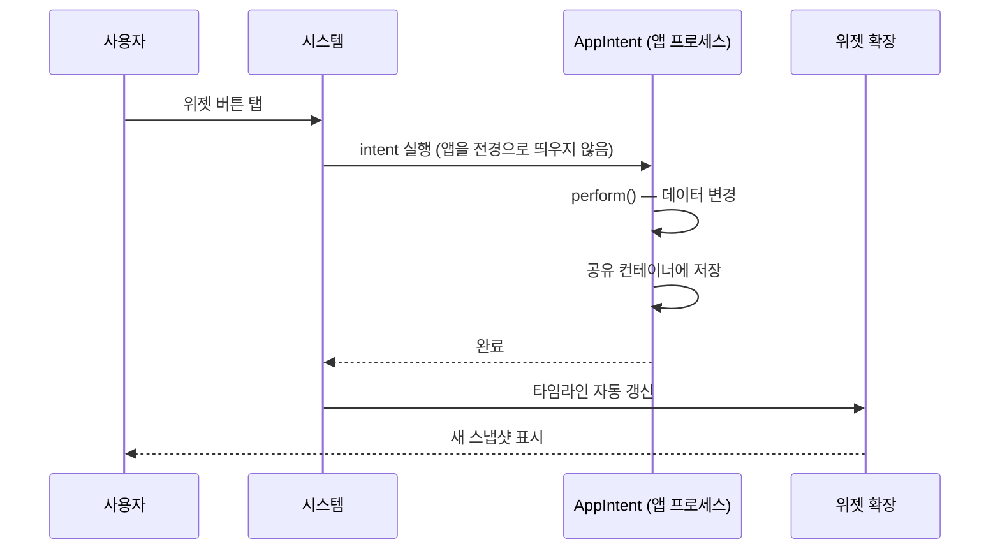

## 상호작용 위젯은 클로저가 아니라 AppIntent 를 실행한다

### 개념 (What)

iOS 17 부터 위젯 안의 버튼과 토글이 동작한다. 그런데 [위젯은 렌더링 후 프로세스가 종료된](widget-is-a-snapshot-not-a-live-view.md) 정지 이미지다. **탭을 받을 프로세스가 없는데 어떻게 동작하는가?**

답은 **클로저를 실행하지 않는다**는 것이다. 버튼은 실행할 **`AppIntent` 타입**을 선언하고, 탭이 발생하면 시스템이 그 intent 를 별도로 실행한다.

```swift
// ❌ 일반 SwiftUI 처럼 클로저를 넘길 수 없다
Button("완료") { markDone() }          // 위젯에서는 동작하지 않는다

// ✅ 실행할 intent 를 선언한다
Button(intent: MarkDoneIntent(itemID: item.id)) {
    Label("완료", systemImage: "checkmark")
}

Toggle(isOn: item.isOn, intent: ToggleItemIntent(itemID: item.id)) {
    Text(item.title)
}
```

### 왜 필요한가 (Why)

1. **프로세스 경계를 넘어야 한다**: 탭 시점에 위젯 프로세스는 없다. 실행 가능한 **직렬화된 명령**이 필요하다.
2. **앱을 열지 않고 처리한다**: intent 가 백그라운드에서 실행되므로 앱이 전경으로 나오지 않는다.
3. **재사용된다**: 같은 intent 를 Siri·단축어·Action 버튼에서도 쓸 수 있다.



### AppIntent 구현

```swift
struct MarkDoneIntent: AppIntent {
    static var title: LocalizedStringResource = "항목 완료"

    @Parameter(title: "항목 ID")
    var itemID: String

    init() {}
    init(itemID: String) { self.itemID = itemID }

    func perform() async throws -> some IntentResult {
        // ★ 앱이 실행 중이 아닐 수 있다. 전역 상태를 가정하지 않는다.
        var items = SharedStore.load()
        items.markDone(id: itemID)
        SharedStore.save(items)
        return .result()
    }
}
```

**핵심 주의점**: `perform()` 은 앱 프로세스에서 실행되지만 **앱이 방금 깨어난 상태일 수 있다.** 초기화된 싱글턴이나 메모리 캐시를 전제하면 실패한다. → [App Intents](../../04_system_services/apple-app-intents.md)

### 갱신은 자동이다

intent 실행이 끝나면 **시스템이 타임라인을 자동으로 다시 요청**한다. `reloadTimelines` 를 직접 부를 필요가 없다.

낙관적 UI 를 원하면 `AppIntentTimelineProvider` 를 쓴다.

```swift
struct Provider: AppIntentTimelineProvider {
    func timeline(for configuration: ConfigIntent, in context: Context) async -> Timeline<Entry> {
        // 사용자 설정(configuration)과 최신 데이터를 함께 반영
        Timeline(entries: [Entry(date: .now, content: load(configuration))], policy: .atEnd)
    }
}
```

### 제약

| 제약 | 내용 |
| :--- | :--- |
| 지원 뷰 | `Button`, `Toggle` (텍스트필드·슬라이더 등은 불가) |
| 실행 시간 | 매우 짧다. 오래 걸리면 중단된다 |
| 앱 열기 | `openAppWhenRun = true` 로 명시하면 앱을 띄운다 |
| 시각 피드백 | 시스템이 처리. 커스텀 애니메이션 불가 |
| watchOS/Live Activity | 동일 메커니즘 사용 가능 |

### 흔한 실수

```swift
// ❌ perform 에서 오래 걸리는 네트워크 → 중단된다
func perform() async throws -> some IntentResult {
    let result = try await slowAPI.upload()     // 위험
    return .result()
}

// ✅ 로컬 상태만 즉시 바꾸고, 동기화는 백그라운드 작업에 맡긴다
func perform() async throws -> some IntentResult {
    SharedStore.markPendingSync(itemID)
    BGTaskScheduler.shared.submitSyncTask()
    return .result()
}
```

### 관찰 가능한 증거

```bash
log stream --device --predicate 'subsystem == "com.apple.AppIntents"' --info
```

```swift
func perform() async throws -> some IntentResult {
    print("intent 실행 \(Date()) itemID=\(itemID)")
    ...
}
```

Xcode 에서 **앱 스킴**으로 실행한 뒤 위젯 버튼을 누르면 `perform()` 에 브레이크포인트가 걸린다(intent 는 앱 프로세스에서 실행되므로).

### 연관 문서

- [위젯은 살아 있는 뷰가 아니라 미리 렌더링된 스냅샷이다](widget-is-a-snapshot-not-a-live-view.md)
- [TimelineProvider 는 미래 상태를 미리 선언한다](timeline-provider-declares-future-states.md)
- [apple-app-intents](../../04_system_services/apple-app-intents.md)

공식 문서: [Adding interactivity to widgets and Live Activities](https://developer.apple.com/documentation/widgetkit/adding-interactivity-to-widgets-and-live-activities)
