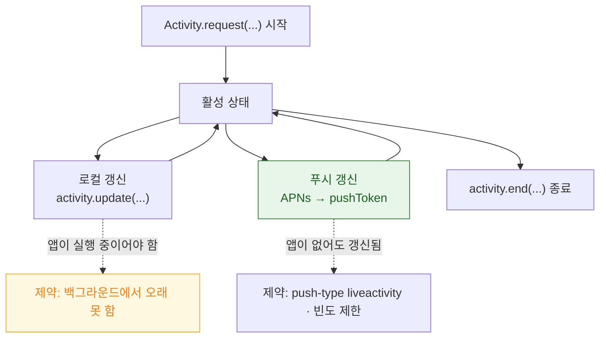

## Live Activity 는 로컬과 푸시 두 경로로 갱신되며 각각 제약이 다르다

### 개념 (What)

Live Activity 는 **진행 중인 하나의 이벤트**(배달, 경기, 타이머)를 잠금 화면과 Dynamic Island 에 실시간으로 보여준다. 일반 위젯과 결정적으로 다른 점은 **명확한 시작과 끝이 있고, 그 사이에 자주 갱신된다**는 것이다.

상태는 두 부분으로 나뉜다.

| | 변하는가 | 예 |
| :--- | :--- | :--- |
| **`attributes`** | 시작 시 고정 | 주문 번호, 매장 이름 |
| **`ContentState`** | 갱신마다 변경 | 배달 상태, 남은 시간, 진행률 |

```swift
struct DeliveryAttributes: ActivityAttributes {
    // 고정
    let orderNumber: String
    let storeName: String

    // 변하는 부분
    struct ContentState: Codable, Hashable {
        var status: DeliveryStatus
        var estimatedArrival: Date
    }
}
```

### 두 갱신 경로



**로컬 갱신** — 앱이 실행 중일 때만 실용적이다.

```swift
let content = ActivityContent(state: newState, staleDate: .now + 600)
await activity.update(content)
```

**푸시 갱신** — 앱이 종료되어 있어도 동작한다. 실제 서비스에서는 이쪽이 주 경로다.

```swift
// 1) 시작할 때 푸시 토큰을 받는다
let activity = try Activity.request(
    attributes: attributes,
    content: .init(state: initialState, staleDate: nil),
    pushType: .token                     // ★ 푸시 갱신을 쓰겠다는 선언
)

// 2) 토큰을 서버로 보낸다 (토큰은 갱신될 수 있으므로 계속 관찰)
for await tokenData in activity.pushTokenUpdates {
    let token = tokenData.map { String(format: "%02x", $0) }.joined()
    await sendToServer(activityID: activity.id, token: token)
}
```

서버는 일반 알림과 **다른 헤더**로 보낸다.

```bash
curl --http2 \
  --header "apns-topic: com.example.app.push-type.liveactivity" \
  --header "apns-push-type: liveactivity" \
  --header "apns-priority: 10" \
  --data '{"aps":{"timestamp":1735000000,"event":"update",
           "content-state":{"status":"delivering","estimatedArrival":1735003600}}}' \
  https://api.push.apple.com/3/device/$ACTIVITY_TOKEN
```

`apns-topic` 에 **`.push-type.liveactivity` 접미사**가 붙는 것이 핵심이다. 일반 푸시 토픽과 다르다.

### 반드시 처리해야 하는 것

| 항목 | 처리하지 않으면 |
| :--- | :--- |
| **`staleDate`** | 데이터가 낡아도 그대로 표시됨 |
| **`dismissalPolicy`** | 종료 후에도 잠금 화면에 오래 남음 |
| **토큰 갱신 관찰** | 중간에 토큰이 바뀌면 갱신이 끊김 |
| **사용자가 끈 경우** | `ActivityAuthorizationInfo().areActivitiesEnabled` 확인 |

```swift
// 종료 시 언제 사라질지 지정
await activity.end(
    ActivityContent(state: finalState, staleDate: nil),
    dismissalPolicy: .after(.now + 300)     // 5분 뒤 자동 제거
)
```

### 제약

- **동시 활성 개수 제한**이 있다. 하나의 이벤트에 하나만 만든다.
- **최대 지속 시간**이 있다. 무한히 유지되지 않으며 시스템이 종료한다.
- **`ContentState` 크기 제한**이 있다. 큰 데이터를 넣지 말고 식별자만 넣는다.
- 사용자가 설정에서 앱별로 **끌 수 있다.**

### 관찰 가능한 증거

```swift
// 활성 Activity 와 상태 관찰
for await state in activity.activityStateUpdates {
    print("Live Activity 상태: \(state)")   // active / dismissed / ended / stale
}
print(ActivityAuthorizationInfo().areActivitiesEnabled)
```

```bash
log stream --device --predicate 'subsystem == "com.apple.ActivityKit"' --info
```

**시뮬레이터에서 Dynamic Island 테스트**: iPhone 15 Pro 이상 시뮬레이터를 쓰고, 푸시는 `.apns` 파일을 시뮬레이터에 드래그해 확인한다.

### 연관 문서

- [갱신 예산은 시스템이 정하며 요청은 보장이 아니다](widget-refresh-budget-is-system-controlled.md)
- [상호작용 위젯은 AppIntent 로 동작한다](interactive-widgets-run-app-intents.md)
- [apple-push-notifications-apns](../../04_system_services/apple-push-notifications-apns.md)
- [04-apns-to-notification-display-and-tap](../../00_foundations/worked-examples/04-apns-to-notification-display-and-tap.md)

공식 문서: [ActivityKit](https://developer.apple.com/documentation/activitykit) · [Starting and updating Live Activities with ActivityKit push notifications](https://developer.apple.com/documentation/activitykit/starting-and-updating-live-activities-with-activitykit-push-notifications)
