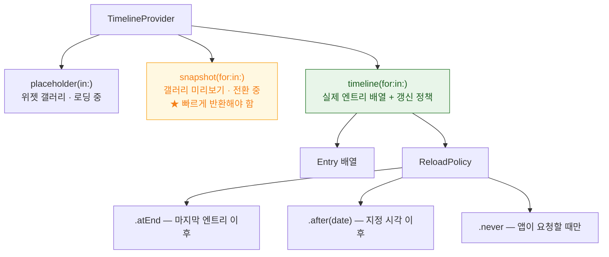

## TimelineProvider 는 현재가 아니라 미래 시점들의 상태를 미리 선언한다

### 개념 (What)

위젯 데이터를 "지금 값"으로 주는 것이 아니다. **"몇 시에는 이 내용, 몇 시에는 저 내용"** 이라는 **미래 엔트리의 배열**을 한 번에 넘긴다.

시스템은 그 배열을 받아 각 시각에 맞춰 스냅샷을 준비해 둔다. 그래서 [프로세스를 띄우지 않고도](widget-is-a-snapshot-not-a-live-view.md) 시간에 따라 내용이 바뀔 수 있다.

```swift
func timeline(for configuration: Intent, in context: Context) async -> Timeline<Entry> {
    let now = Date()
    // 앞으로 5시간 동안 1시간 간격으로 무엇을 보여줄지 미리 선언
    let entries = (0..<5).map { hour in
        Entry(date: Calendar.current.date(byAdding: .hour, value: hour, to: now)!,
              content: predictedContent(at: hour))
    }
    return Timeline(entries: entries, policy: .after(now.addingTimeInterval(5 * 3600)))
}
```

### 왜 필요한가 (Why)

1. **예측 가능한 변화는 프로세스 없이 처리된다**: 캘린더 일정, 카운트다운, 정해진 스케줄은 미리 다 선언하면 갱신 요청이 필요 없다.
2. **[갱신 예산](widget-refresh-budget-is-system-controlled.md)을 아낀다**: 엔트리를 많이 선언할수록 프로세스를 덜 띄운다.
3. **"지금 값"만 주면 위젯이 금방 낡는다**: 다음 갱신까지 그 값이 그대로 남는다.

### 세 개의 메서드



| 메서드 | 언제 | 주의 |
| :--- | :--- | :--- |
| `placeholder` | 갤러리·로딩 중 | **네트워크 금지.** 즉시 반환할 더미 |
| `snapshot` | 갤러리 미리보기 | `context.isPreview` 면 더 빠르게 |
| `timeline` | 실제 표시 | 여기서만 실제 데이터를 읽는다 |

```swift
func snapshot(for configuration: Intent, in context: Context) async -> Entry {
    if context.isPreview {
        return Entry(date: .now, content: .sample)   // 갤러리용 즉시 반환
    }
    return Entry(date: .now, content: loadFromSharedContainer())
}
```

### 갱신 정책 고르기

| 상황 | 정책 |
| :--- | :--- |
| 시간에 따라 예측 가능하게 변함 (일정, 카운트다운) | 엔트리를 여러 개 + `.atEnd` |
| 주기적으로 새 데이터가 필요 | `.after(date)` |
| 앱이 데이터를 바꿀 때만 변함 | `.never` + 앱에서 `reloadTimelines` |
| 푸시로 갱신 | `.never` + 서버 푸시 → 앱이 reload |

**`.never` + 앱 주도**가 가장 예산 효율이 좋다. 시스템이 헛되이 프로세스를 띄우지 않는다.

### 관련성 점수 (Smart Stack)

스택에서 어떤 위젯을 위로 올릴지 시스템이 판단할 때 쓰는 힌트다.

```swift
Timeline(entries: entries, policy: .atEnd)
// 엔트리에 relevance 를 주면 스마트 스택 회전에 반영된다
Entry(date: date, content: content, relevance: TimelineEntryRelevance(score: 80))
```

### 흔한 실수

```swift
// ❌ 엔트리를 하나만 주고 자주 reload 를 요청 → 예산 소진
return Timeline(entries: [Entry(date: .now, content: c)], policy: .after(.now + 60))

// ✅ 예측 가능한 구간을 미리 채운다 → 프로세스를 덜 띄운다
return Timeline(entries: nextSixHoursEntries, policy: .atEnd)
```

```swift
// ❌ timeline 안에서 오래 걸리는 네트워크 → 확장이 시간 초과로 죽는다
let data = try await slowAPI.fetch()

// ✅ 앱이 미리 저장해 둔 것을 읽는다
let data = loadFromSharedContainer()
```

### 관찰 가능한 증거

```swift
func timeline(for configuration: Intent, in context: Context) async -> Timeline<Entry> {
    print("timeline 요청 \(Date()) family=\(context.family) preview=\(context.isPreview)")
    ...
}
```

```bash
log stream --device --predicate 'subsystem == "com.apple.chronod"' --info
```

로그에서 `timeline` 호출 빈도를 보면 [예산이 실제로 어떻게 배분되는지](widget-refresh-budget-is-system-controlled.md) 확인할 수 있다.

### 연관 문서

- [위젯은 살아 있는 뷰가 아니라 미리 렌더링된 스냅샷이다](widget-is-a-snapshot-not-a-live-view.md)
- [갱신 예산은 시스템이 정하며 요청은 보장이 아니다](widget-refresh-budget-is-system-controlled.md)
- [상호작용 위젯은 AppIntent 로 동작한다](interactive-widgets-run-app-intents.md)

공식 문서: [TimelineProvider](https://developer.apple.com/documentation/widgetkit/timelineprovider) · [Keeping a widget up to date](https://developer.apple.com/documentation/widgetkit/keeping-a-widget-up-to-date)
