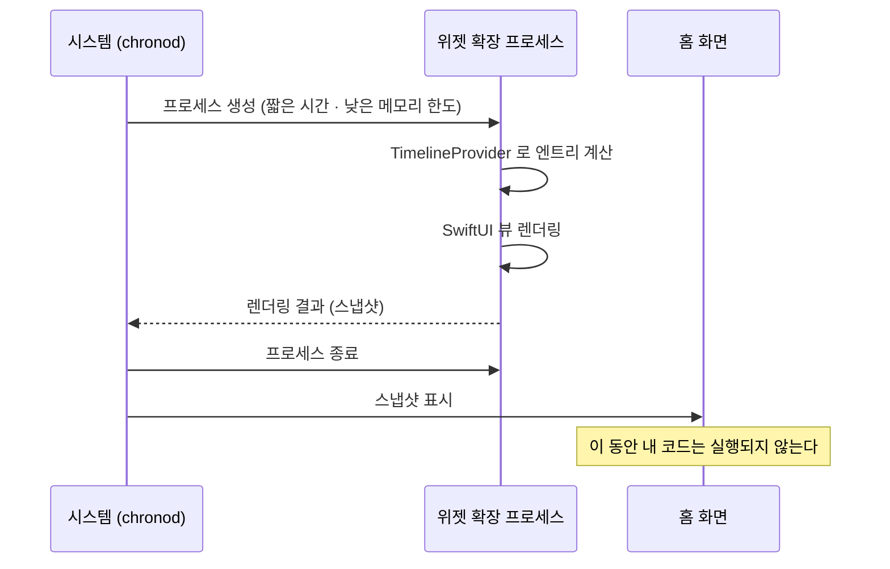

## 위젯은 살아 있는 뷰가 아니라 미리 렌더링된 스냅샷이다

### 개념 (What)

홈 화면의 위젯은 **실행 중인 앱의 화면이 아니다.** 시스템이 미리 위젯 확장 프로세스를 잠깐 띄워 SwiftUI 뷰를 렌더링하고, **그 결과 이미지를 저장해 두었다가 보여준다.** 렌더링이 끝나면 프로세스는 종료된다.

즉 사용자가 위젯을 보고 있는 동안 **내 코드는 전혀 실행되고 있지 않다.**

### 왜 필요한가 (Why)

이 사실 하나가 위젯의 거의 모든 제약을 설명한다.

| 할 수 없는 것 | 이유 |
| :--- | :--- |
| 애니메이션 (일부 전환 제외) | 렌더링 시점의 정지 이미지다 |
| 스크롤·제스처 | 이벤트를 받을 프로세스가 없다 |
| 타이머로 매초 갱신 | 매초 프로세스를 띄울 수 없다 |
| 뷰 안에서 네트워크 요청 | 렌더링 시점에 이미 데이터가 있어야 한다 |
| 상태 보관 | 프로세스가 매번 새로 뜬다 |

**시간 표시만은 예외다.** `Text(date, style: .timer)` 같은 형태는 시스템이 이미지를 다시 만들지 않고 **텍스트만 갱신**해 준다.

```swift
// ✅ 시스템이 갱신해 주는 형태 — 프로세스를 띄우지 않는다
Text(endDate, style: .timer)
Text(endDate, style: .relative)
Text(date, style: .time)

// ❌ 직접 타이머로 갱신하려는 시도 — 동작하지 않는다
Text(currentTime)   // 렌더링 시점 값에 고정된다
```

### 렌더링 흐름



### 데이터는 미리 준비되어 있어야 한다

렌더링 시점에 네트워크를 기다릴 수 없다. 앱이 미리 **공유 컨테이너에 데이터를 써 두고**, 위젯은 그것을 읽기만 한다.

```swift
// 앱 쪽: 데이터를 갱신하면 공유 컨테이너에 쓰고 위젯 갱신을 요청
func didUpdateData(_ items: [Item]) {
    let url = FileManager.default
        .containerURL(forSecurityApplicationGroupIdentifier: "group.com.example.app")!
        .appendingPathComponent("widget-data.json")
    try? JSONEncoder().encode(items).write(to: url)
    WidgetCenter.shared.reloadTimelines(ofKind: "ItemWidget")   // 요청일 뿐 보장 아님
}

// 위젯 쪽: 읽기만 한다
func timeline(for configuration: ConfigurationIntent,
              in context: Context) async -> Timeline<Entry> {
    let items = loadFromSharedContainer()   // 이미 있는 것을 읽는다
    return Timeline(entries: makeEntries(items), policy: .atEnd)
}
```

→ [App Group 공유 컨테이너](../../01_system_internals/storage/app-container-directory-policies.md)

### 메모리 한도가 매우 낮다

위젯 확장은 [별도 프로세스이며 호스트 앱보다 훨씬 낮은 메모리 한도](../../01_system_internals/ipc-and-process/app-extension-process-model.md)를 갖는다. **원본 해상도 이미지를 디코딩하면 즉시 종료**되고, 위젯은 빈 상태나 이전 스냅샷으로 남는다.

```swift
// ❌ 원본 크기 디코딩 — 한도 초과로 확장이 죽는다
Image(uiImage: UIImage(contentsOfFile: path)!)

// ✅ 위젯 표시 크기에 맞춰 미리 다운샘플링한 것을 저장해 두고 읽는다
Image(uiImage: preRenderedThumbnail)
```

> [!WARNING] 한도 수치를 상수로 외우지 않는다
> 널리 인용되는 숫자들이 있지만 공개된 계약값이 아니다. **최저 사양 지원 기기에서 실측**한다.

### 관찰 가능한 증거

```bash
# 위젯 확장 프로세스의 실행/종료
log stream --device --predicate 'process == "runningboardd"' --info | grep -i widget

# 타임라인 갱신 스케줄링
log stream --device --predicate 'subsystem == "com.apple.chronod"' --info
```

**Xcode 에서 위젯 스킴을 선택해 실행**해야 디버거가 붙는다. 앱 스킴으로는 확장 프로세스를 잡을 수 없다.

### 연관 문서

- [TimelineProvider 는 미래 상태를 미리 선언한다](timeline-provider-declares-future-states.md)
- [갱신 예산은 시스템이 정하며 요청은 보장이 아니다](widget-refresh-budget-is-system-controlled.md)
- [앱 확장은 호스트가 수명을 쥔 별도 프로세스다](../../01_system_internals/ipc-and-process/app-extension-process-model.md)

공식 문서: [WidgetKit](https://developer.apple.com/documentation/widgetkit)
