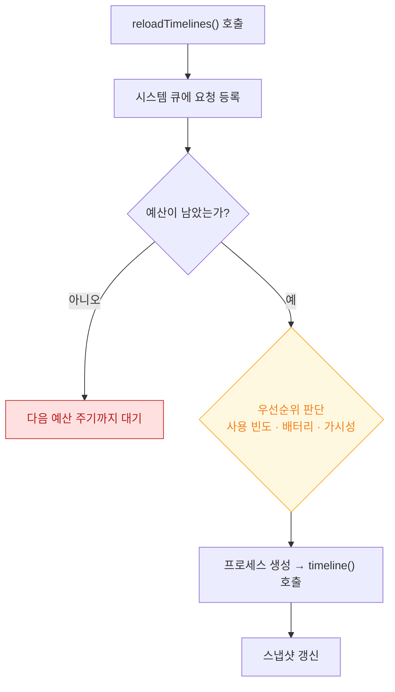

## 갱신 예산은 시스템이 정하며 reloadTimelines 는 요청이지 보장이 아니다

### 개념 (What)

`WidgetCenter.shared.reloadTimelines(ofKind:)` 는 **"갱신해 달라"는 요청**이다. 시스템이 즉시 프로세스를 띄운다는 뜻이 아니다.

시스템은 위젯마다 하루 갱신 예산을 배분하고, 다음을 함께 고려해 실제 시점을 정한다.

- 사용자가 그 위젯을 **얼마나 자주 보는지**
- 배터리 잔량과 저전력 모드
- 기기 전체의 부하
- 위젯이 홈 화면에 실제로 보이는지 (다른 페이지에 있으면 후순위)

### 왜 필요한가 (Why)

"위젯이 갱신되지 않는다"는 문의의 대부분이 버그가 아니라 **예산 정책**이다. 이것을 모르면 `reloadTimelines` 를 더 자주 부르는 방향으로 잘못 대응하게 되고, 그러면 예산이 더 빨리 소진되어 **오히려 갱신이 줄어든다.**



### 예산을 아끼는 네 가지 방법

**1. 엔트리를 미리 여러 개 선언한다** — 가장 효과가 크다

```swift
// ❌ 매번 하나씩 → 갱신 요청이 잦아진다
Timeline(entries: [current], policy: .after(.now + 900))

// ✅ 예측 가능한 구간을 한 번에 → 프로세스를 훨씬 덜 띄운다
Timeline(entries: nextTwelveHours, policy: .atEnd)
```

**2. 시스템이 갱신해 주는 표현을 쓴다**

```swift
Text(endDate, style: .timer)      // 프로세스 없이 매초 갱신된다
Text(endDate, style: .relative)
ProgressView(timerInterval: start...end)
```

카운트다운·경과 시간은 **엔트리를 만들 필요가 없다.**

**3. 실제로 바뀔 때만 요청한다**

```swift
// ❌ 앱이 전경에 올 때마다 무조건
func applicationDidBecomeActive() { WidgetCenter.shared.reloadAllTimelines() }

// ✅ 데이터가 실제로 달라졌을 때만
func didUpdate(_ new: [Item]) {
    guard new != lastPushedToWidget else { return }
    lastPushedToWidget = new
    save(new)
    WidgetCenter.shared.reloadTimelines(ofKind: "ItemWidget")
}
```

**4. 종류를 특정한다**

`reloadAllTimelines()` 는 모든 위젯의 예산을 함께 쓴다. 바뀐 것만 지정한다.

### 푸시로 갱신하기

서버 데이터가 바뀔 때 갱신하려면 [silent push](../../04_system_services/apple-push-notifications-apns.md) 로 앱을 깨워 데이터를 저장하고 reload 를 요청한다. 다만 silent push 역시 시스템이 전달 빈도를 제한한다.

Live Activity 는 별도의 **푸시 갱신 경로**를 갖는다. → [Live Activity 갱신](live-activity-updates-via-push-or-local.md)

### 디버깅 중에는 예산이 다르게 동작한다

Xcode 로 위젯 스킴을 실행하면 갱신이 즉시 일어난다. **실제 사용자 환경과 다르다.** 예산 문제는 다음으로 확인한다.

- Xcode 를 분리하고 실기기에서 하루 정상 사용하며 관찰
- 위젯을 홈 화면 첫 페이지에 두었을 때와 뒤 페이지에 두었을 때 비교
- 저전력 모드에서 비교

### 관찰 가능한 증거

```bash
# 실제 갱신 스케줄링과 예산 판단
log stream --device --predicate 'subsystem == "com.apple.chronod"' --info

# 확장 프로세스가 실제로 떴는지
log stream --device --predicate 'process == "runningboardd"' --info | grep -i widget
```

```swift
// timeline 이 실제로 몇 번 불렸는지 공유 컨테이너에 기록해 두면
// Xcode 없이도 나중에 확인할 수 있다
func timeline(...) async -> Timeline<Entry> {
    appendToSharedLog("timeline \(Date())")
    ...
}
```

### 연관 문서

- [TimelineProvider 는 미래 상태를 미리 선언한다](timeline-provider-declares-future-states.md)
- [위젯은 살아 있는 뷰가 아니라 미리 렌더링된 스냅샷이다](widget-is-a-snapshot-not-a-live-view.md)
- [RunningBoard assertion 이 프로세스의 실행 지속 여부를 결정한다](../../01_system_internals/ipc-and-process/runningboard-assertions.md)
- [05-background-work-not-running](../../00_foundations/diagnostic-runbooks/05-background-work-not-running.md)

공식 문서: [Keeping a widget up to date](https://developer.apple.com/documentation/widgetkit/keeping-a-widget-up-to-date)
