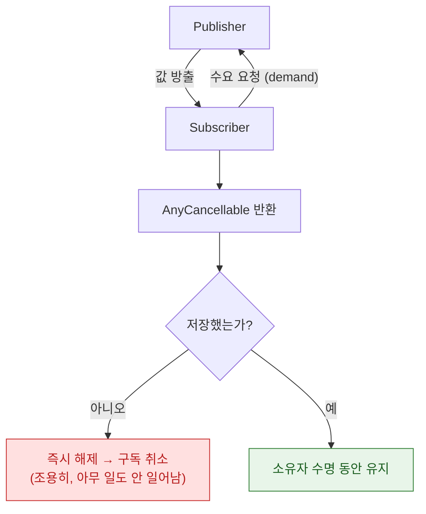

## Combine 은 수요 기반 스트림이며 구독 수명 관리가 무너지면 실패한다

> [!CAUTION] Combine 의 설 자리 축소 (점진적 Legacy 화)
> Combine 은 RxSwift 를 대체하며 등장했지만, Apple 은 **Swift Concurrency(`AsyncSequence`) 와 Observation(`@Observable`)** 으로의 전환을 확고히 하고 있다. SwiftUI 의 상태 관리는 `@Published` 에서 `@Observable` 로, `URLSession` 은 `.dataTaskPublisher` 대신 `async/await` 로 이관되었다. **복잡한 다중 이벤트 병합이 필수인 스트림 처리 외에는** 새 코드에서 `AsyncSequence` 를 우선 검토한다.

Combine 을 이해하는 데 필요한 것은 두 축이다. **Publisher/Subscriber 가 수요(demand)로 통신한다**는 것과, **구독은 `AnyCancellable` 이 살아 있는 동안만 유효하다**는 것. 실무 버그의 대부분이 이 두 축 중 하나를 놓쳐서 생긴다.



### 정본 노트

- [Combine 의 backpressure 는 구독자가 수요를 요청하는 방식이고 sink 는 이를 사실상 끈다](combine/backpressure-is-demand-the-subscriber-requests.md) — `sink` 가 `.unlimited` 를 요청하는 이유, `buffer` 로 완화하기.
- [AnyCancellable 을 보관하지 않으면 구독이 즉시 해제되어 아무 일도 일어나지 않는다](combine/anycancellable-lifetime-gates-the-pipeline.md) — **가장 흔하고 가장 조용한 버그**, 순환 참조 패턴.
- [merge·zip·combineLatest·switchToLatest 는 각각 다른 병합 규칙을 구현한다](combine/flatmap-family-implements-different-merge-strategies.md) — 폼 검증·검색 자동완성의 표준 패턴, 선택 흐름도.
- [AsyncSequence 는 Combine 의 스트림 역할을 언어 기본 기능으로 대체한다](combine/migrating-to-asyncsequence-changes-the-cancellation-model.md) — 대응표, 여전히 Combine 이 나은 경우.

### 증상에서 시작하기

| 증상 | 어느 노트로 |
| :--- | :--- |
| sink 콜백이 한 번도 안 불린다 | [AnyCancellable 수명](combine/anycancellable-lifetime-gates-the-pipeline.md) |
| ViewModel 이 deinit 되지 않는다 | [AnyCancellable 수명](combine/anycancellable-lifetime-gates-the-pipeline.md) (순환 참조) |
| 메모리가 계속 쌓인다 | [backpressure](combine/backpressure-is-demand-the-subscriber-requests.md) |
| 두 필드 중 하나만 바뀌면 갱신이 안 된다 | [연산자 선택](combine/flatmap-family-implements-different-merge-strategies.md) (`zip` 대신 `combineLatest`) |
| 검색 요청이 취소 안 되고 쌓인다 | [연산자 선택](combine/flatmap-family-implements-different-merge-strategies.md) (`switchToLatest`) |
| 새 코드를 뭘로 시작할지 모르겠다 | [AsyncSequence 마이그레이션](combine/migrating-to-asyncsequence-changes-the-cancellation-model.md) |

### 디버깅

```swift
publisher
    .print("🔵 pipeline")             // 모든 이벤트를 콘솔에
    .handleEvents(
        receiveSubscription: { print("구독: \($0)") },
        receiveOutput:       { print("값: \($0)") },
        receiveCompletion:   { print("완료: \($0)") },
        receiveCancel:       { print("취소") }
    )
    .sink { ... }
```

**Instruments의 Leaks** 와 [Memory Graph](../06_testing_performance/debugging/view-debugger-and-memory-graph-answer-different-questions.md)가 구독 관련 순환 참조를 잡는 주 도구다.

### 연관 문서

- [apple-swift-concurrency](../01_language_concurrency/apple-swift-concurrency.md) - 단발성 비동기 작업의 대안 축
- [apple-observation-framework](../01_language_concurrency/apple-observation-framework.md) - Combine 의 ViewModel 역할을 대체하는 @Observable
- [apple-uikit-lifecycle](../02_ui_frameworks/apple-uikit-lifecycle.md) - MVVM 패턴과의 결합

공식 문서: [Combine](https://developer.apple.com/documentation/combine) · [WWDC 2019: Introducing Combine](https://developer.apple.com/videos/play/wwdc2019/722/)
