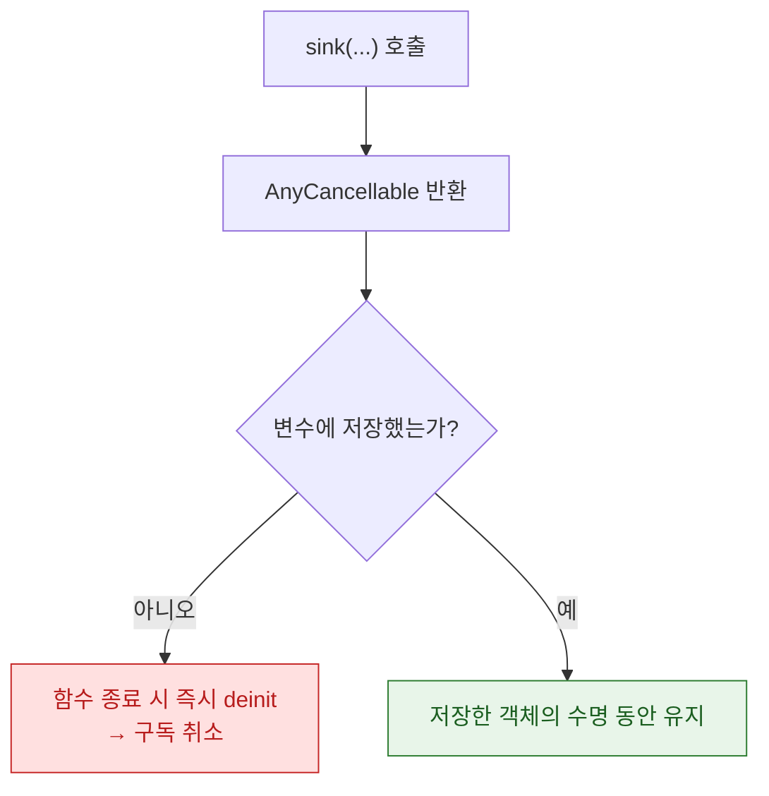

## AnyCancellable 을 보관하지 않으면 구독이 즉시 해제되어 아무 일도 일어나지 않는다

### 개념 (What)

Combine 파이프라인은 `Subscription` 객체가 **살아 있는 동안만** 동작한다. `sink` 나 `assign` 이 반환하는 `AnyCancellable` 을 어딘가에 저장하지 않으면, 그 인스턴스는 **함수가 끝나는 즉시 해제**되고 구독도 함께 취소된다.

```swift
// ❌ 반환값을 버림 — 구독이 즉시 취소된다
func setup() {
    publisher.sink { print($0) }   // 이 줄이 끝나면 AnyCancellable 이 즉시 deinit
}
// 크래시도, 에러도, 경고도 없다. 그냥 아무 일도 일어나지 않는다.

// ✅ 어딘가에 저장해 수명을 연장한다
var cancellables = Set<AnyCancellable>()
func setup() {
    publisher.sink { print($0) }.store(in: &cancellables)
}
```

### 왜 필요한가 (Why)

**이것이 Combine 에서 가장 흔하고 가장 조용한 버그다.** 컴파일도 되고 크래시도 안 나서, "왜 콜백이 한 번도 안 불리지?"를 한참 디버깅하게 만든다.



### 소유자에 따라 저장 위치가 다르다

```swift
final class ProfileViewModel: ObservableObject {
    private var cancellables = Set<AnyCancellable>()   // ViewModel 이 소유

    func bind() {
        $searchText
            .debounce(for: .milliseconds(300), scheduler: RunLoop.main)
            .sink { [weak self] text in self?.search(text) }
            .store(in: &cancellables)
    }
    // ViewModel 이 deinit 되면 cancellables 도 함께 해제 → 자동 구독 취소
}
```

`Set<AnyCancellable>` 이 담긴 소유자가 사라지면 **모든 구독이 자동으로 정리**된다. 별도 `deinit` 코드 없이도 누수가 안 나는 이유다.

### 두 번째 흔한 버그 — 순환 참조

```swift
// ❌ self 를 강하게 캡처 — ViewModel 이 자기 자신의 구독에 붙잡혀 절대 해제되지 않는다
publisher.sink { self.handle($0) }.store(in: &cancellables)

// ✅ weak 캡처
publisher.sink { [weak self] value in self?.handle(value) }.store(in: &cancellables)
```

`cancellables` 는 ViewModel 안에 있고, 클로저가 `self` 를 강하게 잡으면 **ViewModel → cancellables → AnyCancellable → 클로저 → self** 로 순환이 생긴다. [Memory Graph Debugger](../../06_testing_performance/debugging/view-debugger-and-memory-graph-answer-different-questions.md)의 흔한 순환 참조 네 가지 중 하나가 바로 이 패턴이다.

### 단발성 구독은 개별 변수도 가능하다

```swift
private var loadCancellable: AnyCancellable?

func load() {
    loadCancellable = publisher.sink { [weak self] in self?.handle($0) }
}
// 새로 load() 를 호출하면 이전 구독은 자동으로 취소된다 (덮어쓰기)
```

**새 값을 대입하면 이전 `AnyCancellable` 이 해제되며 구독이 취소된다.** 검색 디바운스처럼 "이전 요청을 취소하고 새로 시작"하는 패턴에 유용하다. 다만 여러 구독을 동시에 유지해야 한다면 `Set` 이 맞다.

### 관찰 가능한 증거

```swift
// deinit 로그로 실제 해제 시점 확인
final class ProfileViewModel: ObservableObject {
    private var cancellables = Set<AnyCancellable>()
    deinit { print("ViewModel 해제, 구독 \(cancellables.count)개 함께 정리") }
}
```

**Debug Memory Graph** 필터에 `AnyCancellable` 을 입력하면 해제되지 않은 구독 인스턴스와 그것을 붙잡고 있는 참조 체인이 보인다. `[weak self]` 누락을 찾는 가장 빠른 방법이다.

### 연관 문서

- [Combine 의 backpressure 는 구독자가 수요를 요청하는 방식이다](backpressure-is-demand-the-subscriber-requests.md)
- [View Debugger 는 배치를, Memory Graph 는 참조를 보여준다](../../06_testing_performance/debugging/view-debugger-and-memory-graph-answer-different-questions.md)
- [소유 관계에 따라 property wrapper 를 고른다](../../02_ui_frameworks/swiftui/state-ownership-property-wrappers.md)

공식 문서: [AnyCancellable](https://developer.apple.com/documentation/combine/anycancellable)
