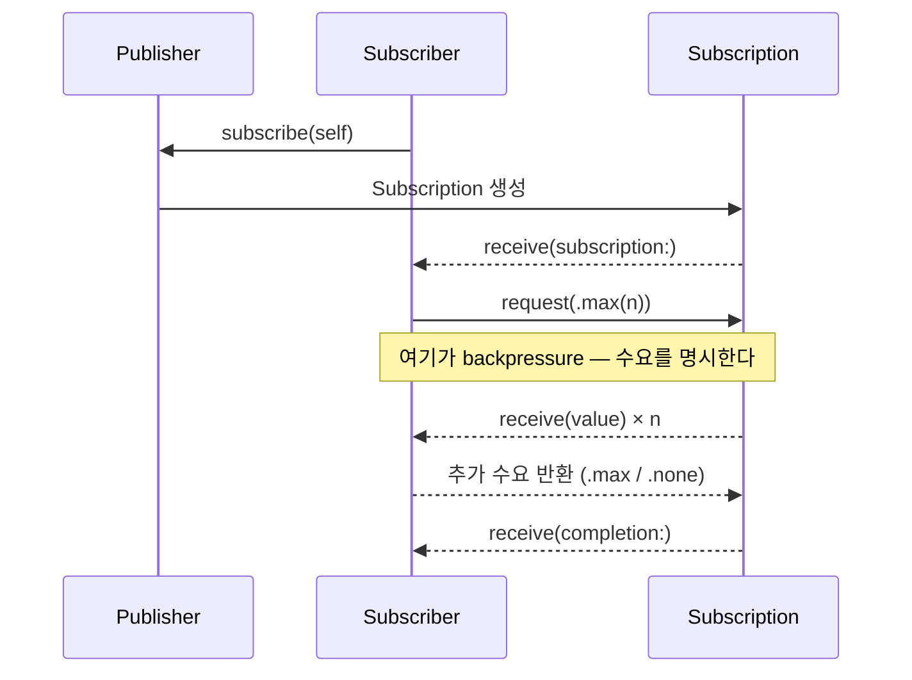
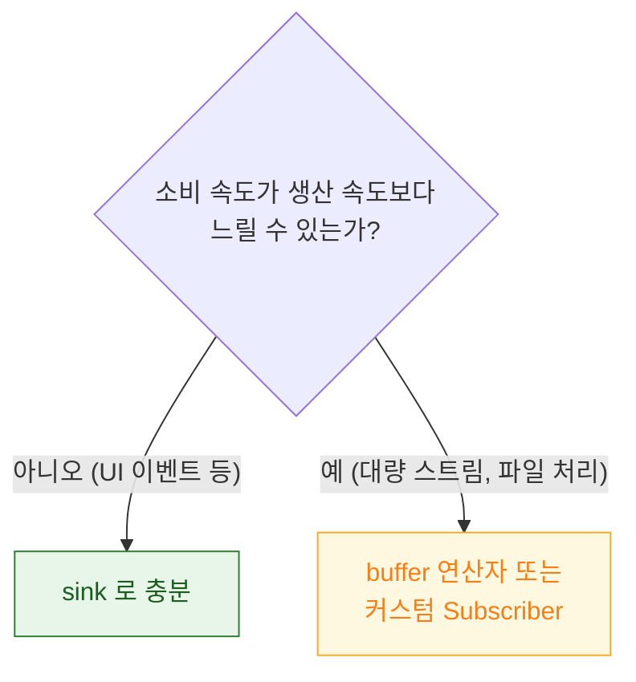

## Combine 의 backpressure 는 구독자가 수요를 요청하는 방식이고 sink 는 이를 사실상 끈다

### 개념 (What)

Combine 이 RxSwift 와 근본적으로 다른 지점이 여기다. Publisher 가 값을 밀어내는 것이 아니라, **Subscriber 가 "몇 개까지 받겠다"는 수요(demand)를 먼저 요청**해야 값이 흐른다.



### 왜 필요한가 (Why)

생산 속도가 소비 속도보다 빠르면, 무제한으로 밀어내는 시스템은 **메모리에 값이 쌓여 폭발**한다. Combine 은 이것을 구조적으로 막는다 — Publisher 는 Subscriber 가 요청한 수만큼만 보낼 수 있다.

**그런데 실무에서 이 방어가 거의 항상 꺼져 있다.** `sink` 가 내부적으로 `.unlimited` 수요를 요청하기 때문이다.

```swift
publisher.sink { value in print(value) }
// 내부적으로: subscription.request(.unlimited)
// → backpressure 가 사실상 없다. Rx 와 동일하게 동작한다.
```

### 수요를 실제로 제어하려면

```swift
final class LimitedSubscriber: Subscriber {
    typealias Input = Int
    typealias Failure = Never

    func receive(subscription: Subscription) {
        subscription.request(.max(3))          // "처음엔 3개만"
    }

    func receive(_ input: Int) -> Subscribers.Demand {
        process(input)
        return .max(1)                          // 처리 후 1개씩만 추가 요청
    }

    func receive(completion: Subscribers.Completion<Never>) {
        print("완료")
    }
}
```

`receive(_:)` 의 **반환값이 다음 수요**다. `.none` 이면 더 요청하지 않고, `.max(1)` 이면 하나 처리할 때마다 하나씩만 새로 받는다 — **생산 속도를 소비 속도에 맞춰 자동으로 조절**하는 효과다.

### 실무적 귀결



`sink` 로 충분하지 않을 때는 **`buffer` 연산자**로 완화할 수 있다.

```swift
publisher
    .buffer(size: 100, prefetch: .byRequest, whenFull: .dropOldest)
    .sink { process($0) }
```

`whenFull` 정책이 핵심이다 — 버퍼가 차면 오래된 것을 버릴지(`.dropOldest`), 새 것을 버릴지(`.dropNewest`), 에러를 낼지(`.customError`) 결정한다.

### 관찰 가능한 증거

```swift
// 수요 요청 시점을 직접 확인
publisher
    .handleEvents(receiveRequest: { demand in
        print("요청된 수요: \(demand)")   // .unlimited 인지 확인
    })
    .sink { ... }
```

`sink` 를 쓰면서 backpressure 를 기대하고 있었다면, 이 로그에서 항상 `.unlimited` 가 찍히는 것을 보고 오해를 바로잡을 수 있다.

### 연관 문서

- [AnyCancellable 을 보관하지 않으면 구독이 즉시 해제된다](anycancellable-lifetime-gates-the-pipeline.md)
- [FlatMap 계열은 각각 다른 병합 전략을 구현한다](flatmap-family-implements-different-merge-strategies.md)
- [AsyncSequence 는 Combine 의 스트림 역할을 언어 기본 기능으로 대체한다](migrating-to-asyncsequence-changes-the-cancellation-model.md)

공식 문서: [Publishers and Subscribers](https://developer.apple.com/documentation/combine/processing-published-elements-with-subscribers)
