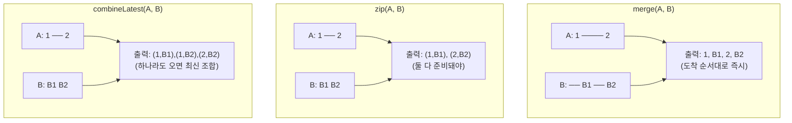
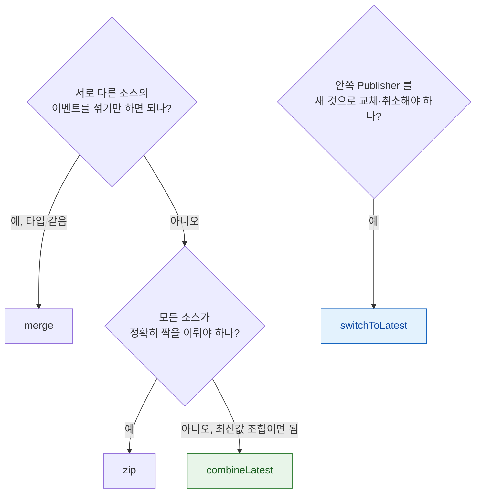

## merge·zip·combineLatest·switchToLatest 는 각각 다른 병합 규칙을 구현한다

### 개념 (What)

여러 Publisher 를 하나로 합치는 연산자는 네 가지가 있고, **"언제 방출할지"의 규칙이 전부 다르다.** 이름이 비슷해서 자주 혼동되지만, 실제 데이터 흐름을 그려보면 용도가 명확히 갈린다.

| 연산자 | 방출 시점 | 타입 요구 |
| :--- | :--- | :--- |
| **merge** | A 나 B **아무거나** 오면 즉시 | 같은 타입이어야 함 |
| **zip** | A 와 B 가 **둘 다** 짝을 이루면 | 서로 다른 타입 가능, 튜플로 묶임 |
| **combineLatest** | A 나 B 중 하나라도 오면, **최신값끼리** | 서로 다른 타입 가능 |
| **switchToLatest** | 새 내부 Publisher 가 오면 **이전 것을 취소** | Publisher 의 Publisher |



### 왜 필요한가 (Why)

잘못 고르면 두 가지 방식으로 틀린다.

- **`combineLatest` 를 써야 할 자리에 `zip`** — 아이디와 비밀번호 필드가 각각 입력될 때마다 버튼 활성 상태를 갱신하고 싶은데, `zip` 을 쓰면 **입력 횟수가 정확히 같아야만** 방출되어 갱신이 안 된다.
- **`merge` 를 써야 할 자리에 `combineLatest`** — 서로 무관한 두 이벤트(예: 새로고침 버튼 탭 vs 풀다운 리프레시)를 "둘 다 최근 값이 있어야" 처리하면 첫 이벤트가 씹힌다.

### combineLatest — UI 폼 검증의 표준 패턴

```swift
Publishers.CombineLatest($username, $password)
    .map { username, password in
        !username.isEmpty && password.count >= 8
    }
    .assign(to: &$isSubmitEnabled)
```

아이디나 비밀번호 **어느 쪽이 바뀌어도** 최신 조합으로 즉시 재평가된다. 폼 검증, 여러 필터를 조합한 목록 갱신에 가장 흔히 쓰인다.

### switchToLatest — 검색어 자동완성의 표준 패턴

```swift
$query
    .debounce(for: .milliseconds(500), scheduler: RunLoop.main)
    .removeDuplicates()
    .map { text -> AnyPublisher<[Result], Error> in
        api.search(text)                    // 네트워크 요청 Publisher
    }
    .switchToLatest()                       // ★ 새 검색어가 오면 이전 요청을 취소
    .sink { results in self.results = results }
    .store(in: &cancellables)
```

`map` 만으로는 **Publisher 안에 Publisher**(`AnyPublisher<AnyPublisher<...>>`)가 되어 구독할 수 없다. `switchToLatest` 가 이것을 평탄화하면서, **동시에 이전 내부 Publisher 의 구독을 취소**한다. 사용자가 "a" → "ap" → "app" 을 빠르게 입력하면 "a"와 "ap" 검색 요청은 취소되고 "app" 결과만 온다.

이것은 [SwiftUI 의 `.task(id:)` 가 하는 일](../../02_ui_frameworks/swiftui/task-modifier-ties-async-to-view-lifetime.md)과 개념적으로 같다 — 입력이 바뀌면 이전 작업을 취소하고 새로 시작한다.

### zip — 여러 소스가 정확히 짝을 이뤄야 할 때

```swift
Publishers.Zip(imageUpload.publisher, metadataUpload.publisher)
    .sink { imageURL, metadataURL in
        // 이미지와 메타데이터가 둘 다 업로드 완료된 시점에만 실행
        finalizePost(image: imageURL, metadata: metadataURL)
    }
    .store(in: &cancellables)
```

한쪽이 먼저 끝나도 **다른 쪽을 기다린다.** 두 비동기 작업의 완료를 동기화해야 할 때 적합하며, 폼 필드처럼 독립적으로 여러 번 발생하는 이벤트에는 부적합하다.

### 선택 흐름도



### 관찰 가능한 증거

```swift
// 각 연산자의 실제 방출 타이밍을 로그로 직접 확인한다
Publishers.CombineLatest($a, $b)
    .print("combineLatest")   // 값이 나올 때마다 콘솔에 타임스탬프와 함께 출력
    .sink { ... }
```

의도한 병합 방식이 맞는지 확신이 안 서면, **작은 예제로 `print()` 를 붙여 실제 순서를 눈으로 확인**하는 것이 가장 빠르다.

### 연관 문서

- [Combine 의 backpressure 는 구독자가 수요를 요청하는 방식이다](backpressure-is-demand-the-subscriber-requests.md)
- [.task 는 비동기 작업의 수명을 뷰 수명에 묶고 사라질 때 자동 취소한다](../../02_ui_frameworks/swiftui/task-modifier-ties-async-to-view-lifetime.md) - switchToLatest 의 async/await 대응
- [AsyncSequence 는 Combine 의 스트림 역할을 언어 기본 기능으로 대체한다](migrating-to-asyncsequence-changes-the-cancellation-model.md)

공식 문서: [Combining Publishers](https://developer.apple.com/documentation/combine/combining-elements-from-multiple-publishers)
