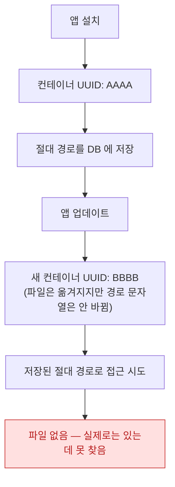

## 앱 컨테이너의 절대 경로는 재설치·업데이트마다 바뀌므로 저장하면 안 된다

### 개념 (What)

앱의 [sandbox 컨테이너](../../01_system_internals/storage/app-container-directory-policies.md)는 실제로는 `/var/mobile/Containers/Data/Application/<UUID>/` 같은 경로에 있다. 이 **UUID 는 고정값이 아니다** — 앱을 업데이트하거나 재설치하면 시스템이 새 UUID 로 컨테이너를 다시 만든다.

```swift
// ❌ 절대 경로를 DB 에 저장 — 다음 업데이트 후 못 찾는다
let fullPath = url.path
// "/var/mobile/Containers/Data/Application/AAAA-1111/Documents/photo.jpg"
saveToDatabase(fullPath)

// (앱 업데이트 후 컨테이너 UUID 가 BBBB-2222 로 바뀜)
// → 저장된 경로는 더 이상 존재하지 않는 폴더를 가리킨다

// ✅ 파일명만 저장하고, 런타임에 현재 컨테이너 기준으로 조합
let fileName = url.lastPathComponent
saveToDatabase(fileName)

let docDir = FileManager.default.urls(for: .documentDirectory, in: .userDomainMask).first!
let currentURL = docDir.appendingPathComponent(fileName)   // 항상 지금 유효한 경로
```

### 왜 필요한가 (Why)

이 버그는 **개발 중에는 절대 재현되지 않는다.** 시뮬레이터에서 매일 실행하는 동안은 UUID 가 안 바뀌기 때문이다. 사용자가 앱을 업데이트한 뒤에만 "저장했던 사진이 사라졌어요"로 나타난다.



**파일 자체는 사라지지 않는다.** 시스템이 컨테이너 내용물을 새 UUID 폴더로 옮겨 주기 때문이다. 문제는 **저장해 둔 절대 경로 문자열이 예전 위치를 가리킨다**는 것뿐이다.

### 안전한 저장 방식

| 저장하면 안 되는 것 | 저장해도 되는 것 |
| :--- | :--- |
| 전체 절대 경로 (`url.path`) | 파일명 (`url.lastPathComponent`) |
| `Documents/sub/file.txt` 같은 하드코딩 접두사 | 상대 경로 (Documents 기준부터) |
| — | Bookmark Data (sandbox 밖 파일 참조용, 별도 메커니즘) |

```swift
// 하위 폴더 구조가 있다면 Documents 디렉터리 기준 상대 경로로
let relativePath = "photos/2026/img001.jpg"
saveToDatabase(relativePath)

// 복원
let fullURL = docDir.appendingPathComponent(relativePath)
```

**항상 `FileManager.default.urls(for:in:)` 로 현재 컨테이너 기준 URL 을 다시 얻고, 그 위에 상대 경로를 붙인다.** 컨테이너 루트 자체를 캐시해 두지 않는다.

### 사용자가 선택한 sandbox 밖 파일은 다른 메커니즘

이 문제는 **앱 자기 컨테이너 안의 파일**에 관한 것이다. `NSOpenPanel`(macOS)이나 파일 앱에서 사용자가 고른, **컨테이너 밖에 있는 파일**을 계속 참조하려면 절대 경로가 아니라 **Security-Scoped Bookmark** 를 쓴다.

```swift
// 컨테이너 밖 파일: bookmark 로 참조를 보존한다
let bookmark = try url.bookmarkData(options: .withSecurityScope)
saveToDatabase(bookmark)

// 복원
var isStale = false
let restoredURL = try URL(resolvingBookmarkData: bookmark,
                          options: .withSecurityScope,
                          bookmarkDataIsStale: &isStale)
```

이것은 [App Sandbox 노트](../../05_security_privacy/apple-sandbox-and-security.md)에서 다루는 별도 메커니즘이며, 컨테이너 안 파일의 상대 경로 문제와는 원인이 다르다.

### 관찰 가능한 증거

```bash
# 현재 컨테이너 UUID 확인 (시뮬레이터)
xcrun simctl get_app_container booted com.example.app data

# 앱을 삭제 후 재설치하면 UUID 가 바뀌는 것을 직접 확인할 수 있다
xcrun simctl uninstall booted com.example.app
xcrun simctl install booted MyApp.app
xcrun simctl get_app_container booted com.example.app data   # 다른 경로가 나온다
```

**재현 테스트**: 앱을 실행해 파일을 저장한 뒤, 삭제하지 않고 **Xcode 로 재설치(업데이트 시뮬레이션)** 한 다음 저장된 파일에 접근되는지 확인한다. 절대 경로를 저장했다면 이 테스트에서 실패가 드러난다.

### 연관 문서

- [앱 컨테이너의 디렉터리는 백업과 정리 정책이 서로 다르다](../../01_system_internals/storage/app-container-directory-policies.md)
- [대용량 파일은 전체를 메모리에 올리지 않고 매핑해서 읽는다](large-files-are-mapped-not-fully-loaded.md)
- [apple-sandbox-and-security](../../05_security_privacy/apple-sandbox-and-security.md)

공식 문서: [File System Programming Guide](https://developer.apple.com/library/archive/documentation/FileManagement/Conceptual/FileSystemProgrammingGuide/Introduction/Introduction.html)
