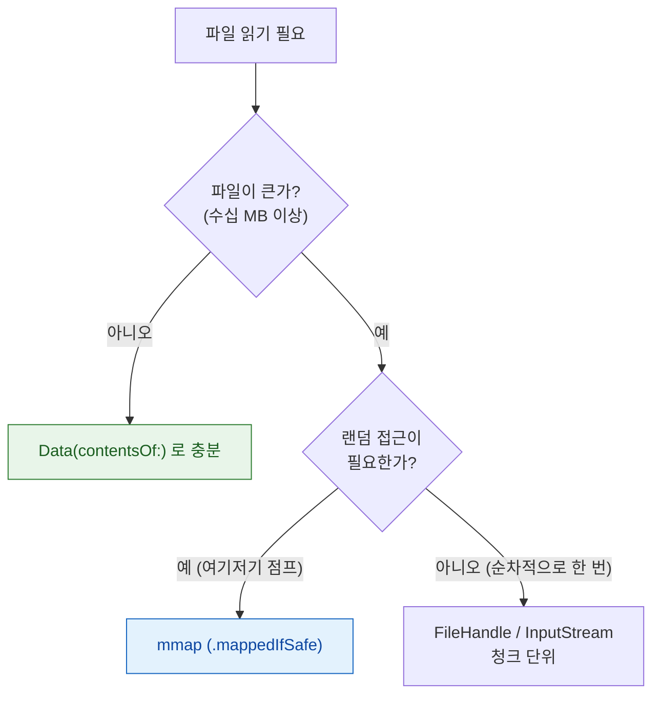

## 대용량 파일은 전체를 메모리에 올리지 않고 매핑하거나 스트리밍해서 읽는다

### 개념 (What)

`Data(contentsOf: url)` 는 파일 전체를 **한 번에 메모리로 복사**한다. 1GB 파일을 이렇게 읽으면 그 순간 1GB 의 [더티 메모리](../../01_system_internals/kernel-and-driver/mach-vm-and-memory-regions.md)가 생기고, [Jetsam](../../01_system_internals/ipc-and-process/jetsam-memory-pressure-bands.md) 종료로 직행할 수 있다.

큰 파일을 다루는 방법은 목적에 따라 셋으로 나뉜다.

| 방법 | 무엇을 하나 | 언제 |
| :--- | :--- | :--- |
| **`.mappedIfSafe`** | 파일을 가상 메모리에 매핑, 실제 읽기는 접근 시점에 | 랜덤 접근이 필요한 큰 읽기 전용 파일 |
| **`FileHandle`/`InputStream`** | 청크 단위로 순차 읽기 | 처음부터 끝까지 한 번만 훑는 처리 |
| **전체 로드 (`Data(contentsOf:)`)** | 통째로 메모리에 | **작은 파일에만** |

### 왜 필요한가 (Why)



### mmap — 매핑된 파일은 "clean" 메모리다

```swift
// 파일을 가상 메모리에 매핑한다. 이 시점에는 물리 메모리를 거의 안 쓴다.
let data = try Data(contentsOf: url, options: .mappedIfSafe)

// 실제로 이 범위를 읽는 순간에만 해당 페이지가 물리 메모리에 올라온다
let header = data.subdata(in: 0..<100)
```

**왜 Jetsam 에 유리한가**: 매핑된 파일 페이지는 [읽기 전용이면 "clean" 메모리](../../01_system_internals/kernel-and-driver/mach-vm-and-memory-regions.md)로 취급된다. 메모리 압력이 오면 시스템은 이것을 압축할 필요도 없이 **그냥 버렸다가 필요하면 파일에서 다시 읽는다.** `Data(contentsOf:)` 로 통째로 읽은 "dirty" 메모리와 정반대다.

**적합한 경우**: 큰 데이터베이스 파일, 미디어 파일의 특정 구간만 필요한 경우, 인덱스를 따라 랜덤 접근하는 대용량 리소스.

### FileHandle — 순차 스트리밍

```swift
// 파일을 처음부터 끝까지 청크 단위로 처리 (업로드, 해시 계산 등)
let handle = try FileHandle(forReadingFrom: url)
defer { try? handle.close() }

while let chunk = try handle.read(upToCount: 1024 * 1024) {   // 1MB 씩
    if chunk.isEmpty { break }
    process(chunk)
}
```

```swift
// Swift Concurrency 와 함께 — AsyncSequence 로 바이트 스트림 소비
let handle = try FileHandle(forReadingFrom: url)
for try await line in handle.bytes.lines {
    process(line)
}
```

**한 번에 메모리에 있는 것은 청크 하나뿐**이므로, 파일 크기와 무관하게 메모리 사용량이 일정하다. 대용량 업로드, 로그 파일 처리, 해시 계산에 적합하다.

### 쓰기도 같은 원칙이다

```swift
// ❌ 큰 데이터를 한 번에 append — 매번 전체를 다시 쓰는 구현도 있어 위험
existingData.append(newChunk)
try existingData.write(to: url)

// ✅ FileHandle 로 이어쓰기 — 기존 내용을 메모리에 올리지 않는다
let handle = try FileHandle(forWritingTo: url)
defer { try? handle.close() }
try handle.seekToEnd()
try handle.write(newChunk)
```

### 이미지는 별도 규칙 — 다운샘플링

이미지는 파일 크기가 작아도 **디코딩된 픽셀 버퍼**가 훨씬 크다(4K 이미지 한 장이 30MB 이상). 이것은 mmap 으로 해결되지 않는다 — 결국 화면에 그리려면 디코딩해야 하기 때문이다.

```swift
// 원본 해상도로 디코딩하지 않고, 필요한 크기로 축소하며 디코딩한다
let options: [CFString: Any] = [
    kCGImageSourceThumbnailMaxPixelSize: 300,
    kCGImageSourceCreateThumbnailFromImageAlways: true
]
let source = CGImageSourceCreateWithURL(url as CFURL, nil)!
let thumbnail = CGImageSourceCreateThumbnailAtIndex(source, 0, options as CFDictionary)
```

이것이 [셀 재사용](../../02_ui_frameworks/uikit/cell-reuse-requires-full-state-reset.md)과 [레이어 커밋](../../01_system_internals/graphics-and-media/layer-tree-commit-to-render-server.md) 성능 문제의 흔한 원인인 "원본 해상도 디코딩"을 피하는 방법이다.

### 관찰 가능한 증거

```bash
# 프로세스의 dirty/clean 메모리 구분 확인
vmmap --summary <pid> | grep -i dirty
footprint <pid>
```

**Instruments의 VM Tracker** 에서 매핑된 파일 영역이 clean 으로 표시되는지, `Data(contentsOf:)` 로 읽은 영역이 dirty 로 잡히는지 비교하면 차이가 직접 보인다. → [Allocations 는 힙만 보여준다](../../06_testing_performance/profiling/allocations-shows-heap-but-vm-tracker-shows-the-rest.md)

### 연관 문서

- [Mach VM 은 영역 단위로 매핑하고 물리 페이지 할당을 미룬다](../../01_system_internals/kernel-and-driver/mach-vm-and-memory-regions.md)
- [Allocations 는 힙만 보여주므로 IOSurface 같은 메모리는 VM Tracker 로 봐야 한다](../../06_testing_performance/profiling/allocations-shows-heap-but-vm-tracker-shows-the-rest.md)
- [메모리 압축기는 iOS 에서 디스크 스왑을 대체한다](../../01_system_internals/kernel-and-driver/memory-compressor-and-swap.md)
- [앱 컨테이너의 절대 경로는 재설치·업데이트마다 바뀐다](container-path-is-a-uuid-that-changes-never-persist-it.md)

공식 문서: [Reading and Writing Files](https://developer.apple.com/documentation/foundation/filemanager) · [FileHandle](https://developer.apple.com/documentation/foundation/filehandle)
