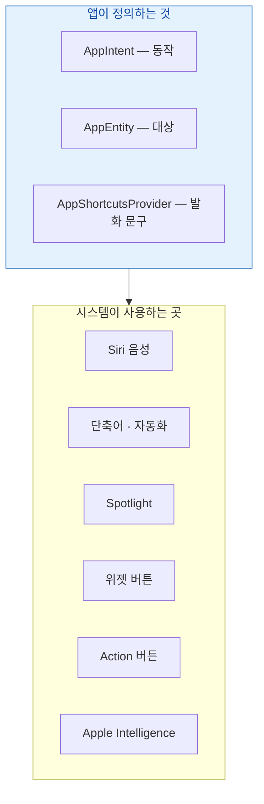

## App Intents 는 앱의 기능과 데이터를 시스템이 실행할 수 있는 단위로 노출하는 계약이다

App Intents 는 "Siri 연동 기능"이 아니라 **앱 기능을 시스템에 공개하는 표준 인터페이스**다. 한 번 정의하면 여러 진입점이 모두 그것을 쓴다.



**핵심 전제**: `perform()` 은 [앱이 전경에 없거나 방금 깨어난 상태에서 실행될 수 있다.](intents/app-intent-runs-without-the-app-in-foreground.md) 전역 상태를 가정하면 실패한다.

### 정본 노트

- [AppIntent 는 앱이 전경에 없어도 실행되므로 전역 상태를 가정하면 안 된다](intents/app-intent-runs-without-the-app-in-foreground.md) — `openAppWhenRun`, 반환값이 UI 를 결정하는 방식, 실행 시간 제약.
- [AppEntity 는 앱의 데이터 모델을 시스템이 검색하고 참조할 수 있게 노출한다](intents/app-entity-exposes-your-model-to-the-system.md) — `EntityQuery` 세 가지 조회 경로, **노출 범위가 곧 프라이버시 결정**.
- [App Shortcuts 는 provider 와 발화 문구가 있어야 설정 없이 음성으로 실행된다](intents/app-shortcuts-need-phrases-and-a-provider.md) — `\(.applicationName)` 필수, 등록 시점.
- [시스템 인텔리전스는 온디바이스와 클라우드 처리를 스스로 나눈다](intents/system-intelligence-decides-on-device-or-cloud.md) — 앱이 통제 가능한 것과 아닌 것.

### 증상에서 시작하기

| 증상 | 어느 노트로 |
| :--- | :--- |
| 단축어 앱에 내 액션이 안 보인다 | [AppIntent](intents/app-intent-runs-without-the-app-in-foreground.md) (앱을 한 번 실행해야 등록됨) |
| 앱 종료 상태에서 실행하면 크래시 | [AppIntent](intents/app-intent-runs-without-the-app-in-foreground.md) (전역 상태 가정) |
| 매개변수 목록에 항목이 안 나온다 | [AppEntity](intents/app-entity-exposes-your-model-to-the-system.md) (`suggestedEntities`) |
| Siri 로 항목 이름을 말해도 못 찾는다 | [AppEntity](intents/app-entity-exposes-your-model-to-the-system.md) (`EntityStringQuery` 미구현) |
| Siri 에 대고 말해도 실행이 안 된다 | [App Shortcuts](intents/app-shortcuts-need-phrases-and-a-provider.md) (provider 없음) |
| 실행 도중 중단된다 | [AppIntent](intents/app-intent-runs-without-the-app-in-foreground.md) (시간 초과 → 배경 작업으로 분리) |

### 설계 순서

1. **동작을 intent 로 정의**한다. 앱 없이도 실행 가능하게 작성한다.
2. **대상을 entity 로 정의**하고 `EntityQuery` 를 구현한다. 음성 지정이 필요하면 `EntityStringQuery` 도.
3. **자주 쓰는 것만 App Shortcut 으로** 승격하고 발화 문구를 여러 개 준다.
4. **노출 범위를 검토**한다. 잠금 화면에 떠도 되는 내용인가?
5. **앱 완전 종료 상태에서 전 경로를 테스트**한다.

### 관찰 가능한 증거

```bash
log stream --device --predicate 'subsystem == "com.apple.AppIntents"' --info
log stream --device --predicate 'process == "siriactionsd"' --info
```

앱 스킴으로 Xcode 실행 중에 단축어나 위젯 버튼을 실행하면 `perform()` 에 브레이크포인트가 걸린다.

### 연관 문서

- [상호작용 위젯은 클로저가 아니라 AppIntent 를 실행한다](../02_ui_frameworks/widgets/interactive-widgets-run-app-intents.md)
- [apple-intelligence-and-agentic-intents](apple-intelligence-and-agentic-intents.md)
- [apple-privacy-and-tcc-details](../05_security_privacy/apple-privacy-and-tcc-details.md)
- [android-app-actions 대응](../../android/04_system_services/assistant-agent/assistant-agent.md)

공식 문서: [App Intents](https://developer.apple.com/documentation/appintents)
