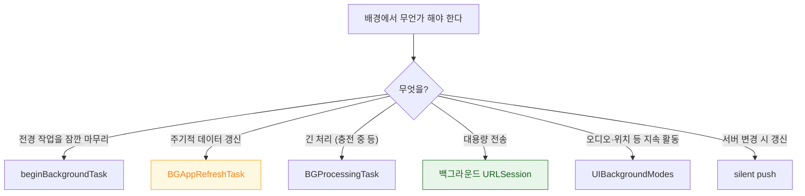

## 배경 실행은 네 가지 메커니즘으로 나뉘고 어느 것을 쓰는지가 진단의 출발점이다

"백그라운드에서 안 돈다"는 하나의 증상이지만, iOS 에는 **실행 주체와 보장 수준이 전혀 다른 네 가지 메커니즘**이 있다. 어느 것을 쓰고 있는지 확정하지 않으면 진단이 시작되지 않는다.

| 메커니즘 | 실행 주체 | 보장 | 대표 실패 |
| :--- | :--- | :--- | :--- |
| `beginBackgroundTask` | 앱 프로세스 | 짧은 유예만 | 만료 핸들러 미처리 → 강제 종료 |
| `BGTaskScheduler` | 앱 프로세스 (재실행됨) | **없음. 시스템이 시점 결정** | 등록 시점 오류 |
| 백그라운드 `URLSession` | **시스템 데몬** | 전송은 이어짐 | 세션 재생성 누락 |
| `UIBackgroundModes` | 앱 프로세스 | 해당 활동 지속 중에만 | 선언 누락, 활동 중단 |



### 정본 노트

- [백그라운드 모드는 런타임 요청이 아니라 Info.plist 선언이며 심사 대상이다](background/background-modes-are-declared-not-requested.md) — 모드별 실제 계약, **오디오 모드의 세 조건**.
- [BGTaskScheduler 는 앱 시작 시점에 등록을 끝내야 하고 실행 시점은 시스템이 정한다](background/bgtaskscheduler-registration-must-happen-at-launch.md) — 세 가지 필수 조건, 핸들러의 세 의무, **디버거 강제 트리거**.
- [beginBackgroundTask 는 짧은 유예 시간을 요청하는 것이지 실행 연장이 아니다](background/background-task-assertion-has-a-grace-period.md) — 무엇을 넣고 무엇을 넣지 않는가.
- [silent push 는 앱을 깨우지만 전달과 실행이 보장되지 않는다](background/silent-push-wakes-the-app-with-limits.md) — `.newData` 를 정직하게 반환해야 하는 이유.

### 진단 순서

1. **어느 메커니즘인가** 확정한다 (위 표).
2. **선언이 있는가** — `UIBackgroundModes`, `BGTaskSchedulerPermittedIdentifiers`
3. **등록 시점이 맞는가** — `didFinishLaunching` 안에서 `register`
4. **디버거로 강제 트리거**해 본다 → 동작하면 **로직은 정상이고 시점 문제**다
   ```
   e -l objc -- (void)[[BGTaskScheduler sharedScheduler] _simulateLaunchForTaskWithIdentifier:@"..."]
   ```
5. 여전히 안 되면 → [05 런북](../00_foundations/diagnostic-runbooks/05-background-work-not-running.md)

### 시스템이 시점을 주지 않는 이유 (버그 아님)

- 사용자가 앱을 자주 쓰지 않음 (사용 패턴 학습)
- 저전력 모드 / 배터리 부족
- `설정 > 일반 > 백그라운드 앱 새로고침` 꺼짐
- **앱 전환기에서 사용자가 강제 종료** — 대부분의 배경 깨우기가 중단된다

> [!IMPORTANT] 배경 실행은 최적화이지 보장이 아니다
> "배경에서 동기화되어 있을 것"을 전제로 UI 를 만들면 안 된다. **전경 복귀 시에도 동기화하는 경로가 반드시 있어야** 한다.

### 파일 보호 클래스와의 결합

배경 작업이 파일을 쓴다면 기기가 잠긴 상태일 수 있다. 목적지의 [Data Protection 클래스](../01_system_internals/storage/data-protection-classes.md)가 `complete` 면 쓰기가 실패한다. `completeUntilFirstUserAuthentication` 이상이어야 한다.

### 관찰 가능한 증거

```bash
log stream --device --predicate 'subsystem == "com.apple.duetactivityscheduler"' --info
log stream --device --predicate 'process == "runningboardd"' --info
```

```swift
BGTaskScheduler.shared.getPendingTaskRequests { print("대기:", $0.map(\.identifier)) }
print(UIApplication.shared.backgroundTimeRemaining)
```

**MetricKit 의 `MXBackgroundTimeMetric`** 으로 실사용자 기기에서 실제 받은 배경 시간을 본다.

### 연관 문서

- [RunningBoard assertion 이 프로세스의 실행 지속 여부를 결정한다](../01_system_internals/ipc-and-process/runningboard-assertions.md) - 시스템이 판정하는 원리
- [백그라운드 전송은 앱이 아니라 시스템 데몬이 이어서 수행한다](../01_system_internals/connectivity/background-transfer-daemon.md)
- [apple-push-notifications-apns](apple-push-notifications-apns.md)
- [05-background-work-not-running](../00_foundations/diagnostic-runbooks/05-background-work-not-running.md)

공식 문서: [BackgroundTasks](https://developer.apple.com/documentation/backgroundtasks)
