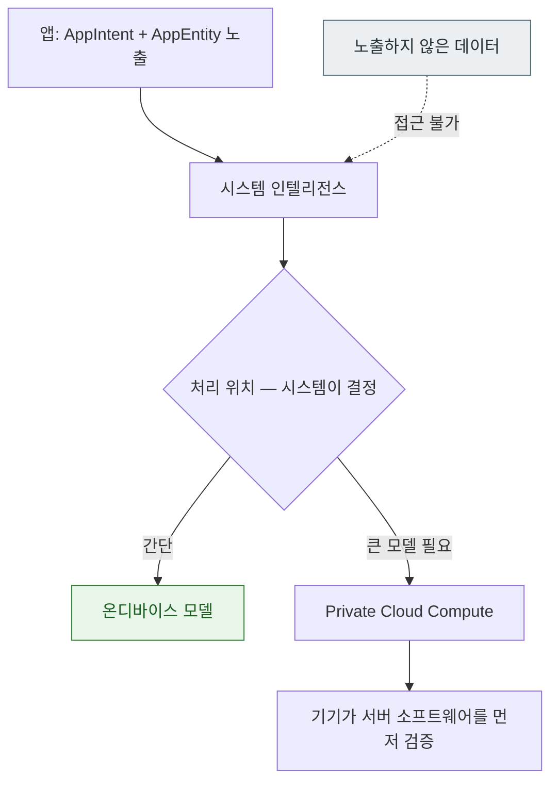

## Apple Intelligence 는 앱이 노출한 intent 와 entity 위에서 동작하며 처리 위치는 시스템이 정한다

앱 개발자 관점에서 Apple Intelligence 는 **별도의 API 가 아니다.** [App Intents](apple-app-intents.md) 로 노출한 것을 시스템이 활용하는 것이며, 앱이 하는 일은 두 가지뿐이다.

1. **무엇을 노출할지 정한다** — 이것이 유일한 통제 수단이다.
2. **인텔리전스가 없어도 동작하게 만든다** — 기기·지역·설정에 따라 사용 불가일 수 있다.



### 정본 노트

- [시스템 인텔리전스는 온디바이스와 클라우드 처리를 스스로 나누며 앱은 노출 범위만 통제한다](intents/system-intelligence-decides-on-device-or-cloud.md) — 통제 가능/불가 표, 노출 설계 원칙.
- [AppEntity 는 앱의 데이터 모델을 시스템이 검색하고 참조할 수 있게 노출한다](intents/app-entity-exposes-your-model-to-the-system.md) — `displayRepresentation` 이 잠금 화면에 보인다는 점.
- [AppIntent 는 앱이 전경에 없어도 실행된다](intents/app-intent-runs-without-the-app-in-foreground.md)

### 노출 판단 기준

| 질문 | 아니라면 |
| :--- | :--- |
| 잠금 화면에 떠도 괜찮은가? | `displayRepresentation` 에 넣지 않는다 |
| 사용자가 이미 화면에서 보는 것인가? | 노출을 재고한다 |
| 제3자가 봐도 문제없는가? | 노출하지 않는다 |
| 클라우드로 가도 되는가? | **entity 에서 제외한다** (유일한 확실한 통제) |

노출한 데이터 종류는 [Privacy Manifest](../05_security_privacy/apple-privacy-and-tcc-details.md) 에 반영해야 하며 심사 확인 대상이다.

### 가용성을 전제하지 않는다

Apple Intelligence 는 **기기·지역·언어·사용자 설정**에 따라 쓸 수 없을 수 있다. 인텔리전스를 전제로 핵심 흐름을 설계하면 상당수 사용자에게 앱이 동작하지 않는다.

> [!IMPORTANT] intent/entity 는 그 자체로 가치가 있다
> 인텔리전스가 없어도 **단축어·위젯·Spotlight·Action 버튼**에서 쓰인다. 그 경로를 먼저 완성하면 인텔리전스는 부가 이득이 된다.

### 신뢰 모델

PCC 는 "데이터를 저장하지 않는다"는 약속을 **검증 가능하게** 만든 구조다. 기기가 서버 소프트웨어 이미지를 공개 로그와 대조한 뒤에만 전송한다. 상세는 [apple-security-pcc](../05_security_privacy/apple-security-pcc.md) 에 있다.

### 관찰 가능한 증거

```bash
log stream --device --predicate 'subsystem == "com.apple.AppIntents"' --info
```

**검증**: 인텔리전스가 활성화된 실기기와 비활성 기기 양쪽에서 앱의 핵심 흐름이 동작하는지 확인한다.

### Android 비교

| | Apple | Android |
| :--- | :--- | :--- |
| 노출 단위 | `AppIntent` / `AppEntity` | App Actions / `shortcuts.xml` |
| 온디바이스 모델 | 시스템 내장 | Gemini Nano (AICore) |
| 클라우드 처리 | PCC (검증 가능성 강조) | 서버 모델 (정책·계약 기반) |
| 개발자 통제 | 노출 범위 | 노출 범위 + 일부 모델 선택 |

→ [cross-platform-ai-privacy-comparison](../../cross-platform/cross-platform-ai-privacy-comparison.md)

### 연관 문서

- [apple-app-intents](apple-app-intents.md) - 기반이 되는 계약
- [apple-security-pcc](../05_security_privacy/apple-security-pcc.md)
- [apple-privacy-and-tcc-details](../05_security_privacy/apple-privacy-and-tcc-details.md)

공식 문서: [App Intents](https://developer.apple.com/documentation/appintents) · [Private Cloud Compute](https://security.apple.com/blog/private-cloud-compute/)
