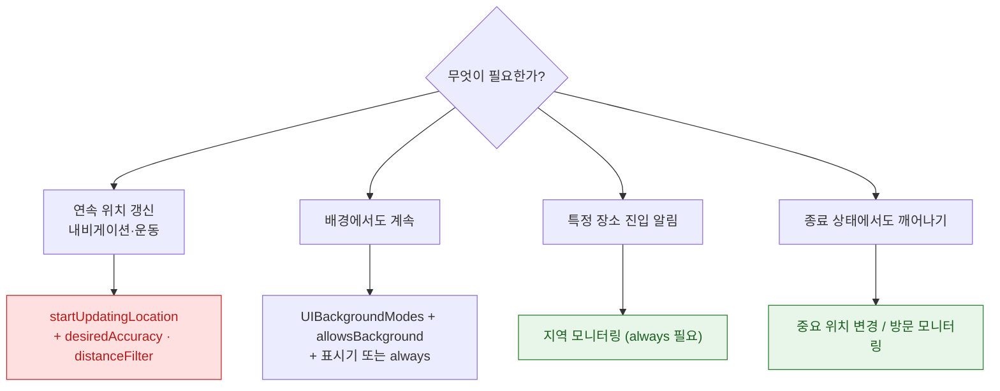

## Core Location 은 좌표를 확보하고 MapKit 은 그리기만 하며 배터리는 전자에서 결정된다

두 프레임워크의 책임이 완전히 분리되어 있고, **실패와 비용도 서로 다른 쪽에서 발생한다.**

| | Core Location | MapKit |
| :--- | :--- | :--- |
| 역할 | 좌표·상태 확보 | 화면 렌더링 |
| 권한 | 필요 (TCC) | 지도 표시만이면 불필요 |
| **배터리** | **여기서 결정** | 렌더링 비용만 |
| 실패 원인 | 권한·정확도·신호 | 어노테이션 과다 |

"위치가 안 나온다"는 Core Location, "지도가 느리다"는 MapKit 문제다. **이 구분이 진단의 첫 단계다.**



빨간 것이 전력을 가장 많이 쓰고, 초록은 매우 적게 쓴다.

### 정본 노트

- [위치 권한과 정확도는 서로 독립된 두 축이며 둘 다 확인해야 한다](location/authorization-and-accuracy-are-independent-axes.md) — **`reducedAccuracy` 는 실패가 아니다**, 일시적 정밀도 상승 요청.
- [배경 위치 갱신은 모드 선언·플래그·권한 세 가지가 모두 맞아야 한다](location/background-location-requires-mode-and-indicator.md) — `whenInUse` + 파란 표시기 조합, 배터리 파라미터.
- [지역 모니터링은 정밀도를 포기하는 대신 종료된 앱까지 깨운다](location/region-monitoring-wakes-a-terminated-app.md) — 지역 개수 제한 대응, 위치 이벤트로 깨어났을 때의 처리.
- [MapKit 은 그리기만 하고 위치 확보는 Core Location 이 한다](location/mapkit-renders-what-core-location-provides.md) — 어노테이션 클러스터링, 지오코딩 호출 제한.

### 증상에서 시작하기

| 증상 | 어느 노트로 |
| :--- | :--- |
| 권한은 받았는데 좌표가 부정확하다 | [권한과 정확도](location/authorization-and-accuracy-are-independent-axes.md) (`reducedAccuracy`) |
| 프롬프트를 띄우는 순간 크래시 | [권한과 정확도](location/authorization-and-accuracy-are-independent-axes.md) (Usage Description 누락) |
| 배경 전환하면 갱신이 멈춘다 | [배경 위치](location/background-location-requires-mode-and-indicator.md) (세 조건) |
| 배터리 소모가 심하다 | [배경 위치](location/background-location-requires-mode-and-indicator.md) (`distanceFilter` 미설정) |
| 앱을 종료하면 지오펜싱이 안 된다 | [지역 모니터링](location/region-monitoring-wakes-a-terminated-app.md) (깨어남 처리 누락) |
| 등록한 지역이 사라진다 | [지역 모니터링](location/region-monitoring-wakes-a-terminated-app.md) (개수 제한) |
| 지도가 버벅인다 | [MapKit](location/mapkit-renders-what-core-location-provides.md) (클러스터링) |
| 지오코딩이 자주 실패한다 | [MapKit](location/mapkit-renders-what-core-location-provides.md) (호출 제한) |

### 배터리 체크리스트

- [ ] `desiredAccuracy` 를 **필요한 만큼만** (내비게이션이 아니면 `Best` 를 쓰지 않는다)
- [ ] `distanceFilter` 설정 — 대부분의 앱에서 가장 효과가 큰 한 줄
- [ ] `pausesLocationUpdatesAutomatically = true`
- [ ] `activityType` 지정
- [ ] 필요 없을 때 `stopUpdatingLocation()`
- [ ] 연속 갱신 대신 [지역 모니터링](location/region-monitoring-wakes-a-terminated-app.md)으로 대체 가능한지 검토

### 관찰 가능한 증거

```bash
xcrun simctl location booted set 37.5665,126.9780
xcrun simctl location booted start --speed 20 37.5665,126.9780 37.5700,126.9820
xcrun simctl privacy booted grant location-always com.example.app
log stream --device --predicate 'process == "locationd"' --info
```

**Instruments의 Energy Log** 로 위치 갱신 소모를 측정한다. `desiredAccuracy` 를 한 단계 낮추고 비교하면 효과가 즉시 보인다.

**실기기 이동 테스트가 필수다.** 시뮬레이터는 셀룰러 기반 감지와 배터리 특성을 재현하지 못한다.

### 연관 문서

- [apple-privacy-and-tcc-details](../05_security_privacy/apple-privacy-and-tcc-details.md)
- [apple-background-tasks](apple-background-tasks.md)
- [06-permission-gates-in-sequence](../00_foundations/worked-examples/06-permission-gates-in-sequence.md)

공식 문서: [Core Location](https://developer.apple.com/documentation/corelocation) · [MapKit](https://developer.apple.com/documentation/mapkit)
