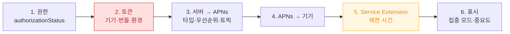

## 푸시는 토큰·타입·권한·확장 네 지점 중 어디서 끊겼는지를 먼저 나눠야 한다

"푸시가 안 온다"는 서로 다른 네 가지 실패의 공통 증상이다. 각각 확인 방법과 처방이 다르므로, **어디까지 갔는지 확정하는 것**이 진단의 전부다.



### 정본 노트

- [APNs 토큰은 기기·번들·환경 세 가지에 묶이며 하나만 어긋나도 실패한다](notifications/apns-token-is-bound-to-environment-and-bundle.md) — **`BadDeviceToken` 의 진짜 원인**, 토큰이 바뀌는 시점, 서버가 처리해야 할 응답.
- [푸시 타입이 전달 우선순위와 허용되는 동작을 결정한다](notifications/push-types-determine-delivery-behavior.md) — 타입별 topic 접미사, `apns-expiration` 과 `apns-collapse-id`.
- [알림 권한에는 단계가 있고 중요도는 그와 별개의 축이다](notifications/notification-authorization-has-levels.md) — `.provisional` 로 거부율 낮추기, 집중 모드와 `interruptionLevel`.
- [Notification Service Extension 은 제한 시간 안에 끝나야 한다](notifications/service-extension-runs-in-a-time-box.md) — **`bestAttempt` 패턴**, 메모리 한도.

### 증상에서 시작하기

| 증상 | 어느 노트로 |
| :--- | :--- |
| 개발에서는 오는데 TestFlight 에서 안 온다 | [토큰과 환경](notifications/apns-token-is-bound-to-environment-and-bundle.md) |
| `BadDeviceToken` 응답 | [토큰과 환경](notifications/apns-token-is-bound-to-environment-and-bundle.md) |
| Live Activity / VoIP 푸시가 안 온다 | [푸시 타입](notifications/push-types-determine-delivery-behavior.md) (topic 접미사) |
| 오래된 알림이 뒤늦게 온다 | [푸시 타입](notifications/push-types-determine-delivery-behavior.md) (`apns-expiration`) |
| 같은 알림이 여러 개 쌓인다 | [푸시 타입](notifications/push-types-determine-delivery-behavior.md) (`apns-collapse-id`) |
| 권한은 있는데 조용히 묻힌다 | [권한과 중요도](notifications/notification-authorization-has-levels.md) (집중 모드) |
| 알림 내용이 서버가 보낸 것과 다르다 | [Service Extension](notifications/service-extension-runs-in-a-time-box.md) (시간 초과) |
| 앱만 조용히 깨우고 싶다 | [silent push](background/silent-push-wakes-the-app-with-limits.md) |

### 첫 번째로 할 일 — 직접 보내 본다

원인을 좁히는 가장 빠른 방법은 서버를 거치지 않고 APNs 에 직접 보내 `reason` 을 보는 것이다.

```bash
curl -v --http2 \
  --header "apns-topic: com.example.app" \
  --header "apns-push-type: alert" \
  --header "apns-priority: 10" \
  --header "authorization: bearer $JWT" \
  --data '{"aps":{"alert":{"title":"제목","body":"본문"},"sound":"default"}}' \
  https://api.sandbox.push.apple.com/3/device/$TOKEN
```

| reason | 원인 |
| :--- | :--- |
| `BadDeviceToken` | 토큰-환경 불일치 |
| `Unregistered` | 앱 삭제/토큰 만료 → 서버에서 제거 |
| `BadTopic` | topic 이 번들 ID 와 불일치 |
| `PayloadTooLarge` | 4KB 초과 |
| `ExpiredProviderToken` | JWT 재발급 |
| 200 인데 안 옴 | 기기 측 문제 → 권한·집중 모드·확장 |

### 탭 처리는 딥링크와 같은 문제다

앱이 **종료 상태에서 알림을 탭한 경우**를 반드시 구현한다. 초기화가 끝나기 전에 라우팅이 도착하면 보류 큐에 넣었다 실행한다. → [진입 경로](../02_ui_frameworks/scene/launch-paths-differ-by-entry-point.md)

### 관찰 가능한 증거

```bash
log stream --device --predicate 'process == "apsd"' --info
xcrun simctl push booted com.example.app payload.apns
codesign -d --entitlements :- MyApp.app | grep aps-environment
```

```swift
func application(_:didFailToRegisterForRemoteNotificationsWithError error: Error) {
    log("APNs 등록 실패: \(error)")   // 비워 두면 원인을 알 수 없다
}
```

### 연관 문서

- [apple-background-tasks](apple-background-tasks.md) - silent push 와 배경 실행
- [04-apns-to-notification-display-and-tap](../00_foundations/worked-examples/04-apns-to-notification-display-and-tap.md) - 전체 경로 추적
- [06-push-notification-missing](../00_foundations/diagnostic-runbooks/06-push-notification-missing.md) - 진단 런북
- [Live Activity 는 로컬과 푸시 두 경로로 갱신된다](../02_ui_frameworks/widgets/live-activity-updates-via-push-or-local.md)

공식 문서: [User Notifications](https://developer.apple.com/documentation/usernotifications) · [Sending notification requests to APNs](https://developer.apple.com/documentation/usernotifications/sending-notification-requests-to-apns)
