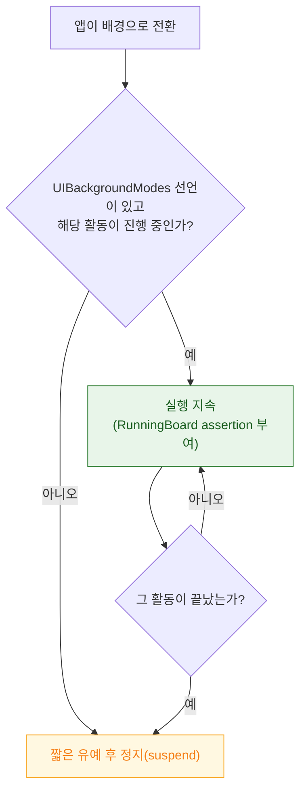

## 백그라운드 모드는 런타임 요청이 아니라 Info.plist 선언이며 심사 대상이다

### 개념 (What)

앱이 배경에서 계속 실행되려면 **무슨 일을 하려는지 미리 선언**해야 한다. `Info.plist` 의 `UIBackgroundModes` 배열이 그것이다.

이것은 [entitlement 처럼 빌드 시점에 확정](../../05_security_privacy/apple-security-entitlements.md)되며, 런타임에 추가할 수 없다. 그리고 **선언한 모드에 해당하는 일을 실제로 하지 않으면 심사에서 반려**된다.

```xml
<key>UIBackgroundModes</key>
<array>
    <string>audio</string>
    <string>location</string>
    <string>remote-notification</string>
</array>
```

### 왜 필요한가 (Why)

1. **선언 없이는 배경 실행이 없다**: 코드가 아무리 맞아도 모드를 빠뜨리면 배경 전환 즉시 정지된다.
2. **모드마다 허용 범위가 다르다**: `audio` 는 재생이 지속되는 동안만, `location` 은 위치 갱신이 있을 때만 실행된다. **모드는 "무제한 실행권"이 아니라 "특정 활동 중에는 정지시키지 않겠다"는 계약**이다.
3. **심사 리스크**: 실제로 배경 오디오를 재생하지 않으면서 `audio` 를 선언하면 반려된다.

### 모드별 계약

| 모드 | 언제 실행이 지속되나 | 흔한 오해 |
| :--- | :--- | :--- |
| `audio` | **실제로 오디오를 재생/녹음하는 동안** | 재생이 멈추면 정지된다 |
| `location` | 위치 갱신이 진행되는 동안 | 상태바 표시가 뜬다 |
| `voip` | VoIP 소켓 활동 | 현대적으로는 PushKit + CallKit 사용 |
| `fetch` | 시스템이 준 짧은 시간 | **주기가 보장되지 않는다** |
| `remote-notification` | silent push 수신 시 짧게 | 빈도가 제한된다 |
| `processing` | `BGProcessingTask` 실행 중 | 충전·Wi-Fi 조건을 걸 수 있다 |
| `bluetooth-central` | 연결된 주변기기와 통신 중 | — |
| `external-accessory` | MFi 액세서리 통신 중 | — |



이 판정은 [RunningBoard 의 assertion](../../01_system_internals/ipc-and-process/runningboard-assertions.md) 으로 표현된다. 모드 선언은 "assertion 을 받을 자격"을 주는 것이고, 실제 활동이 assertion 을 유지시킨다.

### 오디오 모드의 실제 조건

가장 오해가 많은 모드다.

```swift
// 모드 선언만으로는 부족하다. 세션 카테고리도 맞아야 한다.
try AVAudioSession.sharedInstance().setCategory(.playback)   // ambient 면 배경 재생 불가
try AVAudioSession.sharedInstance().setActive(true)
```

`UIBackgroundModes: audio` + `AVAudioSession` 카테고리가 `.playback`/`.playAndRecord` + **실제 재생 중**, 세 조건이 모두 맞아야 한다. → [mediaserverd 가 오디오를 중재한다](../../01_system_internals/graphics-and-media/mediaserverd-audio-arbitration.md)

### 사용자 강제 종료의 영향

앱 전환기에서 사용자가 위로 스와이프해 종료하면, **대부분의 배경 깨우기가 중단된다.** silent push 도, `BGTaskScheduler` 도 동작하지 않는다. 사용자가 앱을 다시 실행해야 복구된다.

이것은 버그가 아니라 의도된 동작이며, **"사용자가 끈 것을 앱이 되살리지 못하게" 하는 정책**이다.

### 관찰 가능한 증거

```bash
# 선언된 모드 확인 (산출물 기준)
plutil -p MyApp.app/Info.plist | grep -A6 UIBackgroundModes

# 실행 지속 판정 로그
log stream --device --predicate 'process == "runningboardd"' --info
```

```swift
// 남은 배경 시간 (모드 없이 유예 중일 때)
print(UIApplication.shared.backgroundTimeRemaining)
```

**실기기에서 Xcode 를 분리하고** 배경 전환 후 실제로 코드가 계속 도는지 로그로 확인한다. 디버거가 붙어 있으면 정지되지 않아 검증이 무의미하다.

### 연관 문서

- [BGTaskScheduler 등록은 앱 시작 시점에 끝나야 한다](bgtaskscheduler-registration-must-happen-at-launch.md)
- [beginBackgroundTask 는 유예 시간을 요청하는 것이지 연장이 아니다](background-task-assertion-has-a-grace-period.md)
- [RunningBoard assertion 이 프로세스의 실행 지속 여부를 결정한다](../../01_system_internals/ipc-and-process/runningboard-assertions.md)
- [05-background-work-not-running](../../00_foundations/diagnostic-runbooks/05-background-work-not-running.md)

공식 문서: [UIBackgroundModes](https://developer.apple.com/documentation/bundleresources/information-property-list/uibackgroundmodes)
