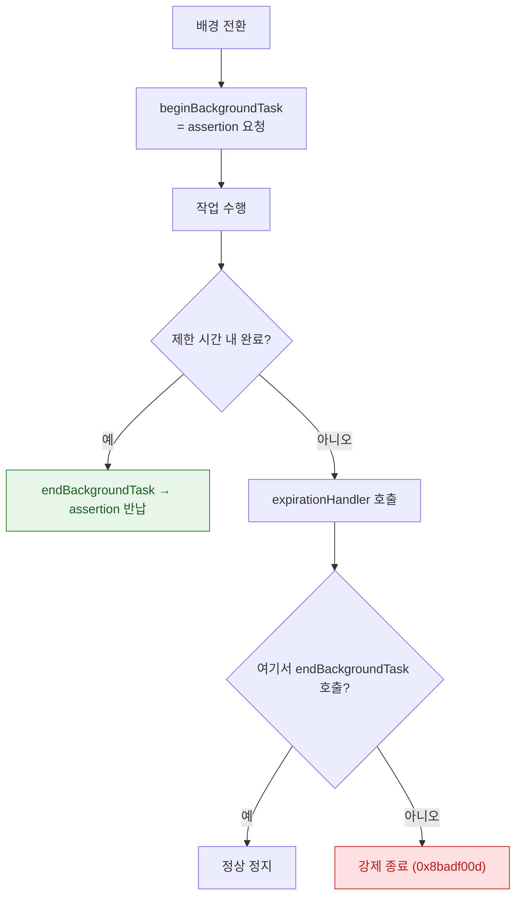

## beginBackgroundTask 는 짧은 유예 시간을 요청하는 것이지 실행 연장이 아니다

### 개념 (What)

앱이 배경으로 전환될 때 **진행 중이던 짧은 작업을 마무리할 시간**을 요청하는 API 다. 파일 저장 완료, 업로드 마무리, 연결 정리 같은 것이 대상이다.

**새 작업을 시작하는 용도가 아니다.** 이것으로 배경 실행을 이어가려는 설계는 반드시 실패한다.

```swift
var taskID: UIBackgroundTaskIdentifier = .invalid

func applicationDidEnterBackground(_ app: UIApplication) {
    taskID = app.beginBackgroundTask(withName: "SavePendingChanges") { [weak self] in
        // ★ 만료 핸들러 — 여기서 정리하지 않으면 강제 종료된다
        self?.cancelWork()
        app.endBackgroundTask(self?.taskID ?? .invalid)
        self?.taskID = .invalid
    }

    savePendingChanges { [weak self] in
        app.endBackgroundTask(self?.taskID ?? .invalid)   // ★ 끝나면 반드시 반납
        self?.taskID = .invalid
    }
}
```

### 왜 필요한가 (Why)

이것은 [RunningBoard assertion](../../01_system_internals/ipc-and-process/runningboard-assertions.md) 을 하나 요청하는 것이다. assertion 에는 **유효 기간**이 있고, 만료되면 시스템이 회수한다.



### 세 가지 계약

| 계약 | 어기면 |
| :--- | :--- |
| **끝나면 `endBackgroundTask` 호출** | assertion 이 남아 배터리를 낭비하고 이후 배정이 줄어든다 |
| **`expirationHandler` 구현** | 만료 시 [워치독 종료](../../01_system_internals/ipc-and-process/watchdog-termination-codes.md) |
| **만료 핸들러에서도 `endBackgroundTask`** | 같음 |

> [!WARNING] 유예 시간을 상수로 외우지 않는다
> 널리 인용되는 수치가 있지만 **공개된 계약값이 아니며** OS 버전·배터리·기기 상태에 따라 달라진다. `backgroundTimeRemaining` 도 참고값일 뿐이다. **"충분히 짧은 작업만" 넣는 것이 유일하게 안전한 전제**다.

### 무엇을 넣고 무엇을 넣지 않는가

| 적합 | 부적합 |
| :--- | :--- |
| 메모리에 있는 상태를 디스크에 기록 | 대용량 업로드 → [백그라운드 URLSession](../../01_system_internals/connectivity/background-transfer-daemon.md) |
| 진행 중이던 짧은 요청 마무리 | 주기적 데이터 갱신 → [BGTaskScheduler](bgtaskscheduler-registration-must-happen-at-launch.md) |
| DB 트랜잭션 커밋, 파일 잠금 해제 | 새 작업 시작 |
| 연결 정리 | 무거운 마이그레이션 |

**파일 잠금 해제가 특히 중요하다.** 공유 컨테이너의 SQLite 잠금을 쥔 채 정지되면 [`0xdead10cc`](../../01_system_internals/ipc-and-process/watchdog-termination-codes.md) 로 죽는다.

### 중첩과 이름

여러 작업을 동시에 마무리해야 하면 각각 별도 identifier 를 받는다. 이름을 주면 진단이 쉬워진다.

```swift
let id1 = app.beginBackgroundTask(withName: "FlushAnalytics") { ... }
let id2 = app.beginBackgroundTask(withName: "CloseDatabase") { ... }
```

크래시 리포트에 어떤 이름의 작업이 만료되었는지 남으므로, **이름을 반드시 지정한다.**

### Swift Concurrency 와 함께

```swift
func saveOnBackground() async {
    let app = UIApplication.shared
    var id: UIBackgroundTaskIdentifier = .invalid
    id = app.beginBackgroundTask(withName: "Save") { app.endBackgroundTask(id); id = .invalid }
    defer { if id != .invalid { app.endBackgroundTask(id); id = .invalid } }   // ★ 경로 무관 반납

    await save()
}
```

`defer` 로 반납하면 예외·취소 경로에서도 누락되지 않는다.

### 관찰 가능한 증거

```swift
print(UIApplication.shared.backgroundTimeRemaining)   // 참고값
```

```bash
# assertion 부여/회수 판정
log stream --device --predicate 'process == "runningboardd"' --info
```

**재현 방법**: Xcode 를 분리하고 앱을 배경으로 보낸 뒤 만료까지 기다린다. 디버거가 붙어 있으면 만료가 발생하지 않아 `expirationHandler` 를 검증할 수 없다.

### 연관 문서

- [백그라운드 모드는 런타임 요청이 아니라 Info.plist 선언이다](background-modes-are-declared-not-requested.md)
- [BGTaskScheduler 등록은 앱 시작 시점에 끝나야 한다](bgtaskscheduler-registration-must-happen-at-launch.md)
- [워치독 종료는 예외 코드로 원인 구간을 구분할 수 있다](../../01_system_internals/ipc-and-process/watchdog-termination-codes.md)
- [05-termination-recovery-of-edit-state](../../00_foundations/worked-examples/05-termination-recovery-of-edit-state.md)

공식 문서: [Extending your app's background execution time](https://developer.apple.com/documentation/uikit/extending-your-app-s-background-execution-time)
