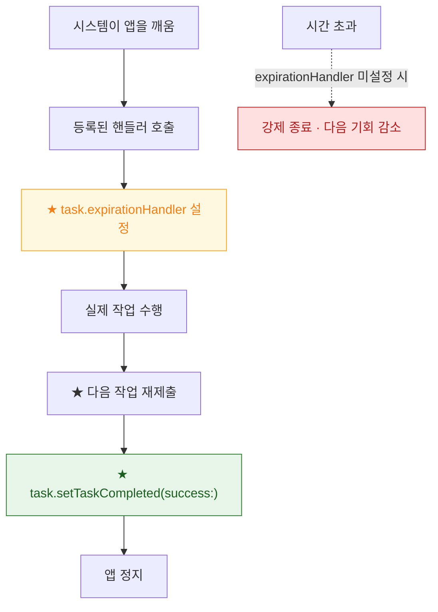

## BGTaskScheduler 는 앱 시작 시점에 등록을 끝내야 하고 실행 시점은 시스템이 정한다

### 개념 (What)

`BGTaskScheduler` 는 두 단계로 동작한다.

1. **등록(register)** — "이 식별자로 작업이 오면 이 핸들러를 부르라"를 **앱이 시작을 마치기 전에** 선언한다.
2. **제출(submit)** — "이런 조건이 되면 실행해 달라"를 요청한다. **시점은 시스템이 정한다.**

등록을 늦게 하면 시스템이 앱을 깨웠을 때 핸들러가 없어 **작업이 그대로 만료**된다.

### 왜 필요한가 (Why)

시스템이 앱을 배경에서 깨우는 순간, 앱은 이제 막 실행된 상태다. 그 시점에 이미 핸들러가 등록되어 있어야 작업을 넘겨줄 수 있다.

```swift
func application(_ app: UIApplication,
                 didFinishLaunchingWithOptions o: [UIApplication.LaunchOptionsKey: Any]?) -> Bool {
    // ★ 반드시 여기서. 화면이 뜬 뒤에 등록하면 늦다.
    BGTaskScheduler.shared.register(
        forTaskWithIdentifier: "com.example.refresh", using: nil) { task in
        self.handleRefresh(task as! BGAppRefreshTask)
    }
    return true
}
```

### 세 가지 필수 조건

하나라도 빠지면 조용히 동작하지 않는다.

| 조건 | 빠뜨리면 |
| :--- | :--- |
| `Info.plist` 의 `BGTaskSchedulerPermittedIdentifiers` 에 식별자 | `submit` 이 예외를 던진다 |
| `didFinishLaunching` 안에서 `register` | 깨어나도 핸들러가 없어 만료 |
| `UIBackgroundModes` 에 `fetch` / `processing` | 깨우기 자체가 없다 |

```xml
<key>BGTaskSchedulerPermittedIdentifiers</key>
<array><string>com.example.refresh</string></array>
<key>UIBackgroundModes</key>
<array><string>fetch</string><string>processing</string></array>
```

### 두 종류의 작업

| | `BGAppRefreshTask` | `BGProcessingTask` |
| :--- | :--- | :--- |
| 용도 | 짧은 데이터 갱신 | 긴 정리·마이그레이션·동기화 |
| 실행 시간 | 짧다 (수십 초 수준) | 상대적으로 길다 |
| 조건 지정 | 없음 | 외부 전원·네트워크 요구 가능 |
| 실행 시점 | 사용 패턴 학습 기반 | 주로 야간 충전 중 |

```swift
let request = BGProcessingTaskRequest(identifier: "com.example.cleanup")
request.requiresExternalPower = true       // 충전 중에만
request.requiresNetworkConnectivity = true
request.earliestBeginDate = Date(timeIntervalSinceNow: 3600)   // "이후에" 이지 "그때" 가 아니다
try? BGTaskScheduler.shared.submit(request)
```

**`earliestBeginDate` 는 하한선일 뿐이다.** 그 시각에 실행된다는 보장이 아니다.

### 핸들러의 두 가지 의무



```swift
func handleRefresh(_ task: BGAppRefreshTask) {
    scheduleNext()                                   // ★ 다음 실행을 지금 예약한다

    let operation = RefreshOperation()
    task.expirationHandler = {                       // ★ 시간 초과 시 정리
        operation.cancel()
    }
    operation.completionBlock = {
        task.setTaskCompleted(success: !operation.isCancelled)   // ★ 반드시 호출
    }
    queue.addOperation(operation)
}

func scheduleNext() {
    let r = BGAppRefreshTaskRequest(identifier: "com.example.refresh")
    r.earliestBeginDate = Date(timeIntervalSinceNow: 15 * 60)
    try? BGTaskScheduler.shared.submit(r)
}
```

**다음 작업을 핸들러 안에서 다시 제출해야 한다.** 한 번 제출하면 계속 반복되는 구조가 아니다.

**`setTaskCompleted` 를 호출하지 않으면** 시스템은 앱이 아직 일하고 있다고 보고 강제 종료하며, 이후 실행 기회를 줄인다.

### 로직과 시점을 분리해 진단한다

```
# 앱을 실행 → 배경으로 보낸 뒤 Xcode 디버거 콘솔에서 강제 트리거
e -l objc -- (void)[[BGTaskScheduler sharedScheduler] _simulateLaunchForTaskWithIdentifier:@"com.example.refresh"]

# 만료 상황 재현
e -l objc -- (void)[[BGTaskScheduler sharedScheduler] _simulateExpirationForTaskWithIdentifier:@"com.example.refresh"]
```

여기서 정상 동작하면 **로직은 맞고 시스템이 시점을 안 준 것**이다. 그 경우는 정책 문제이므로 코드를 고칠 것이 아니다.

### 관찰 가능한 증거

```bash
log stream --device --predicate 'subsystem == "com.apple.duetactivityscheduler"' --info
log stream --device --predicate 'process == "runningboardd"' --info
```

```swift
BGTaskScheduler.shared.getPendingTaskRequests { requests in
    print("대기 중인 작업:", requests.map(\.identifier))
}
```

**MetricKit 의 `MXBackgroundTimeMetric`** 으로 실사용자 기기에서 실제 받은 배경 시간을 집계한다.

### 연관 문서

- [백그라운드 모드는 런타임 요청이 아니라 Info.plist 선언이다](background-modes-are-declared-not-requested.md)
- [silent push 는 앱을 깨우지만 전달이 보장되지 않는다](silent-push-wakes-the-app-with-limits.md)
- [RunningBoard assertion 이 프로세스의 실행 지속 여부를 결정한다](../../01_system_internals/ipc-and-process/runningboard-assertions.md)
- [05-background-work-not-running](../../00_foundations/diagnostic-runbooks/05-background-work-not-running.md)

공식 문서: [BackgroundTasks](https://developer.apple.com/documentation/backgroundtasks) · [Using background tasks to update your app](https://developer.apple.com/documentation/backgroundtasks/using-background-tasks-to-update-your-app)
