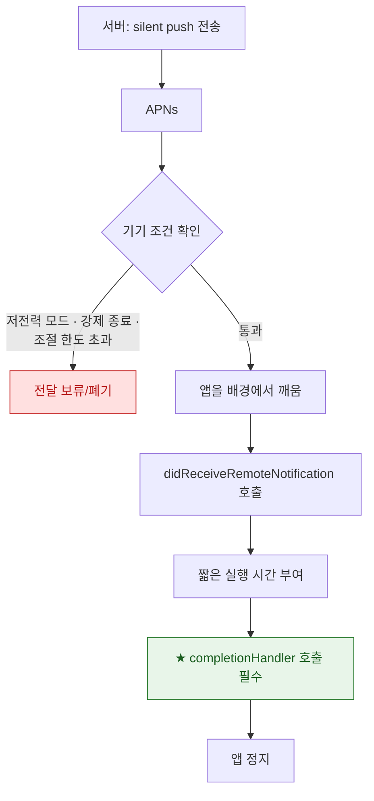

## silent push 는 앱을 깨우지만 전달과 실행이 보장되지 않는다

### 개념 (What)

사용자에게 아무것도 보여주지 않고 **앱만 조용히 깨우는 푸시**다. 서버 데이터가 바뀌었을 때 앱이 미리 내려받게 하는 용도로 쓴다.

```json
{
  "aps": { "content-available": 1 },
  "itemID": "42"
}
```

전송 시 헤더도 함께 맞춰야 한다.

```bash
--header "apns-push-type: background"
--header "apns-priority: 5"        # background 는 10 을 쓸 수 없다
```

### 왜 필요한가 (Why)

silent push 는 **best-effort** 다. 다음 이유로 전달되지 않거나 늦게 도착할 수 있다.

| 이유 | 설명 |
| :--- | :--- |
| **시스템 조절(throttling)** | 앱별로 시간당 전달 횟수를 제한한다 |
| **저전력 모드** | 대부분 보류된다 |
| **사용자 강제 종료** | 앱 전환기에서 종료했으면 깨우지 않는다 |
| **배경 앱 새로고침 꺼짐** | 설정에서 끄면 동작하지 않는다 |
| **기기 사용 패턴** | 잘 안 쓰는 앱은 후순위 |

**따라서 "푸시가 왔으니 데이터가 최신"을 전제로 UI 를 설계하면 안 된다.** 전경 복귀 시에도 동기화하는 경로가 반드시 있어야 한다.



### 처리 계약

```swift
func application(_ app: UIApplication,
                 didReceiveRemoteNotification userInfo: [AnyHashable: Any],
                 fetchCompletionHandler completion: @escaping (UIBackgroundFetchResult) -> Void) {
    Task {
        do {
            let changed = try await syncData(from: userInfo)
            // ★ 결과를 정직하게 보고한다 — 시스템이 이후 배정에 반영한다
            completion(changed ? .newData : .noData)
        } catch {
            completion(.failed)
        }
    }
}
```

| 반환값 | 의미 | 영향 |
| :--- | :--- | :--- |
| `.newData` | 새 데이터를 받았다 | 이후 배정에 유리 |
| `.noData` | 바뀐 것이 없었다 | 반복되면 배정이 줄어든다 |
| `.failed` | 실패했다 | — |

**항상 `.newData` 를 반환하는 것은 좋지 않다.** 시스템이 실제 유용성을 학습하므로 정직하게 보고해야 장기적으로 유리하다.

**`completionHandler` 를 호출하지 않으면** 앱이 강제 종료되고 이후 배정이 크게 줄어든다.

### 필수 선언

```xml
<key>UIBackgroundModes</key>
<array><string>remote-notification</string></array>
```

이것 없이는 `content-available` 를 보내도 앱이 깨어나지 않는다.

### 언제 silent push 를 쓰지 않는가

| 요구사항 | 더 나은 선택 |
| :--- | :--- |
| 반드시 사용자에게 알려야 함 | 일반 alert 푸시 |
| 대용량 다운로드 | [백그라운드 URLSession](../../01_system_internals/connectivity/background-transfer-daemon.md) |
| 주기적 갱신 | [BGAppRefreshTask](bgtaskscheduler-registration-must-happen-at-launch.md) |
| 즉시성이 중요한 통화 | PushKit + CallKit |
| Live Activity 갱신 | [liveactivity 푸시](../../02_ui_frameworks/widgets/live-activity-updates-via-push-or-local.md) |

**"조용히 알림 내용을 미리 받아 두기"** 가 목적이라면 silent push 대신 [Notification Service Extension](../../02_ui_frameworks/widgets/widget-is-a-snapshot-not-a-live-view.md) 이 있는 일반 푸시가 더 확실하다.

### 관찰 가능한 증거

```bash
# 직접 보내 응답 확인
curl -v --http2 \
  --header "apns-topic: com.example.app" \
  --header "apns-push-type: background" \
  --header "apns-priority: 5" \
  --header "authorization: bearer $JWT" \
  --data '{"aps":{"content-available":1},"itemID":"42"}' \
  https://api.sandbox.push.apple.com/3/device/$TOKEN

# 기기 측 수신 로그
log stream --device --predicate 'process == "apsd"' --info
```

APNs 가 200 을 반환해도 **기기 전달은 별개**다. 앱 안에서 수신 로그를 남겨 실제 도착 여부를 확인해야 한다.

```swift
func application(_:didReceiveRemoteNotification:fetchCompletionHandler:) {
    appendToSharedLog("silent push 수신 \(Date())")   // Xcode 없이도 나중에 확인
}
```

### 연관 문서

- [BGTaskScheduler 등록은 앱 시작 시점에 끝나야 한다](bgtaskscheduler-registration-must-happen-at-launch.md)
- [백그라운드 모드는 런타임 요청이 아니라 Info.plist 선언이다](background-modes-are-declared-not-requested.md)
- [apple-push-notifications-apns](../apple-push-notifications-apns.md)
- [06-push-notification-missing](../../00_foundations/diagnostic-runbooks/06-push-notification-missing.md)

공식 문서: [Pushing background updates to your App](https://developer.apple.com/documentation/usernotifications/pushing-background-updates-to-your-app)
