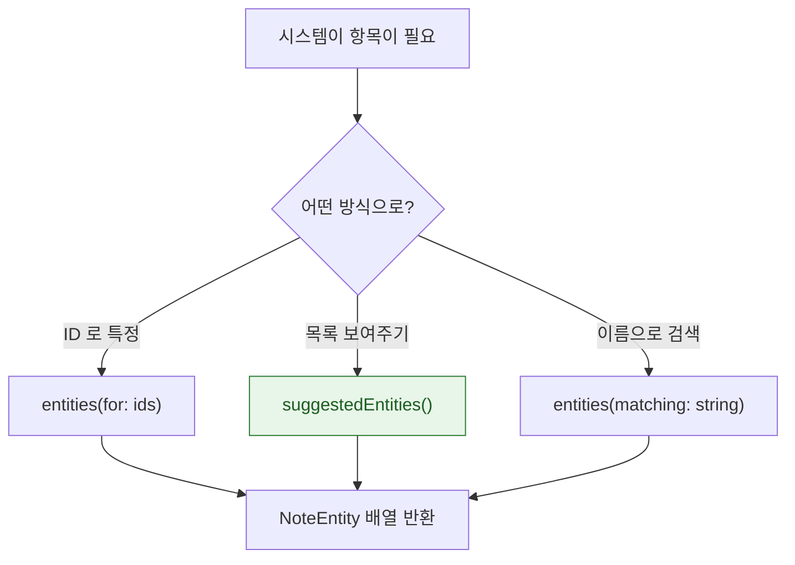

## AppEntity 는 앱의 데이터 모델을 시스템이 검색하고 참조할 수 있게 노출한다

### 개념 (What)

[AppIntent](app-intent-runs-without-the-app-in-foreground.md) 가 **동작**이라면 `AppEntity` 는 그 동작의 **대상**이다. "메모를 열어줘"에서 `열다`가 intent, `메모`가 entity 다.

entity 를 정의하면 시스템이 다음을 할 수 있다.

- 단축어에서 항목 목록을 보여주고 사용자가 고르게 함
- Siri 가 "어떤 메모?"라고 되묻고 이름으로 찾음
- Spotlight 에서 앱 안의 항목이 검색됨
- Apple Intelligence 가 항목을 참조함

```swift
struct NoteEntity: AppEntity {
    let id: UUID
    @Property(title: "제목") var title: String

    static var typeDisplayRepresentation: TypeDisplayRepresentation = "메모"
    var displayRepresentation: DisplayRepresentation {
        DisplayRepresentation(title: "\(title)", subtitle: "\(dateText)")
    }
    static var defaultQuery = NoteQuery()
}
```

### 왜 필요한가 (Why)

entity 없이 intent 만 만들면 **매개변수를 문자열로 받을 수밖에 없다.** 사용자가 정확한 제목을 입력해야 하고, 오타가 나면 실패한다. entity 는 시스템이 **목록·검색·자동완성**을 대신 제공하게 한다.

### `EntityQuery` — 시스템이 항목을 찾는 방법



```swift
struct NoteQuery: EntityQuery {
    // 필수: ID 로 조회
    func entities(for identifiers: [UUID]) async throws -> [NoteEntity] {
        try SharedStore.notes(ids: identifiers).map(NoteEntity.init)
    }

    // 단축어 편집 시 보여줄 목록
    func suggestedEntities() async throws -> [NoteEntity] {
        try SharedStore.recentNotes(limit: 10).map(NoteEntity.init)
    }
}

// 이름으로 찾기 (Siri 가 "회의 메모" 라고 했을 때)
extension NoteQuery: EntityStringQuery {
    func entities(matching string: String) async throws -> [NoteEntity] {
        try SharedStore.searchNotes(string).map(NoteEntity.init)
    }
}
```

**`EntityStringQuery` 를 구현하지 않으면 음성으로 항목을 지정할 수 없다.** Siri 사용이 목표라면 필수다.

### 쿼리도 앱 없이 실행된다

`EntityQuery` 역시 [앱이 전경에 없을 때 실행](app-intent-runs-without-the-app-in-foreground.md)될 수 있다. 메모리 캐시가 아니라 **[App Group 공유 저장소](../../01_system_internals/storage/app-container-directory-policies.md)에서 직접 읽어야** 한다.

### 노출 범위가 곧 프라이버시 결정이다

entity 로 노출한 데이터는 시스템 인텔리전스가 참조할 수 있게 된다.

| 노출한다 | 노출하지 않는다 |
| :--- | :--- |
| 제목, 날짜, 상태 | 본문 전체 |
| 목록 항목의 식별자 | 건강·금융 상세 |
| 사용자가 이미 화면에서 보는 것 | 비밀번호·토큰 |

`displayRepresentation` 에 넣는 값이 **잠금 화면이나 Siri 응답에 그대로 보일 수 있다.** 민감한 내용은 제목에 넣지 않는다.

또한 노출한 데이터는 [Privacy Manifest](../../05_security_privacy/apple-privacy-and-tcc-details.md) 에 반영해야 한다.

### Spotlight 색인과의 관계

`IndexedEntity` 를 채택하면 항목이 Spotlight 에 색인되어 시스템 검색에서 바로 나온다.

```swift
extension NoteEntity: IndexedEntity {}
```

색인은 앱이 명시적으로 갱신해야 하며, 삭제된 항목을 지우지 않으면 **검색 결과를 탭했을 때 없는 항목으로 이동**한다.

### 관찰 가능한 증거

```bash
log stream --device --predicate 'subsystem == "com.apple.AppIntents"' --info
```

**검증 순서**

1. 앱을 한 번 실행한다 (등록 필요)
2. **단축어 앱**에서 내 앱의 액션을 추가하고 매개변수 목록에 항목이 보이는지 확인 → `suggestedEntities` 동작
3. Siri 로 이름을 말해 지정되는지 확인 → `EntityStringQuery` 동작
4. **앱을 완전히 종료한 뒤** 같은 동작을 반복 → 공유 저장소 접근 검증

### 연관 문서

- [AppIntent 는 앱이 전경에 없어도 실행된다](app-intent-runs-without-the-app-in-foreground.md)
- [App Shortcuts 는 문구와 provider 가 있어야 음성으로 실행된다](app-shortcuts-need-phrases-and-a-provider.md)
- [apple-privacy-and-tcc-details](../../05_security_privacy/apple-privacy-and-tcc-details.md)

공식 문서: [AppEntity](https://developer.apple.com/documentation/appintents/appentity) · [EntityQuery](https://developer.apple.com/documentation/appintents/entityquery)
