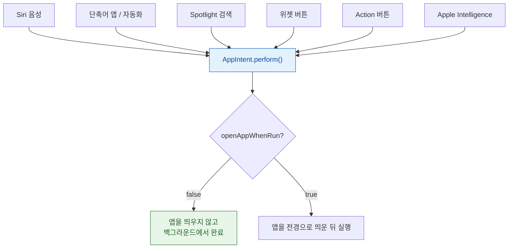

## AppIntent 는 앱이 전경에 없어도 실행되므로 전역 상태를 가정하면 안 된다

### 개념 (What)

`AppIntent` 는 **앱의 기능 하나를 시스템이 실행할 수 있는 단위로 노출**한 것이다. Siri, 단축어, Spotlight, [위젯 버튼](../../02_ui_frameworks/widgets/interactive-widgets-run-app-intents.md), Action 버튼, 자동화가 모두 같은 intent 를 실행한다.

결정적인 성질: **`perform()` 은 앱 프로세스에서 실행되지만, 그 프로세스가 방금 깨어난 것일 수 있다.** 화면도 없고, 초기화 코드가 돌지 않았을 수 있다.

```swift
struct MarkDoneIntent: AppIntent {
    static var title: LocalizedStringResource = "항목 완료"
    static var openAppWhenRun: Bool = false      // 앱을 띄우지 않는다

    @Parameter(title: "항목")
    var item: ItemEntity

    func perform() async throws -> some IntentResult {
        // ★ AppDelegate 가 돌았다고 가정하면 안 된다
        let store = try SharedStore.open()        // 필요한 것을 여기서 직접 준비
        try store.markDone(item.id)
        return .result()
    }
}
```

### 왜 필요한가 (Why)

가장 흔한 버그가 여기서 나온다.

```swift
// ❌ 앱이 실행 중이라고 가정
func perform() async throws -> some IntentResult {
    AppState.shared.currentUser!.markDone(item.id)   // AppState 가 비어 있을 수 있다 → 크래시
    return .result()
}

// ✅ 필요한 것을 직접 확보
func perform() async throws -> some IntentResult {
    guard let user = try SharedStore.loadUser() else {
        throw NeedsSignInError()                      // 명확한 오류로 안내
    }
    ...
}
```

### 실행 경로가 여러 개다



**`openAppWhenRun = false` 가 기본이고 그것이 바람직하다.** 사용자가 위젯 버튼을 눌렀는데 앱이 튀어나오면 흐름이 끊긴다.

### 반환값이 UI 를 결정한다

```swift
// 값만 반환
return .result(value: count)

// 사용자에게 보여줄 스니펫
return .result(dialog: "3개 항목을 완료했습니다") {
    CompletionSnippetView(count: 3)
}

// 확인이 필요한 경우 — 실행 전에 사용자에게 되묻는다
try await requestConfirmation(result: .result(dialog: "정말 모두 삭제할까요?"))
```

`requestConfirmation` 은 **파괴적 동작에 반드시 넣는다.** 음성으로 실수 실행되는 것을 막는다.

### 실행 시간 제약

`perform()` 은 **짧아야 한다.** 오래 걸리면 시스템이 중단한다.

```swift
// ❌ 긴 네트워크 작업
func perform() async throws -> some IntentResult {
    try await api.syncEverything()      // 위험
    return .result()
}

// ✅ 로컬 상태만 즉시 바꾸고 동기화는 배경 작업에 맡긴다
func perform() async throws -> some IntentResult {
    try SharedStore.markPendingSync(item.id)
    scheduleBackgroundSync()            // BGTaskScheduler
    return .result()
}
```

→ [BGTaskScheduler](../background/bgtaskscheduler-registration-must-happen-at-launch.md)

### 등록 시점

**앱을 한 번 실행해야 시스템이 intent 를 인식한다.** 설치만으로는 부족하다. 단축어 앱에 액션이 보이지 않으면 이것을 먼저 확인한다.

### 관찰 가능한 증거

```bash
log stream --device --predicate 'subsystem == "com.apple.AppIntents"' --info
log stream --device --predicate 'process == "siriactionsd"' --info
```

```swift
func perform() async throws -> some IntentResult {
    NSLog("intent 실행 %@ item=%@", Date().description, item.id)
    ...
}
```

**앱 스킴으로 Xcode 실행 중**에 위젯 버튼이나 단축어를 실행하면 `perform()` 에 브레이크포인트가 걸린다(intent 는 앱 프로세스에서 돌기 때문).

**앱을 완전히 종료한 상태에서 단축어를 실행**해 보는 것이 필수 검증이다. 전역 상태 가정 버그가 여기서만 드러난다.

### 연관 문서

- [AppEntity 는 앱의 데이터 모델을 시스템에 노출한다](app-entity-exposes-your-model-to-the-system.md)
- [App Shortcuts 는 문구와 provider 가 있어야 음성으로 실행된다](app-shortcuts-need-phrases-and-a-provider.md)
- [상호작용 위젯은 AppIntent 를 실행한다](../../02_ui_frameworks/widgets/interactive-widgets-run-app-intents.md)

공식 문서: [App Intents](https://developer.apple.com/documentation/appintents)
