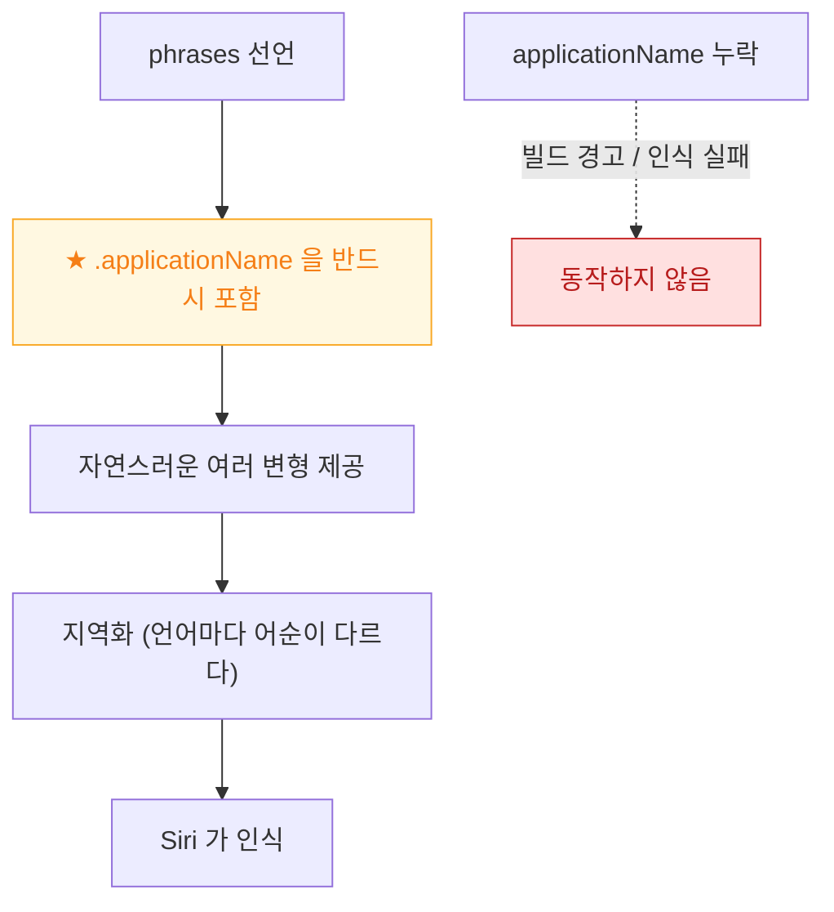

## App Shortcuts 는 provider 와 발화 문구가 있어야 설정 없이 음성으로 실행된다

### 개념 (What)

[AppIntent](app-intent-runs-without-the-app-in-foreground.md) 를 만들면 단축어 앱에서 **사용자가 직접 조립**해 쓸 수 있다. 그러나 그것만으로는 **Siri 에 대고 바로 말할 수 없다.**

`AppShortcutsProvider` 로 **미리 만들어진 단축어와 발화 문구**를 선언해야, 사용자가 아무 설정 없이 즉시 음성으로 실행할 수 있다.

```swift
struct MyAppShortcuts: AppShortcutsProvider {
    static var appShortcuts: [AppShortcut] {
        AppShortcut(
            intent: CreateNoteIntent(),
            phrases: [
                "\(.applicationName)에 메모 추가",
                "\(.applicationName)에서 새 메모 작성",
                "\(.applicationName) 메모 만들기"
            ],
            shortTitle: "메모 작성",
            systemImageName: "square.and.pencil"
        )
    }
}
```

### 왜 필요한가 (Why)

| | 일반 AppIntent | App Shortcut |
| :--- | :--- | :--- |
| 단축어 앱에서 조립 | 가능 | 가능 |
| **설정 없이 Siri 로 실행** | **불가** | **가능** |
| Spotlight 에 노출 | 제한적 | 노출됨 |
| 사용자 설정 필요 | 있음 | **없음** |

사용자가 단축어를 직접 만드는 비율은 낮다. **App Shortcuts 가 실제 도달률을 만든다.**

### 발화 문구의 규칙



| 규칙 | 이유 |
| :--- | :--- |
| **`\(.applicationName)` 필수** | 어느 앱인지 구분해야 한다. 없으면 동작하지 않는다 |
| **여러 변형 제공** | 사용자가 정확히 한 문장을 외우지 않는다 |
| **짧고 자연스럽게** | 긴 문장은 인식률이 떨어진다 |
| **지역화** | 한국어와 영어는 어순이 다르다. 번역이 아니라 각 언어의 자연스러운 표현 |

앱 이름은 `Info.plist` 의 `CFBundleDisplayName` 을 따르며, `AppShortcutsProvider` 에 별칭을 줄 수도 있다.

### 매개변수가 있는 단축어

```swift
AppShortcut(
    intent: OpenNoteIntent(),
    phrases: ["\(.applicationName)에서 \(\.$note) 열기"],   // entity 를 문구에 넣는다
    shortTitle: "메모 열기",
    systemImageName: "doc.text"
)
```

이렇게 하면 "메모앱에서 회의록 열기" 처럼 말할 수 있다. 동작하려면 해당 entity 가 [`EntityStringQuery`](app-entity-exposes-your-model-to-the-system.md) 를 구현해야 한다.

### 개수 제한과 우선순위

App Shortcuts 는 **개수 제한**이 있다. 모든 기능을 넣을 수 없으므로 **가장 자주 쓰는 동작 몇 개**만 고른다.

배열 순서가 시스템 노출 우선순위에 영향을 준다. 중요한 것을 앞에 둔다.

### 등록 시점 — 가장 흔한 실패

**앱을 한 번 실행해야 시스템이 shortcuts 를 등록한다.** 설치만으로는 부족하다.

또한 문구가 동적으로 바뀌면 갱신을 알려야 한다.

```swift
// 예: 사용자가 만든 항목 이름이 문구에 들어가는 경우
MyAppShortcuts.updateAppShortcutParameters()
```

### 검증 순서

1. 앱을 **한 번 실행**한다
2. **단축어 앱 > 갤러리**에서 내 앱 섹션이 보이는지 확인
3. **Spotlight** 에서 `shortTitle` 로 검색되는지 확인
4. **Siri 에 발화 문구를 그대로 말해** 실행되는지 확인
5. 앱을 **완전히 종료한 뒤** 3~4 를 반복

### 관찰 가능한 증거

```bash
log stream --device --predicate 'subsystem == "com.apple.AppIntents"' --info
log stream --device --predicate 'process == "siriactionsd"' --info
```

Siri 가 인식하지 못하면 로그에서 문구 매칭 실패가 보인다. 시뮬레이터에서는 Siri 테스트가 제한적이므로 **실기기 검증이 필요하다.**

### 연관 문서

- [AppIntent 는 앱이 전경에 없어도 실행된다](app-intent-runs-without-the-app-in-foreground.md)
- [AppEntity 는 앱의 데이터 모델을 시스템에 노출한다](app-entity-exposes-your-model-to-the-system.md)
- [시스템 인텔리전스는 온디바이스와 클라우드를 스스로 나눈다](system-intelligence-decides-on-device-or-cloud.md)

공식 문서: [App Shortcuts](https://developer.apple.com/documentation/appintents/appshortcuts)
