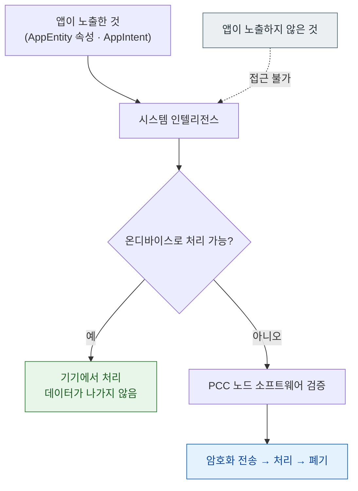

## 시스템 인텔리전스는 온디바이스와 클라우드 처리를 스스로 나누며 앱은 노출 범위만 통제한다

### 개념 (What)

앱이 [AppEntity](app-entity-exposes-your-model-to-the-system.md) 와 [AppIntent](app-intent-runs-without-the-app-in-foreground.md) 로 데이터와 기능을 노출하면, 시스템 인텔리전스가 그것을 활용해 사용자 요청을 처리한다.

이때 **어디서 처리할지는 시스템이 정한다.**

- 간단하고 기기 안에서 되는 것 → **온디바이스 모델**
- 더 큰 모델이 필요한 것 → **[Private Cloud Compute](../../05_security_privacy/apple-security-pcc.md)**

앱은 이 결정에 관여할 수 없다. **앱이 통제할 수 있는 유일한 변수는 "무엇을 노출할 것인가" 다.**

### 왜 필요한가 (Why)

이 경계를 모르면 두 가지 잘못을 한다.

1. **과도하게 노출한다** — 민감한 데이터를 entity 속성에 넣으면 그것이 클라우드로 갈 수 있다.
2. **불필요하게 걱정한다** — 노출하지 않은 데이터는 시스템이 볼 수 없다.



### 앱이 통제할 수 있는 것과 없는 것

| 통제 가능 | 통제 불가 |
| :--- | :--- |
| 어떤 entity·intent 를 노출할지 | 온디바이스/클라우드 선택 |
| entity 의 어떤 속성을 포함할지 | 시스템이 언제 호출할지 |
| `displayRepresentation` 의 내용 | 모델의 응답 내용 |
| Privacy Manifest 선언 | 사용자가 기능을 켜는지 |

**민감도가 매우 높은 데이터는 애초에 노출하지 않는 것이 유일한 통제 수단이다.**

### 노출 설계 원칙

```swift
struct HealthRecordEntity: AppEntity {
    let id: UUID

    // ✅ 사용자가 화면에서 이미 보는 수준
    @Property(title: "기록 종류") var kind: String
    @Property(title: "날짜") var date: Date

    // ❌ 상세 수치를 entity 속성으로 노출하지 않는다
    // @Property(title: "혈압") var bloodPressure: String

    var displayRepresentation: DisplayRepresentation {
        // 잠금 화면·Siri 응답에 그대로 보일 수 있다
        DisplayRepresentation(title: "\(kind) 기록", subtitle: "\(dateText)")
    }
}
```

| 질문 | 노출 여부 |
| :--- | :--- |
| 잠금 화면에 떠도 괜찮은가? | 안 되면 `displayRepresentation` 에 넣지 않는다 |
| 사용자가 이미 화면에서 보는 것인가? | 대체로 안전 |
| 제3자가 봐도 문제없는가? | 아니면 노출하지 않는다 |

### Privacy Manifest 반영

노출한 데이터 종류는 [`PrivacyInfo.xcprivacy`](../../05_security_privacy/apple-privacy-and-tcc-details.md) 에 선언해야 한다. 심사에서 확인 대상이다.

### 기능 가용성을 가정하지 않는다

Apple Intelligence 는 **기기·지역·언어·사용자 설정**에 따라 사용 가능 여부가 다르다.

```swift
// 인텔리전스가 없어도 앱의 핵심 기능은 동작해야 한다
// intent 와 entity 는 단축어·Spotlight 에서도 쓰이므로 그 자체로 가치가 있다
```

**인텔리전스를 전제로 핵심 흐름을 설계하면 상당수 사용자에게 앱이 동작하지 않는다.** intent/entity 는 인텔리전스가 없어도 단축어·위젯·Spotlight 에서 쓰이므로, 그 경로를 우선 완성하는 것이 안전하다.

### 관찰 가능한 증거

```bash
log stream --device --predicate 'subsystem == "com.apple.AppIntents"' --info
```

**검증**: Apple Intelligence 가 활성화된 실기기와 비활성 기기 양쪽에서 앱의 핵심 흐름이 동작하는지 확인한다. 시뮬레이터로는 실제 동작을 검증하기 어렵다.

### 연관 문서

- [AppEntity 는 앱의 데이터 모델을 시스템에 노출한다](app-entity-exposes-your-model-to-the-system.md)
- [AppIntent 는 앱이 전경에 없어도 실행된다](app-intent-runs-without-the-app-in-foreground.md)
- [apple-security-pcc](../../05_security_privacy/apple-security-pcc.md) - 클라우드 처리의 신뢰 모델
- [apple-privacy-and-tcc-details](../../05_security_privacy/apple-privacy-and-tcc-details.md)

공식 문서: [App Intents](https://developer.apple.com/documentation/appintents) · [Private Cloud Compute](https://security.apple.com/blog/private-cloud-compute/)
