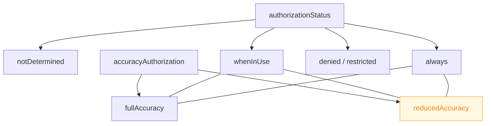

## 위치 권한과 정확도는 서로 독립된 두 축이며 둘 다 확인해야 한다

### 개념 (What)

"위치 권한을 받았다"는 한 문장이 두 가지를 감춘다.

| 축 | 값 | 사용자가 바꿀 수 있나 |
| :--- | :--- | :--- |
| **권한 범위** | `whenInUse` / `always` / `denied` | 예 |
| **정확도** | `fullAccuracy` / `reducedAccuracy` | **예, 별도로** |

사용자는 **"앱 사용 중 허용"을 주면서 동시에 "정확한 위치 끄기"** 를 할 수 있다. 이 조합에서 `authorizationStatus` 는 `authorizedWhenInUse` 지만 좌표는 수 킬로미터 오차를 갖는다.

**`reducedAccuracy` 는 실패가 아니다.** 저정밀 좌표로 동작하는 경로가 필요하다.

### 왜 필요한가 (Why)

```swift
// ❌ 권한만 확인 — 정확도를 놓친다
if manager.authorizationStatus == .authorizedWhenInUse {
    startPreciseNavigation()      // reducedAccuracy 면 쓸모없는 좌표로 길안내를 한다
}

// ✅ 두 축을 함께 확인
func locationManagerDidChangeAuthorization(_ m: CLLocationManager) {
    switch (m.authorizationStatus, m.accuracyAuthorization) {
    case (.authorizedAlways, .fullAccuracy), (.authorizedWhenInUse, .fullAccuracy):
        startPreciseFeatures()
    case (.authorizedAlways, .reducedAccuracy), (.authorizedWhenInUse, .reducedAccuracy):
        startApproximateFeatures()      // 도시 단위 기능으로 축소
    case (.denied, _), (.restricted, _):
        showSettingsGuidance()
    case (.notDetermined, _):
        break
    @unknown default: break
    }
}
```



### 권한은 단계적으로 요청한다

```swift
// 1단계: 앱 사용 중 권한부터
manager.requestWhenInUseAuthorization()

// 2단계: 사용자가 기능의 가치를 경험한 뒤에만
func userEnabledBackgroundTracking() {
    manager.requestAlwaysAuthorization()
}
```

**처음부터 `always` 를 요청하지 않는다.** 시스템도 이 흐름을 권장하며, 사용자 거부율이 크게 다르다.

`whenInUse` 상태에서 `requestAlwaysAuthorization` 을 호출하면 프롬프트가 뜨지만, **이미 거부된 상태에서는 아무 일도 일어나지 않는다.** 그때는 설정으로 안내해야 한다.

### 일시적 정밀도 상승 요청

한 번의 작업에만 정밀 위치가 필요하면 영구 권한 대신 일시 상승을 요청할 수 있다.

```swift
try await manager.requestTemporaryFullAccuracyAuthorization(withPurposeKey: "NavigationPurpose")
```

`Info.plist` 에 목적별 설명을 미리 선언해야 한다.

```xml
<key>NSLocationTemporaryUsageDescriptionDictionary</key>
<dict>
    <key>NavigationPurpose</key>
    <string>정확한 길안내를 위해 이번 경로 동안만 정밀 위치가 필요합니다</string>
</dict>
```

이 방식이 사용자에게 훨씬 덜 부담스럽고 승인율도 높다.

### 필수 선언

| 키 | 언제 |
| :--- | :--- |
| `NSLocationWhenInUseUsageDescription` | 항상 필요 |
| `NSLocationAlwaysAndWhenInUseUsageDescription` | `always` 요청 시 |
| `NSLocationTemporaryUsageDescriptionDictionary` | 일시 정밀도 상승 시 |

**설명 문구가 없으면 프롬프트를 띄우는 순간 크래시한다.** 문구는 심사 대상이므로 "위치가 필요합니다" 같은 무의미한 문장은 반려된다.

### 관찰 가능한 증거

```swift
print(manager.authorizationStatus.rawValue, manager.accuracyAuthorization.rawValue)
```

```bash
# 시뮬레이터에서 권한 조작
xcrun simctl privacy booted grant  location-always com.example.app
xcrun simctl privacy booted revoke location com.example.app
xcrun simctl privacy booted reset  location com.example.app

# 위치 주입
xcrun simctl location booted set 37.5665,126.9780

log stream --device --predicate 'process == "locationd"' --info
```

**정밀 위치를 끈 상태로 전체 흐름을 반드시 테스트한다.** 설정 > 개인정보 보호 > 위치 서비스 > 앱 > 정확한 위치 끄기.

### 연관 문서

- [배경 위치는 모드 선언과 표시기를 동반한다](background-location-requires-mode-and-indicator.md)
- [지역 모니터링은 정밀도를 포기하고 종료된 앱까지 깨운다](region-monitoring-wakes-a-terminated-app.md)
- [apple-privacy-and-tcc-details](../../05_security_privacy/apple-privacy-and-tcc-details.md)
- [06-permission-gates-in-sequence](../../00_foundations/worked-examples/06-permission-gates-in-sequence.md)

공식 문서: [Core Location](https://developer.apple.com/documentation/corelocation) · [Requesting authorization to use location services](https://developer.apple.com/documentation/corelocation/requesting-authorization-to-use-location-services)
