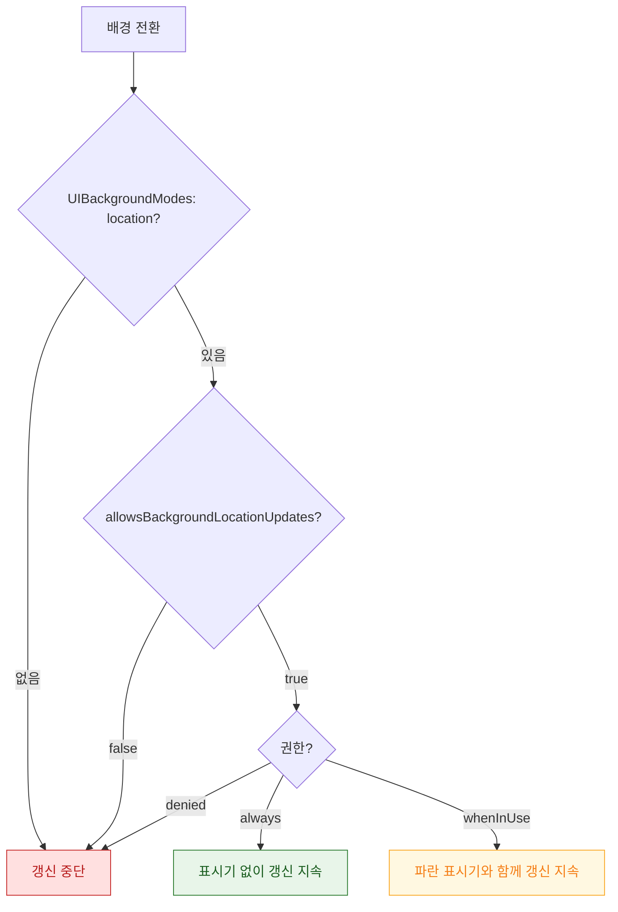

## 배경 위치 갱신은 모드 선언·플래그·권한 세 가지가 모두 맞아야 한다

### 개념 (What)

앱이 배경에서 위치를 계속 받으려면 **세 가지가 동시에** 충족되어야 한다. 하나라도 빠지면 배경 전환 즉시 갱신이 멈춘다.

1. `Info.plist` 의 `UIBackgroundModes` 에 `location`
2. 코드에서 `manager.allowsBackgroundLocationUpdates = true`
3. 권한이 `authorizedAlways` — 또는 `authorizedWhenInUse` + **파란 표시기 노출**

```swift
manager.allowsBackgroundLocationUpdates = true      // ★ 기본값 false
manager.showsBackgroundLocationIndicator = true     // 사용자에게 알림
manager.startUpdatingLocation()
```

### 왜 필요한가 (Why)

`whenInUse` 권한만으로도 배경 갱신이 가능하다는 점이 잘 알려져 있지 않다. 대신 **파란 상태바 표시기(또는 Dynamic Island 표시)** 가 계속 보인다. 사용자가 앱이 위치를 쓰고 있음을 항상 알 수 있게 하는 대가다.



| 권한 | 표시기 | 적합한 용도 |
| :--- | :--- | :--- |
| `whenInUse` + 표시기 | 항상 보임 | **운동 기록, 내비게이션** (사용자가 인지하는 세션) |
| `always` | 없음 | 지오펜싱, 백그라운드 알림 |

**운동 앱이라면 `always` 를 요청할 이유가 없다.** `whenInUse` + 표시기가 사용자에게 더 투명하고 승인율도 높다.

### 배터리는 두 파라미터가 결정한다

```swift
manager.desiredAccuracy = kCLLocationAccuracyHundredMeters   // 필요한 만큼만
manager.distanceFilter = 50                                  // 50m 이동 시에만 콜백
manager.pausesLocationUpdatesAutomatically = true            // 정지 시 자동 일시중지
manager.activityType = .fitness                              // 시스템이 최적화에 활용
```

| 정확도 상수 | 전력 |
| :--- | :--- |
| `kCLLocationAccuracyBestForNavigation` | 가장 높음 |
| `kCLLocationAccuracyBest` | 높음 |
| `kCLLocationAccuracyNearestTenMeters` | 중간 |
| `kCLLocationAccuracyHundredMeters` | 낮음 |
| `kCLLocationAccuracyKilometer` / `.threeKilometers` | 매우 낮음 |

**`distanceFilter` 를 설정하지 않으면** 서 있어도 계속 콜백이 와서 전력을 소모한다. 대부분의 앱에서 이것 하나만 설정해도 소모가 크게 준다.

`activityType` 을 정확히 지정하면 시스템이 상황에 맞게 최적화한다(예: `.automotiveNavigation` 은 도로에 스냅).

### 저장 시 보호 클래스 주의

배경에서 위치를 받아 저장한다면 **기기가 잠긴 상태일 수 있다.** 목적지 파일의 [Data Protection 클래스](../../01_system_internals/storage/data-protection-classes.md)가 `complete` 면 쓰기가 실패한다.

```swift
try data.write(to: url, options: [.completeFileProtectionUntilFirstUserAuthentication])
```

### 앱이 종료되면?

`startUpdatingLocation` 은 **앱이 종료되면 멈춘다.** 종료 상태에서도 깨어나야 한다면 [지역 모니터링이나 중요 위치 변경](region-monitoring-wakes-a-terminated-app.md)을 써야 한다.

### 관찰 가능한 증거

```bash
log stream --device --predicate 'process == "locationd"' --info

# 시뮬레이터로 이동 시뮬레이션
xcrun simctl location booted start --speed 20 37.5665,126.9780 37.5700,126.9820
```

**Instruments의 Energy Log** 로 위치 갱신이 만드는 소모를 측정한다. `desiredAccuracy` 를 한 단계 낮추고 비교하면 효과가 바로 보인다.

**검증**: Xcode 를 분리하고 실기기를 들고 이동하며 배경 상태에서 데이터가 실제로 쌓이는지 확인한다. 디버거가 붙어 있으면 배경 동작이 실제와 다르다.

### 연관 문서

- [위치 권한과 정확도는 서로 독립된 두 축이다](authorization-and-accuracy-are-independent-axes.md)
- [지역 모니터링은 정밀도를 포기하고 종료된 앱까지 깨운다](region-monitoring-wakes-a-terminated-app.md)
- [백그라운드 모드는 런타임 요청이 아니라 Info.plist 선언이다](../background/background-modes-are-declared-not-requested.md)
- [Data Protection 클래스는 파일 키를 기기 잠금 상태에 묶는다](../../01_system_internals/storage/data-protection-classes.md)

공식 문서: [Handling location updates in the background](https://developer.apple.com/documentation/corelocation/handling-location-updates-in-the-background)
