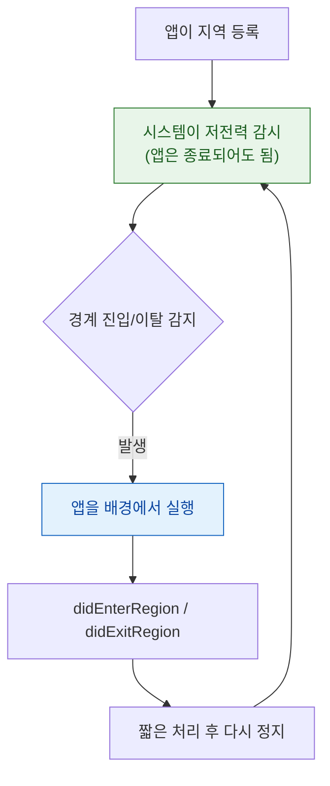

## 지역 모니터링은 정밀도를 포기하는 대신 종료된 앱까지 깨운다

### 개념 (What)

[연속 위치 갱신](background-location-requires-mode-and-indicator.md)은 앱이 종료되면 멈춘다. 그러나 **지역 모니터링과 중요 위치 변경**은 다르다. 시스템이 저전력 하드웨어로 감시하다가, 조건이 맞으면 **종료된 앱을 다시 실행시켜** 알려준다.

| 방식 | 트리거 | 정밀도 | 전력 |
| :--- | :--- | :--- | :--- |
| **연속 갱신** | 계속 | 높음 | 높음 |
| **지역 모니터링 (지오펜싱)** | 특정 원형 지역 진입/이탈 | 수백 미터 | 매우 낮음 |
| **중요 위치 변경** | 기지국이 크게 바뀔 때 | 킬로미터 | 매우 낮음 |
| **방문 모니터링** | 사용자가 머문 장소 | 장소 단위 | 매우 낮음 |

### 왜 필요한가 (Why)

"집에 도착하면 알림" 같은 기능을 연속 갱신으로 구현하면 배터리가 하루를 못 간다. 지역 모니터링은 **셀룰러·Wi-Fi 기반의 저전력 감시**를 시스템이 대신 해 준다.



### 구현

```swift
// 지오펜싱 — always 권한 필요
let region = CLCircularRegion(
    center: CLLocationCoordinate2D(latitude: 37.5665, longitude: 126.9780),
    radius: 200,                     // 너무 작으면 감지가 불안정하다
    identifier: "home")
region.notifyOnEntry = true
region.notifyOnExit = true
manager.startMonitoring(for: region)

// 중요 위치 변경 — 종료된 앱도 깨운다
manager.startMonitoringSignificantLocationChanges()
```

앱이 위치 이벤트로 실행되면 `didFinishLaunching` 의 옵션으로 알 수 있다.

```swift
func application(_ app: UIApplication,
                 didFinishLaunchingWithOptions o: [UIApplication.LaunchOptionsKey: Any]?) -> Bool {
    if o?[.location] != nil {
        // 위치 이벤트로 깨어났다. manager 를 다시 만들고 델리게이트를 붙여야
        // 시스템이 대기 중인 이벤트를 전달해 준다.
        setupLocationManager()
    }
    return true
}
```

**이 처리를 빠뜨리면** 시스템이 앱을 깨워도 이벤트를 받을 객체가 없어 그냥 사라진다.

### 제약과 함정

| 제약 | 내용 |
| :--- | :--- |
| **등록 지역 개수 제한** | 앱당 상한이 있다. 초과하면 오래된 것이 제거된다 |
| **반경 하한** | 너무 작으면 감지가 불안정하다. 100~200m 이상 권장 |
| **`always` 권한 필요** | 지오펜싱은 `whenInUse` 로 동작하지 않는다 |
| **지연** | 즉시가 아니라 수분 지연될 수 있다 |
| **사용자 강제 종료** | 앱 전환기에서 종료하면 중요 위치 변경도 중단될 수 있다 |

**지역 개수 제한** 때문에 "관심 지점 1000개"를 전부 등록할 수 없다. 표준 대응은 **현재 위치 주변 N개만 등록하고, 위치가 바뀔 때 목록을 교체**하는 것이다.

```swift
func refreshMonitoredRegions(near location: CLLocation) {
    manager.monitoredRegions.forEach { manager.stopMonitoring(for: $0) }
    nearestPlaces(to: location, limit: 15).forEach { manager.startMonitoring(for: $0.region) }
}
```

### 방문 모니터링

사용자가 **머문 장소**를 시스템이 판단해 알려준다. 가장 전력 효율이 좋다.

```swift
manager.startMonitoringVisits()

func locationManager(_ m: CLLocationManager, didVisit visit: CLVisit) {
    // arrivalDate / departureDate 가 distantPast/distantFuture 일 수 있다
    if visit.departureDate == .distantFuture { handleArrival(visit) }
    else { handleDeparture(visit) }
}
```

### 관찰 가능한 증거

```swift
print("감시 중인 지역:", manager.monitoredRegions.count)
manager.requestState(for: region)   // 현재 안에 있는지 밖에 있는지 조회
```

```bash
log stream --device --predicate 'process == "locationd"' --info

# 시뮬레이터로 경계 넘기 시뮬레이션
xcrun simctl location booted start --speed 30 37.5600,126.9700 37.5700,126.9850
```

**실기기 검증이 필수다.** 시뮬레이터는 셀룰러 기반 감지를 재현하지 못한다. 앱을 완전히 종료한 뒤 실제로 이동해 깨어나는지 확인한다.

### 연관 문서

- [배경 위치 갱신은 모드 선언·플래그·권한 세 가지가 모두 맞아야 한다](background-location-requires-mode-and-indicator.md)
- [위치 권한과 정확도는 서로 독립된 두 축이다](authorization-and-accuracy-are-independent-axes.md)
- [앱은 여러 진입점으로 시작되며 각 경로가 서로 다른 콜백을 탄다](../../02_ui_frameworks/scene/launch-paths-differ-by-entry-point.md)

공식 문서: [Monitoring the user's proximity to geographic regions](https://developer.apple.com/documentation/corelocation/monitoring-the-user-s-proximity-to-geographic-regions)
