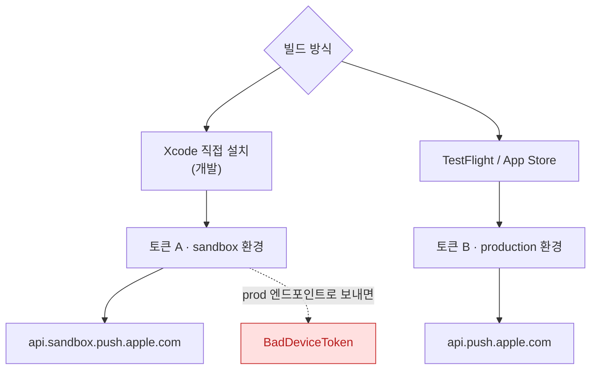

## APNs 토큰은 기기·번들·환경 세 가지에 묶이며 하나만 어긋나도 실패한다

### 개념 (What)

기기 토큰은 단순한 기기 식별자가 아니다. **(기기, 번들 ID, APNs 환경)** 세 값의 조합에 대해 발급된다.

| 축 | 어긋나면 |
| :--- | :--- |
| **기기** | 다른 기기로 보낼 수 없음 |
| **번들 ID** | `BadTopic` |
| **환경 (sandbox / production)** | **`BadDeviceToken`** ← 가장 흔한 실패 |

세 번째가 문제의 대부분을 차지한다. **Xcode 로 설치한 개발 빌드의 토큰은 sandbox 에서만, TestFlight/App Store 빌드의 토큰은 production 에서만 유효하다.**

### 왜 필요한가 (Why)

같은 기기, 같은 앱인데 빌드 방식만 다르면 토큰이 다르다. 서버가 토큰만 저장하고 환경을 저장하지 않으면 **"개발 중에는 되는데 TestFlight 에서는 안 온다"** 가 발생한다.



**서버는 토큰과 함께 환경을 반드시 저장해야 한다.**

```swift
func application(_ app: UIApplication,
                 didRegisterForRemoteNotificationsWithDeviceToken token: Data) {
    let hex = token.map { String(format: "%02x", $0) }.joined()
    #if DEBUG
    let environment = "sandbox"
    #else
    let environment = "production"
    #endif
    api.registerToken(hex, environment: environment)
}
```

> [!NOTE] `aps-environment` entitlement
> 어느 환경의 토큰을 받을지는 **서명에 봉인된 `aps-environment` entitlement** 가 결정한다. 코드가 아니라 프로비저닝 프로파일이 정한다.
> ```bash
> codesign -d --entitlements :- MyApp.app | grep -A2 aps-environment
> ```

### 토큰은 바뀐다

다음 상황에서 토큰이 새로 발급된다. **한 번 받고 저장해 두면 안 된다.**

- 앱 삭제 후 재설치
- 기기 복원 (백업에서 복구)
- 기기 이전
- 드물게 시스템이 갱신

```swift
// 앱이 실행될 때마다 등록을 요청하고, 받은 토큰을 매번 서버에 보낸다
UIApplication.shared.registerForRemoteNotifications()
```

서버는 **같은 토큰을 여러 번 받아도 문제없도록** 멱등하게 처리해야 한다.

### 실패 콜백을 비워 두지 않는다

```swift
func application(_ app: UIApplication,
                 didFailToRegisterForRemoteNotificationsWithError error: Error) {
    // 이 콜백을 비워 두면 등록 실패 원인을 영영 알 수 없다
    log("APNs 등록 실패: \(error)")
}
```

시뮬레이터, 네트워크 문제, entitlement 누락이 여기로 온다.

### 서버가 처리해야 하는 응답

| reason | 서버가 할 일 |
| :--- | :--- |
| `BadDeviceToken` | **환경 확인.** 토큰-환경 짝이 맞는지 |
| `Unregistered` | **토큰을 DB 에서 삭제.** 앱이 지워졌다 |
| `BadTopic` | `apns-topic` 이 번들 ID 와 일치하는지 |
| `TooManyRequests` | 같은 토큰 대상 전송 빈도 조절 |
| `ExpiredProviderToken` | JWT 재발급 (보통 1시간 유효) |

**`Unregistered` 를 무시하고 계속 보내면** 무효 토큰이 쌓여 전송 비용과 실패율이 함께 올라간다.

### 관찰 가능한 증거

```bash
# 환경을 바꿔가며 직접 시험해 원인을 확정한다
curl -v --http2 --header "apns-topic: com.example.app" \
  --header "authorization: bearer $JWT" \
  --data '{"aps":{"alert":"test"}}' \
  https://api.sandbox.push.apple.com/3/device/$TOKEN     # 개발 토큰

# 위가 200 이고 아래가 BadDeviceToken 이면 개발 토큰이 맞다
curl ... https://api.push.apple.com/3/device/$TOKEN
```

```bash
log stream --device --predicate 'process == "apsd"' --info
codesign -d --entitlements :- MyApp.app | grep aps-environment
```

### 연관 문서

- [푸시 타입이 전달 동작과 우선순위를 결정한다](push-types-determine-delivery-behavior.md)
- [알림 권한에는 단계가 있고 중요도는 별도 축이다](notification-authorization-has-levels.md)
- [silent push 는 앱을 깨우지만 전달이 보장되지 않는다](../background/silent-push-wakes-the-app-with-limits.md)
- [06-push-notification-missing](../../00_foundations/diagnostic-runbooks/06-push-notification-missing.md)

공식 문서: [Registering your app with APNs](https://developer.apple.com/documentation/usernotifications/registering-your-app-with-apns)
