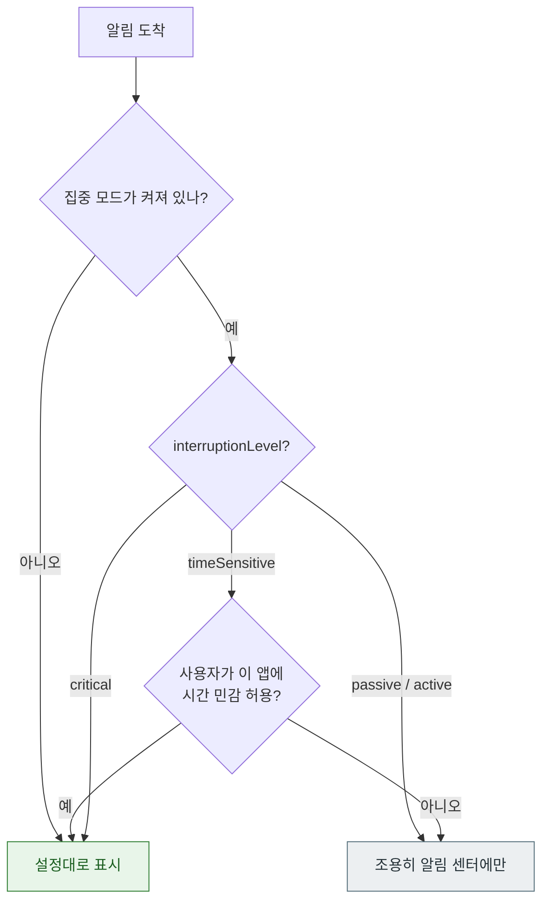

## 알림 권한에는 단계가 있고 중요도는 그와 별개의 축이다

### 개념 (What)

"알림 권한"은 켜짐/꺼짐 두 가지가 아니다. **두 개의 독립된 축**이 있다.

| 축 | 무엇을 정하나 | 누가 정하나 |
| :--- | :--- | :--- |
| **권한(authorization)** | 알림을 보낼 수 있는가, 어떤 형태로 | 사용자 |
| **중요도(interruption level)** | 집중 모드를 뚫는가, 즉시 표시되는가 | **앱이 알림마다 지정** |

이 둘을 혼동하면 "권한은 받았는데 알림이 조용히 묻힌다"를 이해할 수 없다.

### 권한 축 — 요청 방식이 여러 가지다

```swift
let center = UNUserNotificationCenter.current()

// 표준: 프롬프트를 띄운다
try await center.requestAuthorization(options: [.alert, .badge, .sound])

// 임시(provisional): 프롬프트 없이 조용히 전달되고, 사용자가 나중에 유지/차단을 고른다
try await center.requestAuthorization(options: [.alert, .sound, .provisional])
```

**`.provisional` 이 유용한 이유**: 사용자가 앱의 가치를 경험하기 전에 프롬프트를 띄우면 거부율이 높다. 임시 권한은 알림이 **알림 센터에만 조용히 쌓이고**, 사용자가 그것을 보고 "유지" 를 누르면 정식 권한이 된다. 한 번 거부되면 되돌릴 수 없는 표준 프롬프트와 달리 **회복 가능한 경로**다.

| 옵션 | 의미 |
| :--- | :--- |
| `.alert` / `.badge` / `.sound` | 표시 형태 |
| `.provisional` | 프롬프트 없이 조용히 전달 |
| `.criticalAlert` | 무음 모드·집중 모드 무시 (**Apple 승인 필요**) |
| `.timeSensitive` | 시간 민감 알림 허용 요청 |
| `.carPlay` | CarPlay 표시 |

**상태를 가정하지 말고 매번 확인한다.**

```swift
let settings = await center.notificationSettings()
switch settings.authorizationStatus {
case .authorized, .provisional, .ephemeral: break
case .denied:        showSettingsGuidance()    // 코드로 되돌릴 수 없다
case .notDetermined: requestIfAppropriate()
@unknown default: break
}
// 세부 설정도 따로 확인해야 한다
print(settings.alertSetting, settings.soundSetting, settings.badgeSetting)
```

권한이 `authorized` 여도 사용자가 **소리만 끄거나 배너만 끌 수 있다.**

### 중요도 축 — 집중 모드와의 관계



| `interruptionLevel` | 언제 쓰나 |
| :--- | :--- |
| `.passive` | 급하지 않음. 화면을 켜지 않음 (프로모션, 추천) |
| `.active` | **기본값.** 일반 알림 |
| `.timeSensitive` | 즉시 확인이 필요 (배달 도착, 보안 코드) — **집중 모드를 뚫을 수 있음** |
| `.critical` | 안전 관련 (의료 경보) — **Apple 승인 entitlement 필요** |

```json
{ "aps": { "alert": {"title": "배달 도착"}, "interruption-level": "time-sensitive" } }
```

```swift
// 로컬 알림
content.interruptionLevel = .timeSensitive
content.relevanceScore = 0.9        // 알림 요약에서의 정렬 순서
```

> [!WARNING] `.timeSensitive` 남용은 역효과다
> `com.apple.developer.usernotifications.time-sensitive` entitlement 가 필요하고, 사용자가 앱별로 끌 수 있다. 모든 알림을 시간 민감으로 보내면 사용자가 그 스위치를 꺼 버려 **정말 급한 알림까지 묻힌다.**

### 알림 요약(Notification Summary)

사용자가 요약을 켜면 `.passive`/`.active` 알림이 정해진 시각에 묶여 전달된다. `relevanceScore` 가 요약 안에서의 순서를 정한다.

### 관찰 가능한 증거

```swift
let s = await UNUserNotificationCenter.current().notificationSettings()
print("status:", s.authorizationStatus.rawValue)
print("alert:", s.alertSetting.rawValue, "sound:", s.soundSetting.rawValue)
print("timeSensitive:", s.timeSensitiveSetting.rawValue)
print("scheduledDelivery:", s.scheduledDeliverySetting.rawValue)   // 요약 사용 여부
```

```bash
# 시뮬레이터에서 권한 상태 조작
xcrun simctl privacy booted reset all com.example.app

# 시뮬레이터에 푸시 직접 전달 (.apns 파일)
xcrun simctl push booted com.example.app payload.apns
```

**집중 모드를 켜고 각 중요도를 실기기에서 시험**해 보는 것이 유일한 확실한 검증이다.

### 연관 문서

- [푸시 타입이 전달 우선순위와 허용되는 동작을 결정한다](push-types-determine-delivery-behavior.md)
- [APNs 토큰은 기기·번들·환경 세 가지에 묶인다](apns-token-is-bound-to-environment-and-bundle.md)
- [Notification Service Extension 은 제한 시간 안에 끝나야 한다](service-extension-runs-in-a-time-box.md)
- [apple-privacy-and-tcc-details](../../05_security_privacy/apple-privacy-and-tcc-details.md)

공식 문서: [Asking permission to use notifications](https://developer.apple.com/documentation/usernotifications/asking-permission-to-use-notifications)
