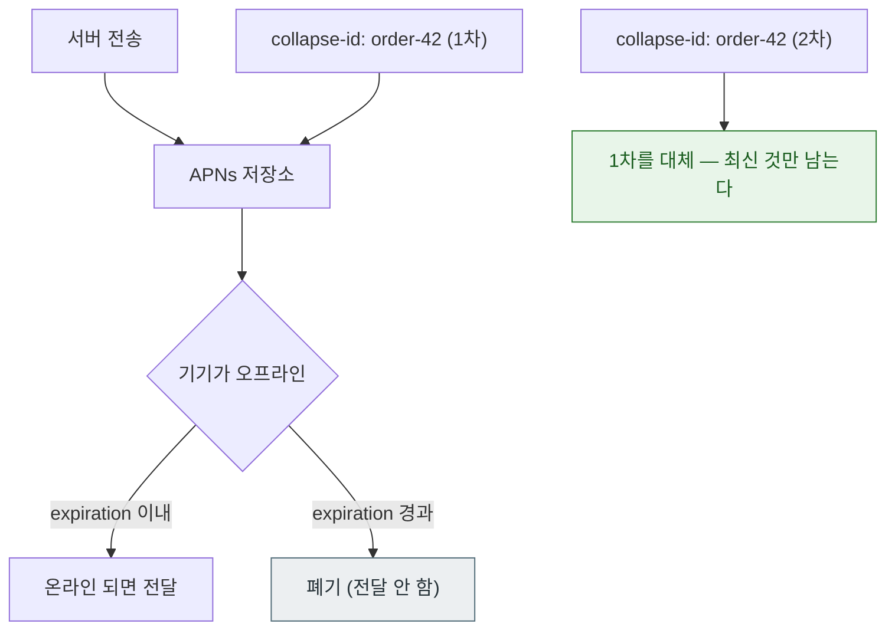

## 푸시 타입이 전달 우선순위와 허용되는 동작을 결정한다

### 개념 (What)

`apns-push-type` 헤더는 **페이로드의 성격을 APNs 에 선언**하는 것이다. 단순한 메타데이터가 아니라, 시스템이 전달 우선순위와 허용 동작을 결정하는 근거다.

```bash
--header "apns-push-type: alert"        # 필수. 생략하면 거부되거나 오동작한다
--header "apns-priority: 10"
--header "apns-topic: com.example.app"
--header "apns-expiration: 0"
--header "apns-collapse-id: order-42"
```

### 타입별 계약

| `apns-push-type` | 용도 | 허용 `apns-priority` | topic 접미사 |
| :--- | :--- | :--- | :--- |
| `alert` | 사용자에게 보이는 알림 | 10 또는 5 | 없음 |
| `background` | [silent push](../background/silent-push-wakes-the-app-with-limits.md) | **5 만** | 없음 |
| `voip` | 수신 통화 | 10 | `.voip` |
| `liveactivity` | [Live Activity 갱신](../../02_ui_frameworks/widgets/live-activity-updates-via-push-or-local.md) | 10 또는 5 | `.push-type.liveactivity` |
| `complication` | watchOS 컴플리케이션 | 10 또는 5 | `.complication` |
| `fileprovider` | 파일 공급자 갱신 | 5 | `.pushkit.fileprovider` |

**topic 접미사를 빠뜨리는 것**이 Live Activity 와 VoIP 에서 가장 흔한 실패다. 일반 번들 ID 만 쓰면 전달되지 않는다.

### 우선순위의 실제 의미

| `apns-priority` | 동작 |
| :--- | :--- |
| **10** | 즉시 전달 시도 |
| **5** | 전력 상황을 고려해 묶어서 전달 |
| **1** | 매우 낮은 우선순위 (일부 타입) |

**`background` 타입에 10 을 쓰면 거부된다.** 조용한 갱신은 정의상 급하지 않기 때문이다.

### 만료와 병합 — 자주 놓치는 두 헤더



**`apns-expiration`**

```bash
--header "apns-expiration: 0"          # 즉시 전달 불가하면 폐기 (일회성 알림에 적합)
--header "apns-expiration: 1735000000" # 이 Unix 시각까지 재시도
```

`0` 은 "지금 못 보내면 버려라"다. **채팅 알림처럼 늦게 도착하면 무의미한 것**에 쓴다. 기본값(미지정)은 APNs 가 상당 기간 보관하며 재시도하므로, 오래된 알림이 뒤늦게 도착하는 문제가 생긴다.

**`apns-collapse-id`**

같은 값을 가진 알림은 **최신 것 하나만 남는다.** 배달 상태 갱신처럼 최신 값만 의미 있는 경우에 쓴다. 이것 없이 상태를 10번 보내면 알림이 10개 쌓인다.

### 페이로드 크기

| 종류 | 상한 |
| :--- | :--- |
| 일반 알림 | 4KB |
| VoIP | 5KB |

초과하면 `PayloadTooLarge` 다. **큰 데이터는 넣지 말고 식별자만 넣은 뒤 [Notification Service Extension](service-extension-runs-in-a-time-box.md) 에서 받아온다.**

### 인증 방식

| 방식 | 특징 |
| :--- | :--- |
| **토큰 기반 (JWT, `.p8`)** | 키 하나로 모든 앱·환경. 만료 관리 필요(보통 1시간). **권장** |
| 인증서 기반 (`.p12`) | 앱별·환경별 인증서. 매년 갱신 필요 |

JWT 를 매 요청마다 새로 만들면 `TooManyProviderTokenUpdates` 를 받는다. **재사용하되 주기적으로 갱신**한다.

### 관찰 가능한 증거

```bash
# 헤더를 바꿔가며 응답의 reason 을 확인하는 것이 가장 빠른 진단
curl -v --http2 \
  --header "apns-topic: com.example.app" \
  --header "apns-push-type: alert" \
  --header "apns-priority: 10" \
  --header "apns-expiration: 0" \
  --header "apns-collapse-id: test-1" \
  --header "authorization: bearer $JWT" \
  --data '{"aps":{"alert":{"title":"제목","body":"본문"}}}' \
  https://api.sandbox.push.apple.com/3/device/$TOKEN
```

응답의 `apns-id` 헤더를 로그에 남겨 두면 나중에 개별 전송을 추적할 수 있다.

### 연관 문서

- [APNs 토큰은 기기·번들·환경 세 가지에 묶인다](apns-token-is-bound-to-environment-and-bundle.md)
- [알림 권한에는 단계가 있고 중요도는 별도 축이다](notification-authorization-has-levels.md)
- [Notification Service Extension 은 제한 시간 안에 끝나야 한다](service-extension-runs-in-a-time-box.md)
- [silent push 는 앱을 깨우지만 전달이 보장되지 않는다](../background/silent-push-wakes-the-app-with-limits.md)

공식 문서: [Sending notification requests to APNs](https://developer.apple.com/documentation/usernotifications/sending-notification-requests-to-apns)
