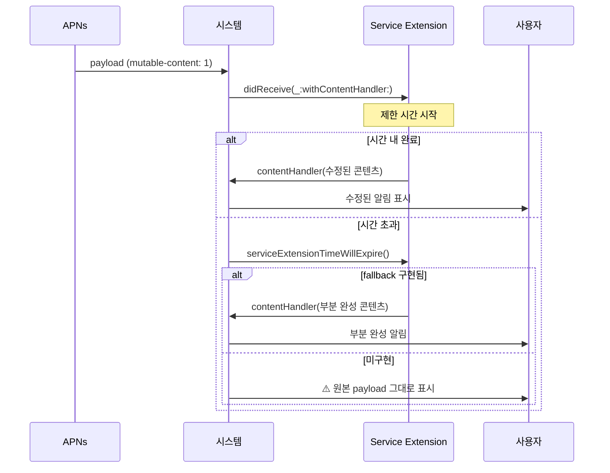

## Notification Service Extension 은 제한 시간 안에 끝나야 하고 실패하면 원본이 그대로 표시된다

### 개념 (What)

알림이 표시되기 **직전에** 내용을 수정할 기회를 주는 확장이다. 종단 간 암호화된 내용을 복호화하거나, 이미지를 첨부하거나, 제목을 지역화할 때 쓴다.

핵심 성질 두 가지:

1. **시간 제한이 있다.** 초과하면 시스템이 개입한다.
2. **실패하면 서버가 보낸 원본 payload 가 그대로 표시된다.** 조용히 실패하므로 사용자는 "가끔 알림 내용이 이상하다"고만 느낀다.

### 왜 필요한가 (Why)



### 필수 조건 세 가지

| 조건 | 빠뜨리면 |
| :--- | :--- |
| payload 에 `"mutable-content": 1` | **확장이 아예 호출되지 않는다** |
| `apns-push-type: alert` | 확장 호출 안 됨 |
| `serviceExtensionTimeWillExpire` 구현 | 시간 초과 시 원본 표시 |

### 표준 구현

```swift
final class NotificationService: UNNotificationServiceExtension {
    private var contentHandler: ((UNNotificationContent) -> Void)?
    private var bestAttempt: UNMutableNotificationContent?

    override func didReceive(_ request: UNNotificationRequest,
                             withContentHandler handler: @escaping (UNNotificationContent) -> Void) {
        contentHandler = handler
        bestAttempt = request.content.mutableCopy() as? UNMutableNotificationContent

        // ★ 먼저 확실한 것부터 채운다 — 시간 초과해도 이만큼은 남는다
        bestAttempt?.title = localizedTitle(from: request.content.userInfo)

        // 그다음 시간이 걸리는 작업
        guard let urlString = request.content.userInfo["image-url"] as? String,
              let url = URL(string: urlString) else {
            handler(bestAttempt ?? request.content); return
        }
        downloadAttachment(url) { [weak self] attachment in
            if let a = attachment { self?.bestAttempt?.attachments = [a] }
            self?.contentHandler?(self?.bestAttempt ?? request.content)
        }
    }

    override func serviceExtensionTimeWillExpire() {
        // ★ 여기까지 만든 것이라도 반드시 넘긴다
        if let best = bestAttempt { contentHandler?(best) }
    }
}
```

**`bestAttempt` 패턴이 핵심이다.** 빠르게 확정할 수 있는 것을 먼저 채워 두면, 느린 작업이 실패해도 부분적으로는 개선된 알림이 나간다.

### 메모리 한도가 매우 낮다

확장은 [별도 프로세스이며 호스트 앱보다 훨씬 낮은 메모리 한도](../../01_system_internals/ipc-and-process/app-extension-process-model.md)를 갖는다. **원본 해상도 이미지를 디코딩하면 확장이 죽고 원본 알림이 표시된다.**

```swift
// ❌ 이미지를 메모리에 디코딩
let image = UIImage(data: data)

// ✅ 파일로 저장해 첨부만 한다 (디코딩은 시스템이 필요할 때)
let tmp = FileManager.default.temporaryDirectory.appendingPathComponent("img.jpg")
try data.write(to: tmp)
let attachment = try UNNotificationAttachment(identifier: "image", url: tmp)
```

첨부 파일도 크기 제한이 있으므로 **서버에서 미리 작은 썸네일을 준비**하는 것이 안전하다.

### Content Extension 과의 구분

| | Service Extension | Content Extension |
| :--- | :--- | :--- |
| 역할 | 표시 **전에 내용 수정** | 알림을 **길게 눌렀을 때 커스텀 UI** |
| 시점 | 도착 직후 | 사용자가 펼칠 때 |
| 시간 제한 | 짧다 | 상대적으로 여유 |

### 관찰 가능한 증거

```bash
log stream --device --predicate 'process == "runningboardd"' --info | grep -i notification
```

Xcode 에서 **확장 스킴을 선택해 실행**하고 호스트 앱을 지정해야 브레이크포인트가 걸린다.

```swift
override func didReceive(_ request: UNNotificationRequest,
                         withContentHandler handler: @escaping (UNNotificationContent) -> Void) {
    NSLog("확장 시작 %@", Date().description)   // print 보다 NSLog 가 확장에서 잘 보인다
    ...
}
```

**시뮬레이터 테스트**: `.apns` 파일을 시뮬레이터 창에 드래그하거나 `xcrun simctl push` 로 보낸다. 저사양 실기기에서 **큰 이미지 첨부 시나리오**를 반드시 확인한다.

### 연관 문서

- [푸시 타입이 전달 우선순위와 허용되는 동작을 결정한다](push-types-determine-delivery-behavior.md)
- [알림 권한에는 단계가 있고 중요도는 별도 축이다](notification-authorization-has-levels.md)
- [앱 확장은 호스트가 수명을 쥔 별도 프로세스다](../../01_system_internals/ipc-and-process/app-extension-process-model.md)
- [04-apns-to-notification-display-and-tap](../../00_foundations/worked-examples/04-apns-to-notification-display-and-tap.md)

공식 문서: [Modifying content in newly delivered notifications](https://developer.apple.com/documentation/usernotifications/modifying-content-in-newly-delivered-notifications)
