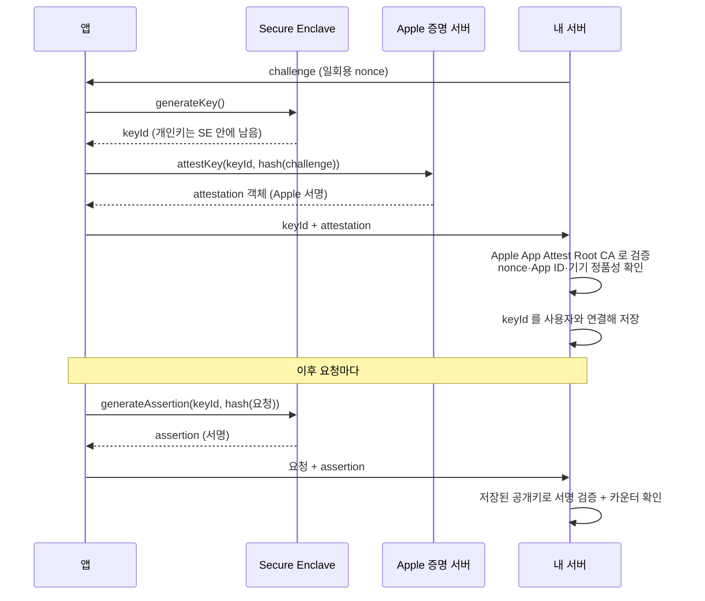

## App Attest 는 앱의 자기 주장이 아니라 Secure Enclave 키를 서버가 Apple CA 로 검증하는 무결성이다

### 개념 (What)

서버가 받은 요청이 **정품 앱에서, 정품 Apple 기기에서** 왔는지 확인하는 메커니즘이다. 핵심은 신뢰의 방향이다.

- ❌ **탈옥 탐지 같은 클라이언트 자체 검사**: 앱이 "나는 안전하다"고 주장하는 것. 그 코드 자체를 공격자가 패치할 수 있다.
- ✅ **App Attest**: Secure Enclave 가 만든 키로 서명하고, **서버가 Apple 의 CA 로 그 서명을 검증**한다. 앱이 뚫려도 키는 나오지 않는다.

### 왜 필요한가 (Why)

1. **클라이언트 검사는 우회된다**: 탈옥 탐지, 디버거 탐지는 방어 층으로서 가치가 있지만, 그 판정 결과를 서버가 믿을 근거가 없다. 공격자는 "안전함"이라고 응답하도록 패치하면 된다.
2. **서버 API 남용 차단**: 리버스 엔지니어링한 클라이언트나 봇이 API 를 직접 호출하는 것을 막는다.
3. **키가 유출되지 않는다**: 개인키는 Secure Enclave 밖으로 나오지 않는다. 메모리를 덤프해도 얻을 수 없다.

### 내부 메커니즘 (How)



**두 단계로 나뉜다.**

| 단계 | 언제 | 서버가 하는 일 |
| :--- | :--- | :--- |
| **Attestation** | 한 번 (설치/키 생성 시) | 인증서 체인, nonce, App ID 검증 후 공개키 저장 |
| **Assertion** | 중요한 요청마다 | 저장된 공개키로 서명 검증 + **카운터 단조 증가 확인** |

### 서버 검증에서 빠뜨리면 안 되는 것

1. **인증서 체인**: Apple App Attest Root CA 에서 이어지는지.
2. **nonce 일치**: 서버가 보낸 challenge 와 일치하는지. → **재전송 공격 차단**
3. **App ID**: `TeamID.BundleID` 의 해시가 내 앱인지.
4. **카운터**: assertion 마다 증가한다. 감소하거나 같으면 재전송이다.
5. **환경**: 개발 빌드는 개발 환경 증명을 만든다. 프로덕션 서버가 이를 받아들이면 안 된다.

> [!IMPORTANT] 서버 검증 없이는 무의미하다
> 클라이언트에서 `attestKey` 만 호출하고 서버가 검증하지 않으면 아무 보안 효과가 없다. **가치는 전부 서버 측 검증에 있다.**

### 제약과 대응

| 제약 | 대응 |
| :--- | :--- |
| 탈옥 기기에서 실패하거나 부정확 | 실패를 "차단"으로 볼지 "경고"로 볼지 정책 결정 필요 |
| 시뮬레이터에서 지원되지 않음 | 실기기 테스트 필수 |
| 키가 기기·앱에 묶임 | 앱 재설치·기기 변경 시 재증명 필요 |
| 네트워크 필요 | 오프라인 우선 앱은 폴백 설계 필요 |

### 구현 예

```swift
import DeviceCheck
import CryptoKit

func attest(challenge: Data) async throws -> (keyId: String, attestation: Data) {
    let service = DCAppAttestService.shared
    guard service.isSupported else { throw AttestError.unsupported }
    let keyId = try await service.generateKey()
    let hash = Data(SHA256.hash(data: challenge))
    let attestation = try await service.attestKey(keyId, clientDataHash: hash)
    return (keyId, attestation)
}

func assert(keyId: String, request: Data) async throws -> Data {
    let hash = Data(SHA256.hash(data: request))
    return try await DCAppAttestService.shared.generateAssertion(keyId, clientDataHash: hash)
}
```

### 연관 문서

- [apple-keychain-biometrics](apple-keychain-biometrics.md) - Secure Enclave 와 키 관리
- [apple-sandbox-and-security](apple-sandbox-and-security.md) - 클라이언트 측 런타임 진단(보완적 층)
- [apple-security-entitlements](apple-security-entitlements.md) - App Attest 사용에 필요한 설정
- [mobile-vulnerability-check](../../cross-platform/mobile-vulnerability-check.md)

공식 문서: [Establishing your app's integrity](https://developer.apple.com/documentation/devicecheck/establishing-your-app-s-integrity)
