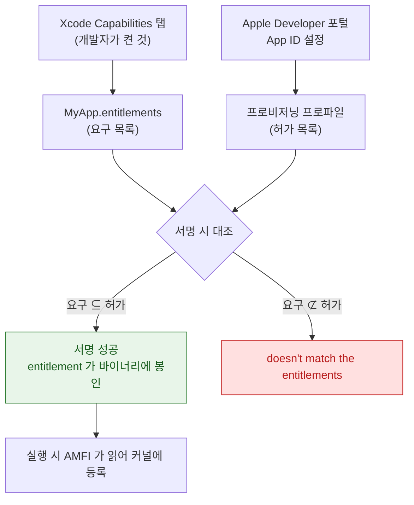

## Entitlement 는 코드 서명에 봉인되므로 런타임이 아니라 빌드·프로비저닝 시점에 확정된다

### 개념 (What)

**Entitlement** 는 "이 바이너리가 어떤 시스템 능력을 쓸 수 있는가"를 선언한 키-값 목록이다. 결정적인 성질은 그 목록이 **코드 서명 안에 봉인된다**는 것이다.

앱이 실행되면 [AMFI 가 exec 시점에 서명에서 entitlement 를 읽어 커널에 등록](../01_system_internals/kernel-and-driver/amfi-code-signature-enforcement.md)하고, 이후 sandbox 를 비롯한 커널 정책들이 그 값을 조회한다. **런타임에 추가하는 API 는 존재하지 않는다.**

### 왜 필요한가 (Why)

1. **위조 불가능한 능력 선언**: 앱이 스스로 "나는 iCloud 를 쓸 수 있다"고 주장하는 것이 아니라, Apple 이 서명한 프로비저닝 프로파일이 그것을 허가한다.
2. **TCC 와 근본적으로 다르다**: TCC 는 사용자가 런타임에 허용/거부하고 언제든 회수한다. entitlement 는 **빌드 시점에 이미 끝난 문제**다. 둘을 혼동하면 "권한을 받았는데 왜 안 되는가"를 영원히 못 푼다.
3. **가장 흔한 배포 실패 원인**: `Provisioning profile doesn't match the entitlements` 는 앱이 요구하는 entitlement 가 프로파일이 허가한 집합에 없다는 뜻이다.

### 세 개의 파일이 일치해야 한다



**Capabilities 를 켜는 것만으로는 부족하다.** 포털에서 App ID 의 능력을 켜고 프로파일을 **재생성**해야 허가 목록이 갱신된다.

### 자주 쓰는 entitlement

| 키 | 용도 | 흔한 실수 |
| :--- | :--- | :--- |
| `com.apple.security.application-groups` | 앱-확장 데이터 공유 | 앱과 확장이 **서로 다른 그룹**을 선언 |
| `keychain-access-groups` | Keychain 공유 | 팀 접두사 누락 |
| `com.apple.developer.associated-domains` | 유니버설 링크 | AASA 파일과 도메인 불일치 |
| `aps-environment` | 푸시 | **개발/프로덕션 값 혼동** |
| `com.apple.developer.icloud-services` | CloudKit | 컨테이너 식별자 불일치 |
| `com.apple.security.app-sandbox` (macOS) | 샌드박스 | 필요한 하위 권한 미선언 |

### 확장도 각각 서명된다

앱 확장은 **자기 번들 ID, 자기 프로파일, 자기 entitlement** 를 갖는다. 앱 본체는 맞는데 확장이 틀린 경우가 매우 흔하다. App Group 이나 Keychain 그룹은 양쪽이 정확히 같아야 한다.

### 관찰 가능한 증거

**원칙: Xcode 설정이 아니라 산출물을 본다.**

```bash
# 앱에 실제로 봉인된 entitlement
codesign -d --entitlements :- MyApp.app

# 모든 확장까지 한 번에
for e in MyApp.app/PlugIns/*.appex; do
  echo "=== $e"; codesign -d --entitlements :- "$e"
done

# 프로파일이 허가한 집합 (Entitlements 항목을 위 출력과 diff 한다)
security cms -D -i MyApp.app/embedded.mobileprovision

# 서명 전체 검증
codesign --verify --deep --strict --verbose=2 MyApp.app
```

**개발 빌드와 배포 빌드의 출력을 diff** 하면 "TestFlight 에서만 실패한다"의 원인이 대부분 드러난다.

### 연관 문서

- [AMFI 는 exec 시점에 코드 서명과 entitlement 를 커널에서 강제한다](../01_system_internals/kernel-and-driver/amfi-code-signature-enforcement.md)
- [apple-sandbox-and-security](apple-sandbox-and-security.md) - 세 게이트 중 sandbox
- [apple-privacy-and-tcc-details](apple-privacy-and-tcc-details.md) - 세 게이트 중 TCC
- [apple-build-and-distribution](../08_packaging_deployment/apple-build-and-distribution.md) - 서명 체인
- [04-permission-granted-but-api-fails](../00_foundations/diagnostic-runbooks/04-permission-granted-but-api-fails.md) - 진단 런북
- [06-permission-gates-in-sequence](../00_foundations/worked-examples/06-permission-gates-in-sequence.md)

공식 문서: [Entitlements](https://developer.apple.com/documentation/bundleresources/entitlements)
