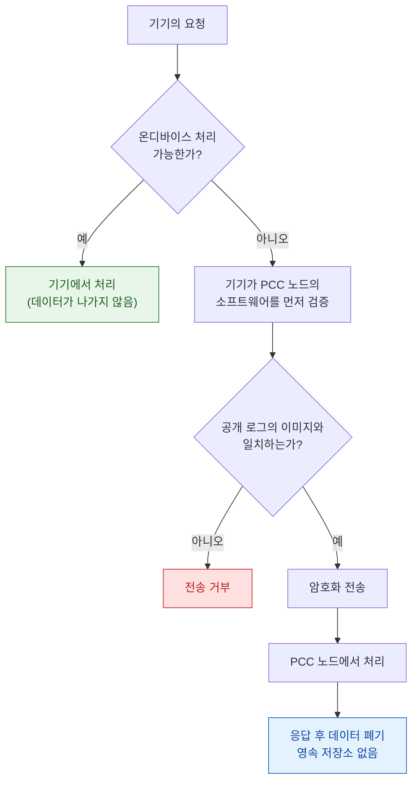

## PCC 는 서버가 데이터를 보관하지 않음을 외부 연구자가 검증할 수 있게 만들어 신뢰를 이전한다

### 개념 (What)

**Private Cloud Compute** 는 Apple Intelligence 가 기기에서 처리하기 어려운 요청을 클라우드로 보낼 때 쓰는 실행 환경이다. 기존 클라우드 AI 와의 차이는 기술 스택이 아니라 **신뢰의 근거**에 있다.

- 기존 모델: "우리는 데이터를 저장하지 않습니다"라는 **정책적 약속**. 사용자는 그것을 믿을 수밖에 없다.
- PCC: 서버가 그렇게 동작함을 **외부에서 검증할 수 있게** 만든다. 믿음이 아니라 확인의 문제로 바꾼다.

### 왜 필요한가 (Why)

온디바이스 AI 는 프라이버시가 강하지만 모델 크기와 연산량에 한계가 있다. 클라우드 AI 는 성능이 좋지만 데이터가 남의 서버에 간다. PCC 는 **성능을 얻으면서 신뢰 문제를 구조로 해결**하려는 시도다.

앱 개발자 관점에서 중요한 점: 시스템 인텔리전스 기능을 쓸 때 **어떤 데이터가 어디까지 가는지**를 사용자에게 설명할 수 있어야 한다.

### 설계 원칙과 그 근거

| 원칙 | 무엇을 막는가 |
| :--- | :--- |
| **Stateless 처리** | 요청 처리 후 데이터를 남기지 않는다. 유출될 저장소 자체가 없다 |
| **강제된 무권한 접근** | Apple 운영자도 사용자 데이터에 접근할 수 없도록 **하드웨어·소프트웨어로 차단**. 정책이 아니라 구조 |
| **비대상화(non-targetability)** | 특정 사용자의 요청만 골라 특정 노드로 보내는 것이 불가능하게 설계 |
| **검증 가능한 투명성** | 실행되는 소프트웨어 이미지를 공개하고, 기기가 그 이미지와 대조한 뒤에만 전송 |

네 번째가 핵심이다. **기기가 서버를 검증한 뒤에 데이터를 보낸다.** 서버가 약속을 지키는지 사용자가 믿는 것이 아니라, 기기가 확인한다.

### Apple Silicon 기반 서버를 쓰는 이유

PCC 노드는 일반 클라우드 VM 이 아니라 Apple Silicon 서버다. 그 이유는 iPhone 과 같은 하드웨어 보안 기능(Secure Boot 체인, Secure Enclave, 메모리 암호화)을 서버에서도 쓰기 위해서다. [기기의 신뢰 사슬](../01_system_internals/boot-and-runtime/boot-rom-hardware-root-of-trust.md)과 같은 원리가 서버에 적용된다.

### 개발자에게 주는 의미

1. **직접 호출하는 API 가 아니다.** PCC 는 시스템 인텔리전스 기능의 백엔드이며, 앱은 그것을 의식하지 않는다.
2. **데이터 흐름 설명 책임은 남는다.** 앱이 시스템 인텔리전스에 데이터를 전달한다면, 그 사실을 사용자에게 알리고 Privacy Manifest 에 반영해야 한다.
3. **온디바이스와 클라우드의 경계는 시스템이 정한다.** 앱이 통제할 수 없으므로, 민감도가 극히 높은 데이터는 애초에 전달하지 않는 설계가 필요하다.

### Android 진영과의 비교

Google 은 온디바이스 소형 모델과 클라우드 대형 모델을 나누는 접근을 취한다. 프라이버시 보장의 근거가 **정책과 계약**에 더 기대는 반면, PCC 는 **검증 가능성**에 무게를 둔다. 상세 비교는 [cross-platform-ai-privacy-comparison](../../cross-platform/cross-platform-ai-privacy-comparison.md) 참고.

### 연관 문서

- [apple-intelligence-and-agentic-intents](../04_system_services/apple-intelligence-and-agentic-intents.md) - 앱이 인텔리전스에 노출하는 데이터
- [apple-privacy-and-tcc-details](apple-privacy-and-tcc-details.md) - Privacy Manifest 요구사항
- [Boot ROM 은 교체 불가능한 하드웨어 신뢰 근원이며 여기서만 신뢰가 시작된다](../01_system_internals/boot-and-runtime/boot-rom-hardware-root-of-trust.md)
- [cryptography-basics](../../../security/fundamentals/cryptography-basics.md)

공식 문서: [Private Cloud Compute — Apple Security Research](https://security.apple.com/blog/private-cloud-compute/)
