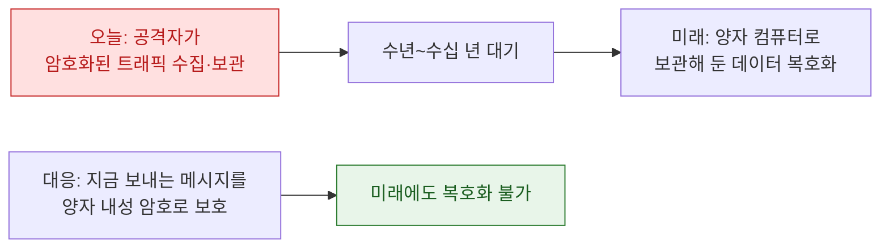

## PQ3 는 하이브리드 키 교환과 주기적 리키잉으로 지금 수집해 나중에 복호화하는 공격을 막는다

### 개념 (What)

**PQ3** 는 iMessage 에 적용된 양자 내성 메시징 프로토콜이다. 두 가지 방어를 결합한다.

1. **하이브리드 키 교환**: 기존 타원 곡선(ECC)과 양자 내성 알고리즘을 **함께** 쓴다.
2. **지속적 리키잉(rekeying)**: 대화 도중에도 주기적으로 새 키를 만들어 교환한다.

### 왜 필요한가 (Why) — "Harvest Now, Decrypt Later"

양자 컴퓨터는 아직 실용화되지 않았다. 그런데도 지금 대비해야 하는 이유는 공격 모델이 **시간을 건너뛰기 때문**이다.

**오늘 보낸 메시지가 10 년 뒤에 읽힐 수 있다.** 그래서 "양자 컴퓨터가 나오면 그때 바꾸자"는 대응이 성립하지 않는다.

### 내부 메커니즘 (How)

#### 1. 하이브리드 — 둘 중 하나가 뚫려도 안전

기존 ECC 와 양자 내성 알고리즘(Kyber 계열)의 결과를 **결합해** 세션 키를 만든다.

| 시나리오 | 결과 |
| :--- | :--- |
| ECC 가 양자 컴퓨터로 깨짐 | 양자 내성 부분이 여전히 보호 |
| 양자 내성 알고리즘에 미발견 취약점 | ECC 가 여전히 보호 |
| 둘 다 깨짐 | 위험 |

새 알고리즘만 쓰지 않고 굳이 결합하는 이유가 두 번째 줄이다. **양자 내성 알고리즘은 상대적으로 검증 기간이 짧다.**

#### 2. 리키잉 — 침해의 시간 범위를 좁힌다

세션 키를 한 번 정하고 대화 내내 쓰면, 그 키가 유출될 때 대화 전체가 노출된다. PQ3 는 대화 중에도 주기적으로 새 키를 만든다.

- **Forward secrecy**: 현재 키가 유출되어도 **과거** 메시지는 안전하다.
- **Post-compromise security**: 기기가 한 번 침해되어도, 이후 리키잉이 일어나면 **미래** 메시지는 다시 안전해진다.

두 번째가 특히 중요하다. 대부분의 프로토콜은 한 번 뚫리면 계속 뚫린 상태로 남지만, 주기적 리키잉은 침해로부터 **복구**된다.

### 보안 수준의 단계

메시징 프로토콜의 양자 내성은 단계로 이야기된다.

| 수준 | 내용 |
| :--- | :--- |
| 0~1 | 양자 내성 없음 또는 초기 키 설정에만 적용 |
| 2 | 초기 키 설정에 양자 내성 적용 |
| **3** | **초기 키 설정 + 지속적 리키잉 모두 양자 내성** |

PQ3 는 3 단계를 목표로 설계되었다. 차이는 "한 번 안전하게 시작하는가"와 "계속 안전하게 유지되는가"다.

### 개발자에게 주는 의미

1. **iMessage 내부 프로토콜이므로 앱이 직접 쓰는 API 가 아니다.** 사용자는 인지하지 못한 채 보호받는다.
2. **자체 메시징·전송 보안을 설계한다면 같은 질문을 해야 한다** — "지금 수집된 트래픽이 미래에 복호화되면 문제가 되는가?" 장기 기밀성이 필요한 데이터라면 하이브리드 접근을 고려한다.
3. **[ATS](../01_system_internals/connectivity/ats-transport-security-defaults.md) 는 다른 계층이다.** ATS 는 TLS 최소 요구를 강제하는 시스템 정책이고, PQ3 는 애플리케이션 계층 종단 간 암호화다.

### 연관 문서

- [ATS 는 기본적으로 TLS 와 순방향 비밀성을 요구한다](../01_system_internals/connectivity/ats-transport-security-defaults.md)
- [apple-keychain-biometrics](apple-keychain-biometrics.md) - 키의 하드웨어 보호
- [cryptography-basics](../../../security/fundamentals/cryptography-basics.md) - 암호학 기초
- [network-security-protocols](../../../security/protocols/network-security-protocols.md)

공식 문서: [iMessage with PQ3 — Apple Security Research](https://security.apple.com/blog/imessage-pq3/)
