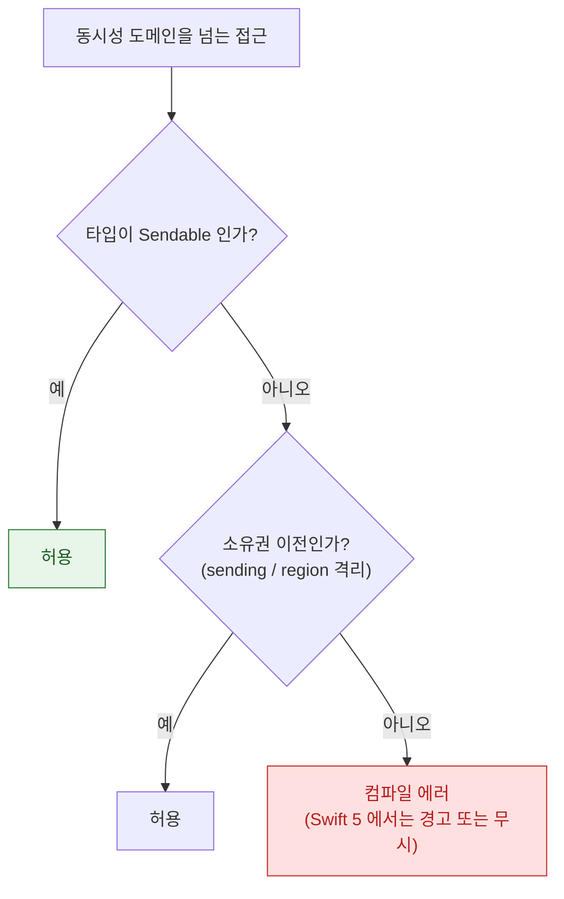

## Swift 6 는 데이터 경합을 런타임 버그가 아니라 컴파일 에러로 바꾼다

### 개념 (What)

메모리 안전성은 기능 품질 문제이자 **보안 문제**다. 데이터 경합은 단순한 "가끔 이상한 값"이 아니라, 힙 손상을 통해 **임의 코드 실행으로 이어질 수 있는 취약점 계열**이다.

Swift 는 이미 경계 검사와 ARC 로 버퍼 오버플로와 use-after-free 를 크게 줄였다. Swift 6 는 마지막으로 남은 큰 구멍인 **동시성 관련 메모리 안전성**을 컴파일 타임으로 옮겼다.

### 왜 보안 관점에서 다루는가 (Why)

메모리 안전성 취약점의 상당 부분은 C/C++ 계열의 수동 메모리 관리에서 나오지만, **동시 접근으로 인한 손상**은 언어를 가리지 않는다.

| 취약점 계열 | Swift 의 방어 | 도입 시점 |
| :--- | :--- | :--- |
| 버퍼 오버플로 | 배열 경계 검사 | 처음부터 |
| Use-after-free | ARC | 처음부터 |
| 정수 오버플로 | 기본 트랩 | 처음부터 |
| 타입 혼동 | 강한 타입 시스템 | 처음부터 |
| **데이터 경합으로 인한 상태 손상** | **actor 격리 + Sendable** | **Swift 6** |

마지막 줄이 Swift 6 의 기여다. 이전에는 개발자의 규율에 의존했고, 규율은 대규모 코드베이스에서 반드시 깨진다.

### 무엇이 컴파일 에러가 되는가



구체적인 규칙과 각각의 대응은 언어 계층 정본에 있다.

- [actor 격리는 가변 상태 접근을 직렬화해 데이터 경합을 컴파일 타임에 차단한다](../01_language_concurrency/concurrency/actor-isolation-serializes-state-access.md)
- [Sendable 은 타입 수준 보장이고 sending 은 값 수준 소유권 이전이다](../01_language_concurrency/concurrency/sendable-vs-sending.md)
- [region 기반 격리는 non-Sendable 값의 안전한 전송을 컴파일러가 증명한다](../01_language_concurrency/concurrency/region-based-isolation.md)

### 보안 관점의 함정: `@unchecked Sendable`

> [!WARNING] 이것은 검증을 끄는 스위치다
> `@unchecked Sendable` 은 "내가 직접 동기화를 보장한다"는 선언이며, 컴파일러는 그 뒤로 해당 타입을 검사하지 않는다. **경고를 없애려고 붙이면 취약점을 그대로 둔 채 경고만 사라진다.**

보안 리뷰 체크 항목으로 삼을 것:

```bash
# 코드베이스의 @unchecked Sendable 사용처를 전수 확인
grep -rn "@unchecked Sendable" --include="*.swift" .
```

각 사용처에 대해 다음을 확인한다.

1. 실제로 락이나 직렬 큐로 보호하고 있는가?
2. 보호 범위가 **모든** 가변 상태를 덮는가?
3. 왜 actor 로 만들 수 없는지 주석으로 남겼는가?

### 마이그레이션은 보안 작업이다

경고를 급하게 억제하면 안전성이 오히려 나빠질 수 있다. 단계적 접근과 효과 순 작업 순서는 [Swift 6 마이그레이션 노트](../01_language_concurrency/concurrency/swift6-migration-path.md)에 있다.

CI 에서 다음을 추적한다.

```bash
# 동시성 경고 수 (역행 방지)
xcodebuild -scheme MyApp 2>&1 | grep -c "warning:.*concurrency"

# @unchecked Sendable 사용 수 (증가하면 리뷰)
grep -rc "@unchecked Sendable" --include="*.swift" . | awk -F: '{s+=$2} END {print s}'
```

### 연관 문서

- [apple-swift-concurrency](../01_language_concurrency/apple-swift-concurrency.md) - 동시성 모델 전체 지도
- [Swift 6 마이그레이션은 경고를 먼저 켜서 모듈 단위로 단계적으로 한다](../01_language_concurrency/concurrency/swift6-migration-path.md)
- [apple-secure-coding-checklist](apple-secure-coding-checklist.md) - 보안 코딩 점검
- [apple-memory-management](../01_language_concurrency/apple-memory-management.md) - ARC 와 메모리 안전성

공식 문서: [Migrating to Swift 6](https://www.swift.org/migration/documentation/migrationguide/)
