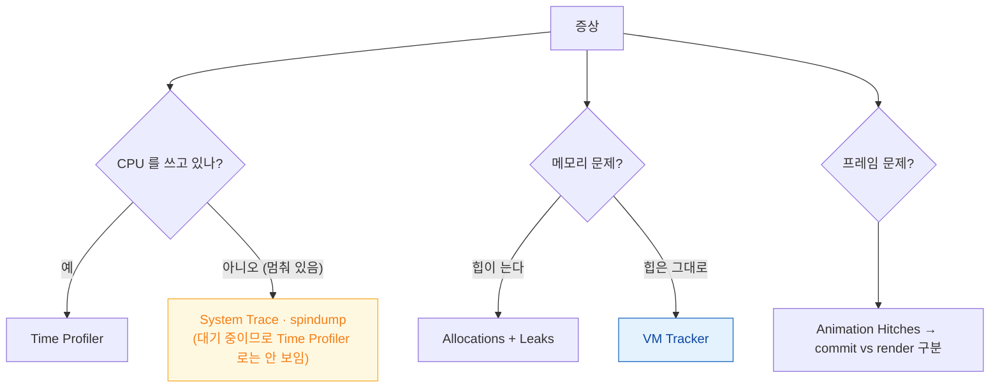

## 계측기는 증상에 맞춰 골라야 하고 Time Profiler 는 뒤집어야 읽힌다

Instruments 를 열고 아무 템플릿이나 켜는 것이 가장 흔한 실수다. **각 계측기는 다른 질문에 답하며, 잘못 고르면 원인이 아예 보이지 않는다.**

첫 분기는 항상 같다 — **CPU 를 쓰고 있는가?**



### 정본 노트

- [계측기 템플릿은 각각 다른 질문에 답하므로 증상에 맞춰 골라야 한다](profiling/instrument-templates-answer-different-questions.md) — **증상 → 템플릿 대응표**, signpost 로 내 구간 표시, `xctrace` CLI.
- [Time Profiler 는 호출 트리를 뒤집고 시스템 라이브러리를 숨겨야 읽힌다](profiling/time-profiler-needs-inverted-tree-and-hidden-system-libraries.md) — 읽는 순서, 샘플링의 한계, **Release 로 프로파일해야 하는 이유**.
- [Allocations 는 힙만 보여주므로 IOSurface 같은 메모리는 VM Tracker 로 봐야 한다](profiling/allocations-shows-heap-but-vm-tracker-shows-the-rest.md) — Generations(Mark) 사용법, 어떤 수치를 믿을 것인가.

### 증상 → 템플릿 빠른 표

| 증상 | 템플릿 |
| :--- | :--- |
| 특정 동작이 느리다 | Time Profiler |
| 멈추는데 CPU 는 낮다 | System Trace |
| 메모리로 죽는다 | Allocations + VM Tracker + Leaks |
| 스크롤이 끊긴다 | **Animation Hitches** (먼저 구간 확정) |
| 앱 시작이 느리다 | App Launch |
| GPU 가 병목이다 | Metal System Trace |
| 배터리를 먹는다 | Energy Log |
| async 코드가 이상하다 | Swift Concurrency |
| 네트워크가 느리다 | Network |

### 측정 원칙

| 원칙 | 이유 |
| :--- | :--- |
| **Release 구성으로** | Debug 는 최적화가 없어 병목이 다르다 |
| **실기기에서** | 시뮬레이터는 맥 CPU 를 쓴다 |
| **구간을 좁혀서** | 전체 기록은 노이즈가 크다 |
| **고친 뒤 재측정** | 추측으로 끝내지 않는다 |

### signpost 를 심어 두면 세 곳에서 쓴다

```swift
import OSLog
let signposter = OSSignposter(subsystem: "com.example.app", category: "Feed")
let state = signposter.beginInterval("LoadFeed")
defer { signposter.endInterval("LoadFeed", state) }
```

이 구간은 **Instruments 트랙**, **[CI 성능 기준선](performance/xctest-metrics-lock-performance-in-ci.md)**, **[MetricKit 실사용자 분포](performance/metrickit-collects-what-you-cannot-reproduce.md)** 세 곳에서 모두 활용된다.

### Instruments 전에 확인할 것

| 도구 | 언제 |
| :--- | :--- |
| Debug Navigator 게이지 | CPU·메모리 추이 대략 |
| [View Debugger](debugging/view-debugger-and-memory-graph-answer-different-questions.md) | 레이아웃 문제 |
| [Memory Graph](debugging/view-debugger-and-memory-graph-answer-different-questions.md) | 순환 참조 |
| Core Animation 디버그 색상 | [offscreen·오버드로](../01_system_internals/graphics-and-media/offscreen-rendering-cost.md) |

### 관찰 가능한 증거

```bash
xcrun xctrace list templates
xcrun xctrace record --template 'Time Profiler' \
  --device-name 'My iPhone' --attach MyApp --output trace.trace

sample <pid> 5 -file /tmp/sample.txt      # macOS
spindump <pid> 5 -file /tmp/spin.txt
```

**필수 설정**: Scheme > Run > Diagnostics 에서 `Malloc Stack Logging` 을 켜야 메모리 객체의 할당 출처가 보인다.

### 연관 문서

- [apple-performance-and-debug](apple-performance-and-debug.md) - 측정 지표와 디버그 도구
- [apple-testing-and-quality](apple-testing-and-quality.md)
- [07-scroll-hitches](../00_foundations/diagnostic-runbooks/07-scroll-hitches.md)
- [03-jetsam-memory-termination](../00_foundations/diagnostic-runbooks/03-jetsam-memory-termination.md)

공식 문서: [Instruments](https://developer.apple.com/tutorials/instruments) · [Analyzing the performance of your app](https://developer.apple.com/documentation/xcode/analyzing-the-performance-of-your-app)
